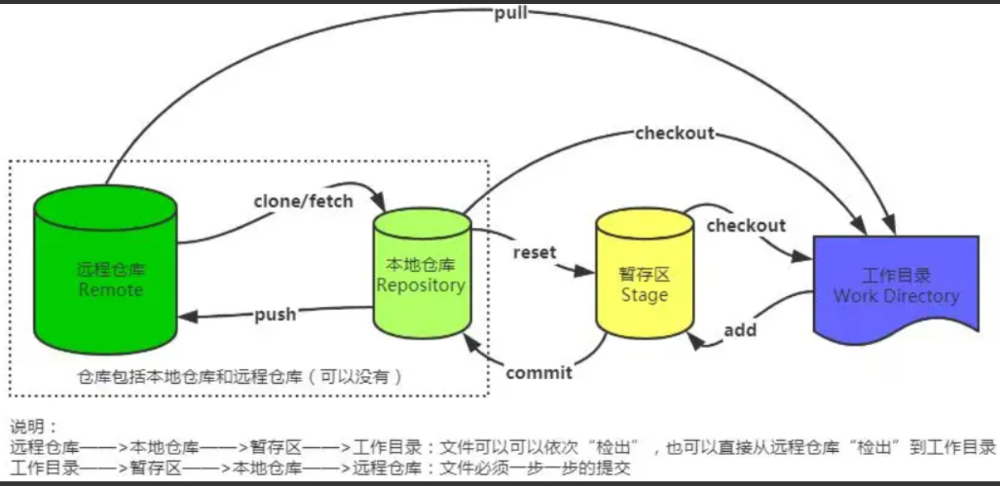

# 1 基本 Linux 命令
## 1.cd：切换目录
- cd ~ ：切换到当前用户的根目录
- cd / ：切换到根目录
- cd .. ：切换到上一级目录
- cd - ：切换到上一次所在的目录
- cd /home/username ：切换到指定用户的目录
- cd /home/username/xxx ：切换到指定用户目录下的子目录
## 2.pwd：显示当前所在目录
## 3.ls：显示当前目录下的文件
- ls -a ：显示所有文件，包括隐藏文件
- ls -l ：显示文件的详细信息
## 4.mkdir：创建目录
- mkdir xxx ：创建一个名为 xxx 的目录
- mkdir -p xxx/xxx ：创建一个名为 xxx 的目录，并在该目录下创建一个名为 xxx 的子目录
## 5.touch：创建文件
- touch xxx ：创建一个名为 xxx 的文件
## 6.rm：删除文件或目录
- rm -r xxx ：删除一个名为 xxx 的目录
- rm -f xxx ：删除一个名为 xxx 的文件
## 7.mv：移动文件或目录
- mv xxx /home/username ：将 xxx 移动到指定用户的目录下
- mv xxx xxx ：将 xxx 重命名为 xxx
## 8.reset：清屏; clear：清屏
## 9.history：查看历史命令
## 10. cat：查看文件内容
- cat xxx ：查看 xxx 文件的内容
## 11. help：查看帮助
## 12. exit：退出

# 2 Git 基本概念
## 1. 工作区域
工作区：workspace，本地电脑中的文件夹\
暂存区：stage，本地电脑中的 .git 文件夹\
本地仓库:local repository，本地电脑中的 .git 文件夹\
远程仓库：remote repository，远程服务器中的 .git 文件夹

## 2. Git **常用命令**
- workspace --> stage: `git add xxx` 表示添加指定文件到暂存区 `git add .`表示将所有文件添加到暂存区
- stage --> local repository: `git commit -m "xxx"`
- local repository --> remote repository: `git push`
- remote repository --> local repository: `git fetch/pull`
- local repository --> workspace: `git checkout xxx`
- remote repository --> workspace: `git clone xxx`\
注意: fetch 和 pull 的区别: 
- fetch 只是将远程仓库的内容下载到本地仓库，不会自动合并到工作区，需要手动合并；
- pull 是将远程仓库的内容下载到本地仓库，并自动合并到工作区(相当于fetch+merge)

# 3. Git 基本操作
## 1. Git 基本配置
- git config --global user.name "xxx" ：配置用户名
- git config --global user.email "xxx“: 配置邮箱
- git config --global core.editor vim ：配置编辑器
- git config --list ：查看配置信息
## 2. Git 基本操作
- git init ：初始化本地仓库
- git status ：查看本地仓库状态
- git clone xxx ：克隆远程仓库, xxx为远程仓库的地址（https）
## 3. 文件的四种状态
- Untracked：未跟踪，即文件在工作区，但未被添加到暂存区
- Unmodified：未修改，即文件在暂存区，但未被修改，如果被修改则进入modified，如果git rm移除版本库，则成为untracked文件
- Modified：已修改，即文件在暂存区，但被修改，如果git add添加到版本库，则成为unmodified文件
- Staged：已暂存，即文件在暂存区，但未被修改，如果git commit提交到版本库，则成为unmodified文件\
可通过`git status`查看文件状态
## 4. Git 分支常用命令
- git branch 'xxx' ：创建一个名为 xxx 的分支，但不会切换到该分支
- git checkout -b 'xxx' ：创建一个名为 xxx 的分支，并切换到该分支
- git checkout 'xxx' ：切换到 xxx 分支
- git branch -d 'xxx' ：删除一个名为 xxx 的分支
- git branch -r ：查看远程分支
- git merge 'xxx' ：将 xxx 分支合并到当前分支