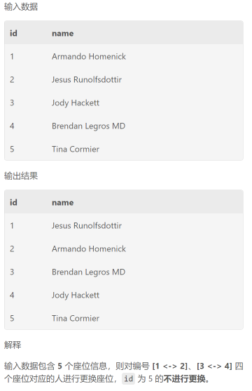

# <BIG>SQL</BIG>

## [目录](#目录)
1. [执行顺序](#0-执行顺序big)
   - [limit的写法](#limit的写法)
   - [group by规则](#group-by规则)
2. [使用`with`创建虚拟表](#1使用with创建虚拟表)
3. [regexp 匹配](#2-regexp-匹配big)
   - [字符匹配](#1-字符匹配)
   - [特殊字符](#2-特殊字符)
   - [重复次数](#3-重复次数)
   - [字符类](#4字符类)
   - [预定义字符类](#5预定义字符类)
   - [边界](#6-边界-需要用转义)
   - [量词贪婪与非贪婪](#7-量词贪婪与非贪婪)
4. [like 模糊匹配](#3-like-模糊匹配big)
5. [使用`case when`进行条件判断](#4-使用case-when进行条件判断big)
6. [空值处理](#5空值处理big)
7. [设定列值](#6-设定列值big)
8. [窗口函数](#7-窗口函数)
   - [定义](#1定义)
   - [常用窗口函数](#2-常用窗口函数big)
9. [时间函数](#8-时间函数big)
10. [group_concat()函数](#9-group_concat函数big)
11. [字符串处理](#10-字符串处理big)
12. [增删改](#11-增删改big)
13. [创建视图](#12-创建视图big)
14. [exists语句](#13-exists语句big)

## [SQL 刷题总结](#sql-刷题总结)
1. [topN问题](#1topn问题)
   - [使用窗口函数](#1使用窗口函数)
   - [使用limit](#2使用limit)
2. [连续/重复问题](#2连续重复问题)
   - [连续](#1连续)
   - [重复](#2重复)
3. [中位数问题](#3中位数问题big)
4. [累计区间计算问题](#4累计区间计算问题big)
5. [条件求和问题](#5条件求和问题)
6. [行转列问题](#6行转列问题)
7. [笛卡儿积问题](#7笛卡儿积问题)

## [例题总结](#例题总结)
1. [用户登录问题](#1-用户登录问题big)
2. [考试分数问题](#2-考试分数问题)
3. [课程订单分析(条件筛选)](#3-课程订单分析条件筛选)
4. [字符串处理函数；多表连接进行筛选](#4-字符串处理函数多表连接进行筛选)
5. [经典：更换座位（连续问题）](#5-经典更换座位连续问题)
6. [ifnull的使用：价格修改问题](#6-ifnull的使用价格修改问题)


# SQL Tips
## 0. 执行顺序<big>
SQL语句的执行顺序如下：
1. `from`：从表中获取数据
2. `where`：对数据进行过滤
3. `group by`：按照指定的列对数据进行分组
4. `having`：对分组后的数据进行过滤
5. `select`：选取指定的列
6. `order by`：对数据进行排序
7. `limit`：限制返回的数据行数

#### limit的写法
- `limit N`：返回前N行
- `limit N,M`：从第N行开始，返回M行(N为偏移量，M为需要返回的数量)
- `limit M offset N`：用于限制查询结果中返回的行数，并指定一个偏移量，从查询结果的第 N+1 行开始。
例如，LIMIT 10 OFFSET 5 将返回查询结果的从第6行开始的10行。
- `limit n*(i-1),n` 用于分页，表示每页显示n条记录，要显示第i页数据

#### group by规则
- `group by`语句必须出现在`where`语句之后，`order by`语句之前。
- `group by`语句中的列必须是`select`语句中出现的列，或者是聚合函数的参数。
- `group by`语句中的列可以是`select`语句中出现的列的别名。但where语句中不能使用别名。

当使用DISTINCT时，所有的ORDER BY中的列都必须在SELECT列表中出现。\
而order by中的列不一定要在select中出现，但是必须是group by中的列或者是聚合函数的参数。
</big>


## 1.使用`with`创建虚拟表
`with`语句可以创建一个虚拟表，该表只在当前查询中有效，可以在`with`语句中使用`select`语句，也可以使用`union`语句。\
`with`语句的基本语法如下：
```
with table_name as (
    select ...
    from ...
    where ...
)
select ...
from table_name
where ...
```
`with`语句的主要作用是将复杂的查询分解为多个简单的查询，提高查询的可读性和可维护性。
并且使用with可以避免子查询的嵌套，提高查询效率。

## 2. regexp 匹配<big>
`regexp`是正则表达式匹配，可以用来匹配字符串，常用于模糊查询。\
`regexp`的基本语法如下：
```
select ...
from ...
where col regexp 'pattern'
```
其中`pattern` 的语法规则如下：

### 1. 字符匹配:
- `a`：匹配字母 a。
- `123`：匹配连续的数字 123。
- `[a-z]`：匹配任何小写字母。
- `[A-Z]`：匹配任何大写字母。
- `[0-9]`：匹配任何数字。
- `.`：匹配任何字符（除了换行符 \n）。
### 2. 特殊字符:
- `\`：用于转义后续字符，使其匹配其字面意义，例如 \\ 匹配反斜杠字符 \。
- `^`：匹配字符串的开头。
- `$`：匹配字符串的结尾。
- `|`：用于表示“或”的关系，例如 cat|dog 匹配 "cat" 或 "dog"。
- `()`：用于分组表达式，改变优先级和创建子模式。
### 3. 重复次数:
- `*`：匹配前一个元素零次或多次，例如 a* 匹配零个或多个字母 a。
- `+`：匹配前一个元素一次或多次，例如 a+ 匹配一个或多个字母 a。
- `?`：匹配前一个元素零次或一次，例如 a? 匹配零个或一个字母 a。
- `{n}`：精确匹配前一个元素 n 次，例如 a{3} 匹配三个字母 a。
- `{n,}`：匹配前一个元素至少 n 次，例如 a{2,} 匹配至少两个字母 a。
- `{n,m}`：匹配前一个元素至少 n 次但不超过 m 次，例如 a{2,4} 匹配 2 到 4 个字母 a。
### 4.字符类:
- [abc]：匹配字符集中的任何一个字符，例如 [abc] 匹配 a、b 或 c。
- [^abc]：匹配不在字符集中的任何一个字符，例如 [^abc] 匹配除了 a、b 和 c 之外的字符。
- [a-z]：匹配字符范围内的任何一个字符，例如 [a-z] 匹配任何小写字母。
- [A-Z0-9]：匹配字符范围内的任何一个字符，例如 [A-Z0-9] 匹配大写字母和数字。
### 5.预定义字符类:
- `\d`：匹配任何数字字符，等同于 [0-9]。
- `\D`：匹配任何非数字字符，等同于 [^0-9]。
- `\w`：匹配任何字母、数字或下划线字符，等同于 [a-zA-Z0-9_]。
- `\W`：匹配任何非字母、非数字和非下划线字符，等同于 [^a-zA-Z0-9_]。
- `\s`：匹配任何空白字符，例如空格、制表符、换行符等。
- `\S`：匹配任何非空白字符。
### 6. 边界: 需要用\转义
- \b：匹配单词边界，用于确保匹配的内容是一个独立的单词。
  - 例如，`\\bno\\b` 匹配 "no"，而不匹配 "nor"。
- \B：匹配非单词边界。
### 7. 量词贪婪与非贪婪:
- `*` 和 `+` 默认是贪婪的，尽可能匹配更多字符。
- `*?` 和 `+?` 是非贪婪的，尽可能匹配更少字符。

eg:\
````
where col regexp '^[a-zA-Z][a-zA-Z0-9_.-]*\\@leetcode\\.com$'
````
该语句会返回表中email列满足：\
以字母（可以是小写或大写字母）开头。
后面可以是零个或多个字母、数字、下划线、句点或连字符。
最后以 "@leetcode.com" 结尾。
如"bob_123@leetcode.com"的邮件地址</big>

## 3. like 模糊匹配<big>
`like`是模糊匹配，可以用来匹配字符串，常用于模糊查询。\
`like`的基本语法如下：
```
where col like 'pattern'
```

其中`pattern` 的语法规则如下：
- `%`（百分号）：表示匹配任意长度的任意字符。例如，'a%' 匹配以字母 'a' 开头的任何字符串。
- `_`（下划线）：表示匹配任何单个字符。例如，'_pple' 匹配以任意字符开头，后跟 "pple" 的字符串，如 "apple" 或 "opple"。
- `[charlist]`：用于指定要匹配的字符集合。例如，'[aeiou]' 匹配任何单个元音字母。
- `[^charlist]`：用于指定不匹配的字符集合。例如，'[^0-9]' 匹配不包含数字的任何字符串。
- `\`（反斜杠）：用于转义特殊字符，使其成为字面字符。例如，'\%' 匹配实际字符 '%'。

一些示例：
- `'apple%'`：匹配以 "apple" 开头的任何字符串，如 "apple"、"applesauce" 等。
- `'%apple'`：匹配以 "apple" 结尾的任何字符串，如 "pineapple"、"caramel apple" 等。
- `'_pple'`：匹配以任何字符开头，后跟 "pple" 的字符串，如 "apple" 或 "opple"。
- `'[aeiou]pple'`：匹配以元音字母开头，后跟 "pple" 的字符串，如 "apple" 或 "epple"。
- `'[^0-9]'`：匹配不包含数字的任何字符串，如 "apple" 或 "banana"。</big>

## 4. 使用`case when`进行条件判断<big>
`case when`语句可以用于条件判断，类似于`if else`语句。\
`case when`语句的基本语法如下：
```
select col1,
case
    when condition1 then result1
    when condition2 then result2
    ...
    else result
end as col2
from table
```
`case when`语句的主要作用是根据条件返回不同的结果，可以用于数据转换和数据清洗。

if else的语法规则：
- `if(condition, result1, result2)`：如果条件为真，则返回result1，否则返回result2。
</big>

## 5.空值处理<big>
### 1. 判断空值
- `is null`：判断是否为空值
- `is not null`：判断是否不为空值
- `isnull()`：判断是否为空值，如果为空值则返回 true，否则返回 false
- `ifnull(expression，replacement)`：判断是否为空值，如果为空值则返回replacement，否则返回原始值
</big>
## 6. 设定列值<big>
`select value as col` 可以将value的值设定为col列的值\
eg:`select 1 as col1` 该语句会返回一列，列名为col1，值为1
</big>

## 7. 窗口函数
### 1.定义
窗口函数是一类特殊的函数，它可以计算当前行与其他行之间的关系，常用于统计和排序。\
窗口函数的基本语法如下：
```
select col1, col2, ...
from (
    select col1, col2, ...,
    row_number() over(partition by col3 order by col4) as rk
    from table
) as t
where t.rk <= N
```
窗口函数的主要作用是对数据进行分组和排序，常用于统计排名和计算累计值。
返回按照col3分组后，按照col4排序的表，rk列为排序后的行号，最后选取前N行。

窗口范围定义：


#### 2. 常用窗口函数<big>
- `row_number()`：为每一行添加一个唯一的行号，行号从 1 开始递增。
- `rank()`：为每一行添加一个排名，如果有相同的值，则会跳过下一个排名。
- `dense_rank()`：为每一行添加一个排名，如果有相同的值，则不会跳过下一个排名。

通常使用rank和dense_rank进行排名，rank会跳过下一个排名，dense_rank不会跳过下一个排名。\
使用row_number进行排序时，不存在并列排名。
- `sum()`：计算当前行与其他行之间的累计和。
- `avg()`：计算当前行与其他行之间的累计平均值。
- `count()`：计算当前行与其他行之间的累计数量。
- `max()`：计算当前行与其他行之间的最大值。
- `min()`：计算当前行与其他行之间的最小值。
- `first_value()`：计算当前行与其他行之间的第一个值。
- `last_value()`：计算当前行与其他行之间的最后一个值。
- `lead()`：计算当前行与其他行之间的向后偏移量。
- `lag()`：计算当前行与其他行之间的向前偏移量。

lead()和lag()的语法规则：
- `lead(col, offset, default)`：计算当前行与其他行之间的向后偏移量，offset表示偏移量，default表示默认值。
- `lag(col, offset, default)`：计算当前行与其他行之间的向前偏移量，offset表示偏移量，default表示默认值。
```
select col1, col2, col3,
lead(col1, 1, 0) over(order by col3) as lead_col1,
lag(col1, 1, 0) over(order by col3) as lag_col1
from table
```
该语句会返回表中col1列的当前行与前一行的值，以及当前行与后一行的值。</big>

## 8. 时间函数<big>
- `year()`：返回日期的年份。
- `month()`：返回日期的月份。
- `day()`：返回日期的天数。
- `hour()`：返回日期的小时数。
- `DateDiff(date1, date2)`：返回两个日期之间的天数。
- `Date_Add(date, interval unit)`：返回日期加上指定时间间隔后的日期。
  - eg:`select Datea_Add(col1,interval 1 day)` 该语句会返回表中col1列的日期加上一天后的日期
- `Date_Sub(date, interval unit)`：返回日期减去指定时间间隔后的日期。
- `DatePart(interval, date)`：返回日期的指定部分。
- `Date_Format(date, format)`：返回日期的指定格式。
  - eg：`select Date_Format(col1, '%Y-%m-%d')` 该语句会返回表中col1列的日期，格式为YYYY-MM-DD
</big>

## 9. group_concat()函数<big>
`group_concat()`函数可以将分组后的多行数据合并为一行\
`group_concat()`函数的基本语法如下：
```
select col1, group_concat(col2 order by col3 separator ', ')
from table
group by col1
```
`group_concat()`函数的主要作用是将分组后的多行数据合并为一行，按照指定separator分隔符进行分隔。\
group_concat使用的分组依据为group by语句，本身没有分组效果
</big>

## 10. 字符串处理<big>
- `left(str, length)`：返回字符串左边指定长度的子串。
- `right(str, length)`：返回字符串右边指定长度的子串。

一般left和right用于order by或where等条件语句中按指定位置字符串排序
- `substring(str, start, length)`：返回字符串指定位置和长度的子串。
- `lower(str)`：将字符串转换为小写。
- `upper(str)`：将字符串转换为大写。
- `trim(str)`：去除字符串左右两边的空格。
- `char_length(str)`：返回字符串的长度。
- `concat()`函数可以将多个字符串拼接为一个字符串\
`select concat(str1, str2, )` 若需要在字符串中添加空格，可以使用`concat(str1, ' ', str2, )`

eg: ```SELECT user_id, CONCAT(UPPER(SUBSTRING(name, 1, 1)), LOWER(SUBSTRING(name, 2))) AS name```
该查询会返回表中name列的首字母大写，其余字母小写的字符串。</big>

## 11. 增删改<big>
1. 表的创建
```SQL
create table table_name if not exist(
    col1 type1 not null,
    col2 type2 primary key,
    ...
)
```
通过primary key指定主键，通过not null指定非空约束。


复制表格\
`create 目标表 like 来源表`

将table1的部分拿来创建table2\
```SQL
create table if not exists actor_name
(first_name varchar(45) not null,
last_name varchar(45) not null)
select first_name,last_name
from actor
```
2. 表的插入
```SQL
insert into table_name(col1, col2, ...)
values(v11, v12, ...),
      (v21, v22, ...),
      ...
```
其中v11, v12, ...表示第一行的值，v21, v22, ...表示第二行的值，以此类推。

```SQL
insert ignore into table_name(col1, col2, ...)
```
ignore表示如果插入的数据与表中的数据重复，则忽略该条数据。
3. 表的修改\
(1) 通过replace将指定列数据修改
```SQL
replace into table_name(col1, col2, ...)
values(v11, v12, ...),
      (v21, v22, ...),
      ...
```
(2) update可以修改指定位置的数据，通过where进行定位

````SQL
update table_name
set col1 = v11,
    col2 = v12,
    ...
where condition
````
```SQL
update table_name
set col1=if(condition1, new_value, value2) 
    col2=if(condition2, new_value, value2)
# else:value2

set col1=case
    when condition1 then new_value
    when condition2 then new_value
    ...
    else value2
end

```
```SQL
修改满足条件的具体某个值
update table_name
set col_name=replace(col_name, 'old_value', 'new_value')
where condition
```


(3) alter可以修改表的结构，包括添加列、删除列、修改列的数据类型等等。
- add: 添加列
- change: 修改列名
- modify: 修改列的数据类型
```
ALTER TABLE 表名 ADD 列名/索引/主键/外键等；
ALTER TABLE 表名 DROP 列名/索引/主键/外键等；
ALTER TABLE 表名 ALTER 仅用来改变某列的默认值；
ALTER TABLE 表名 RENAME 列名/索引名 TO 新的列名/新索引名；
ALTER TABLE 表名 RENAME TO/AS 新表名;
ALTER TABLE 表名 MODIFY 列的定义但不改变列名；
ALTER TABLE 表名 CHANGE 列名和定义都可以改变。
```
```
ALTER TABLE <表名> ADD COLUMN <新字段名> <数据类型> [约束条件] [FIRST|AFTER 已存在的字段名];

alter table table_name
add column col1 type1 not null,
change column col2_old_name col2_new_name type2,
modify column col3 type3,
```

4. 索引

(1) **使用`create`语句创建索引**
```
CREATE [UNIQUE | FULLTEXT | SPATIAL] INDEX index_name ON tbl_name (col_name);
无法用create语句创建primary-key！！！
```
(2) **使用`alter`语句创建索引或primary key**
```
alter table table_name
add [UNIQUE | FULLTEXT | SPATIAL] index/primary key index_name(col1, col2, ...)
该语句指定了索引可以是唯一索引、全文索引、空间索引以及普通索引。
```
alter允许一条语句同时创建多个索引；Create一次只能创建一个索引

(3) **删除索引**:使用drop或alter均可
```
drop index index_name on table_name 或
alter table table_name drop index index_name
```

5. 表的删除

(1) delete可以删除指定位置的数据，通过where进行定位
```sql
delete from table_name
where condition
```
注意：语法不允许使用子查询进行删除，如果有需要用到子查询的情况，可以使用下面的语句,通过命名虚拟表来实现
```sql
delete from table_name
where id in (
    select* from(
        select id
        from table_name
        where condition
    ) as t
)
```

(2) truncate可以清空表中的所有数据，但是不会删除表的结构。
```
truncate table table_name
```
(3) drop可以删除表的结构，包括表中的所有数据。</big>
```
drop table table_name
```


## 12. 创建视图<big>
视图是一种虚拟的表，具有和物理表相同的功能。\
创建视图的语法如下：
```
create view view_name (col_name1, col_name2..) as
select ...
from ...
where ...

with local/cascaded check option
```
```
create view view_name as
select col1 as col_name1, col2 as col_name2, ...
from ...
where ...
```
两种写法都可以创建视图，并给视图的列指定名称。\
视图的主要作用是简化复杂的查询，保护数据安全。

- `WITH CHECK OPTION`：用于确保通过视图进行的插入或更新操作符合视图的定义。这可以防止通过视图添加或修改那些不符合视图定义的行。
- `WITH LOCAL CHECK OPTION`：该选项仅应用于当前定义的视图。它不会影响基于该视图创建的其他视图。
- `WITH CASCADED CHECK OPTION`：该选项不仅应用于当前视图，还会级联应用到所有基于当前视图的视图上。即，任何基于当前视图定义的其他视图也会受到同样的检查限制。

简而言之：LOCAL 选项仅影响当前视图，而 CASCADED 选项还会影响所有基于当前视图创建的视图。
</big>

## 13. exists语句<big>
exists语句用于判断子查询是否为空，如果子查询为空，则返回false，否则返回true。\
exists语句的基本语法如下：
```
select ...
from ...
where exists (
    select ...
    from ...
    where ...
)
```
表示如果子查询返回的结果不为空，则返回true，否则返回false。

eg：查询出所有在表1中出现过，但是没有在表2中出现过的人员。
```
select *
from table1 as t1
where not exists (
    select *
    from table2 as t2
    where t1.id = t2.id
)
```

## 14. union语句
union语句用于合并两个或多个select语句的结果集，union语句的基本语法如下：
```
select ...from ...
union
select ...from ...
```
union语句会自动去重，如果不想去重，可以使用`union all`语句。

## 15. procedure 存储过程
存储过程是一种预编译的代码块，可以接受参数，可以执行SQL语句并返回结果。\
在一个存储过程内部，你需要在每个语句的末尾使用分号来分隔各个语句

**创建存储过程**：
```
create procedure procedure_name(param1, param2, ...)
begin
    # decalre语句用于声明变量
    declare var1 type1;
    declare var2 type2;
    ...
    sql_statement;(select..from...);
    ...
end
```
注意：sql语句必须以分号结尾，否则会报错。

1. 参数传递：存储过程可以接受输入参数（IN参数）、输出参数（OUT参数）和输入/输出参数（INOUT参数）。
2. 重复使用：存储过程可以在多个地方调用，以实现代码的重用，提高性能和维护性。
3. 安全性：存储过程可以控制对数据库的访问权限，并减少SQL注入的风险。
4. 事务控制：存储过程可以包含多个SQL语句，这些语句可以作为一个事务单元执行，从而保证数据的一致性。

以下是关于存储过程参数的说明：

- IN参数：这些参数用于传递值给存储过程。在存储过程内部，您可以使用这些参数进行计算、查询或其他操作。IN参数是只读的，不会改变传入的值。

- OUT参数：这些参数用于存储过程向调用者返回值。在存储过程内部，您可以将结果赋给OUT参数，然后在调用存储过程的代码中访问这些值。

- INOUT参数：这些参数既可以传递值给存储过程，又可以用于存储过程向调用者返回值。它们可以被读取和写入。

以下是一个示例存储过程的创建，其中包括IN、OUT和INOUT参数：

```sql
CREATE PROCEDURE CalculateTotalPrice(IN productId INT, IN quantity INT, 
        OUT totalPrice DECIMAL(10, 2), INOUT discount DECIMAL(5, 2))
BEGIN
    DECLARE productPrice DECIMAL(10, 2);
    
    -- 根据产品ID查询产品价格，select into语句用于将查询结果赋值给变量
    SELECT price INTO productPrice FROM products WHERE id = productId;
    
    -- 计算总价
    SET totalPrice = productPrice * quantity;
    
    -- 应用折扣
    SET totalPrice = totalPrice * (1 - (discount / 100));
    
    -- 更新折扣
    SET discount = discount + 5;  -- 增加5%的折扣
    
END; # 结束存储过程的定义,需要分号结尾
```

在这个示例中，存储过程接受产品ID（productId）、数量（quantity）和折扣（discount）作为参数，计算总价格，并将结果存储在totalPrice参数中。同时，它也更新了折扣参数。您可以在调用存储过程时传递这些参数，并获取计算后的结果。

要调用这个存储过程，可以使用如下SQL语句：

```sql
CALL CalculateTotalPrice(1, 5, @total, @discount);
SELECT @total AS TotalPrice, @discount AS Discount;
```

这将计算产品ID为1，数量为5的产品的总价格，并返回计算结果以及更新后的折扣。

存储过程可以看作是一个函数，它接受输入参数并返回结果。
但是，存储过程与函数之间有一个重要的区别：存储过程可以包含多个SQL语句 ，
而函数只能包含一个SQL语句。

eg2： 不需要out参数，只需要in参数，此时直接call该存储过程，会调用内部sql语句并返回结果
```sql
create procedure query_country(
    in country_name varchar(100) 
)
begin
select * from teachers where country = country_name;
end;

call query_country('CN');
```

eg3:批量插入数据。使用循环+`insert into table_name values()`

```sql
create procedure addTeachers()
begin
    declare id int default 1;
    declare name varchar(255);
    declare email varchar(255);
    declare age int;

    while id<=30000 do
        set name=concat('teacher',id);
        set email=concat(name,'@chapter.com');
        set age=26+(id%20);

        -- 插入表teachers中，用反引号标注列名
        insert into teachers(`name`,`email`,`age`,`country`)
        values(name,email,age,'');

        set id=id+1;
    end while;
end;
```

**删除存储过程**：
```
drop procedure if exists procedure_name
```
eg:
```sql
drop procedure if exists query_country
```

请注意，存储过程的语法和功能会根据不同的数据库管理系统（如MySQL、SQL Server、Oracle等）而有所不同。上述示例是基于MySQL的语法。如果您使用的是其他数据库系统，请根据该系统的文档来创建和调用存储过程。

# SQL 刷题总结
# 1.topN问题
一般来说，topN问题可以分为两类：
- 一类是求某一字段的分组排名在前N名的记录，比如公司不同部门薪水的前三名；
- 另一类是求某一字段的排名在前N名的记录，比如全国人口排名前三的省份。

## 1.使用窗口函数
一般使用`dense_rank()`或者`rank()`来创建一个新列（排名列），然后选出该列前N行\
基本思路：使用子查询得到一个虚拟表，该表应该是按某字段进行rank排序得到rk列的表，
然后从该表选取目标字段和rk列，再按rk列进行排序，最后选取前N行即可。

使用虚拟表得到rk原因：WHERE 子句是在 SELECT 子句中定义的列别名（如此处的 rk）可见之前执行的。
也就是说，不能在 WHERE 子句中直接使用窗口函数 rank() 计算出来的别名 rk。

`select t.col1,t.col2
from (select col1,col2,
dense_rank() over(partition by col1 order by col3 desc) as rk
from ... ) as t
where t.rk<=N`\
\
重点是先得到虚拟子表(t表),在该表中使用rank()等窗口函数得到新一列作为判断条件，
再从子表中选取目标字段(where t.rk<=N)

**注意**：关于窗口函数用over的情况下，`partition by`相当于`group by`，即分组

## 2.使用limit
`select col1,col2
from ...
order by col3 desc
limit N`\
重点是先排序，再选取前N行，该方法仅适用于不用分组的情况

# 2.连续\重复问题
## 1.连续
可以使用暴力解法，多表自连接：\
`table as t1, table as t2, table as t3`\
`where t1.id=t2.id-1 and t2.id=t3.id-1 and t1.num=t2.num and t2.num=t3.num`
即保证id连续，num相同则说明连续出现。


## 2.重复
同样使用多表自连：\
`where t1.id!=t2.id and t1.num=t2.num`\
当id不同，num相同则说明重复出现。

**注意**：进行自连接时，最后select语句中的字段从自连接表1中取出，否则会出现表二进行比较时无法取出表一的字段的情况。

\


- eg: 连续自增问题\
需要选出每行人数>=100且id连续的3行或更多记录

\
该问题核心在于当加入约束people>=100后，id不再连续。解决方法：使用窗口函数`row_number()`\
row_number()会为结果集的行分配唯一行号，必然连续。此时当id不连续时，row_number()仍然连续，且id-row_number()的值发生改变\
即若id连续，则id-row_number()应相同，可以根据这个特性对其group by.

\
\
可以看到当id连续，id-rk相同。则用上表为虚拟表t1，加入主查询：\
\
满足每个rk相同的组里>=3行则表示至少有连续三行id，且每行人数>=100</big>


# 3.中位数问题<big>
中位数是大家都熟悉的概念，但是在SQL题目，查询某个字段值为该字段中位数的记录并不是很好求，需要根据中位数的定义特性进行求取，
有时候也可以用辅助列帮忙。题目通常为：求数字的中位数、求薪资的中位数等等。

mysql中没有专门求中位数的函数，因此需要使用其他函数配合，常见为count，floor：
```sql
select
   # start和end为中位数的起始和结束的位置
   floor((count(*)+1)/2) as start,
   
   floor((count(*)+1)/2)+if(COUNT(*) % 2=1,0,1) as end 或者
   ceiling((count(*)+1)/2) as end
```

##### row_number配合floor和ceiling找中位数位置


使用row_number()进行排序，然后再筛选出中位数位置的行即可\
当总行数为奇数时，(TotalCount + 1) / 2 将是中位数所在行；（此时floor和ceil的结果相同）\
当总行数为偶数时，由于 FLOOR 和 CEIL 函数的作用，这将选择位于中间的两行。
```mysql
WITH RankedNumbers AS (
    SELECT num,
           ROW_NUMBER() OVER (ORDER BY num) AS RowNum,
           COUNT(*) OVER () AS TotalCount
    FROM Numbers
)

SELECT AVG(num) AS Median
FROM RankedNumbers
WHERE RowNum IN (FLOOR((TotalCount + 1) / 2.0), CEIL((TotalCount + 1) / 2.0));

```
或：
```sql
WITH t1 AS (
    SELECT *,
           ROW_NUMBER() OVER (ORDER BY num DESC) AS t_rank,
           COUNT(*) OVER () AS total_count
    FROM Number
),
t2 AS (
    SELECT FLOOR((total_count + 1) / 2.0) AS start,
           CEILING((total_count + 1) / 2.0) AS end
    FROM t1
    LIMIT 1 # 当不需要分组时，必须在这里限制limit 1，否则会报错group by语法错误
)
SELECT AVG(t1.num) AS median
FROM t1, t2
WHERE t1.t_rank IN (t2.start, t2.end);
```

另一思路：当某一数的正序和逆序累计均大于整个序列的数字个数的一半即为中位数
```sql
select grade
from
    (select grade,
    (select sum(number) from class_grade) as total,
    
    sum(number)over(order by grade) a, -- 求正序
    sum(number)over(order by grade desc) b  -- 求逆序
     
     from class_grade
    order by grade)t

where a >= total/2 and b >= total/2  -- 正序逆序均大于整个数列数字个数的一半
order by grade;
```


即：图中B和C为中位数所在grade</big>

# 4.累计区间计算问题<big>
累计区间计算问题指的是对于某一字段，需要计算该字段在某一区间内的累计值，比如求某一天之前的累计销售额、求某一天之前的累计订单数等等。

思路：使用窗口函数`sum()`，`sum()`会计算当前行与其他行之间的累计和，即可以使用`sum()`来计算累计值。\
`sum() over(partition by group_col)`
</big>

# 5.条件求和问题
条件求和问题指的是对于某一字段，需要根据某一条件对该字段进行求和，比如求某一天的销售额、求某一天的订单数等等。

思路：形式常为sum if,或者是sum case when。\


# 6.行转列问题
\
1. 列转行就是指把某一字段的值作为新的字段输出。\
一般使用`union`连接多个查询的方法实现\
```sql
SELECT product_id, 'store1' AS store, store1 AS price FROM products WHERE store1 IS NOT NULL
UNION
SELECT product_id, 'store2' AS store, store2 AS price FROM products WHERE store2 IS NOT NULL
UNION
SELECT product_id, 'store3' AS store, store3 AS price FROM products WHERE store3 IS NOT NULL;
```
该查询使用三个查询进行union连接，每个分别将store1,store2,store3作为store列的值，将对应的价格作为price列的值，最后得到一个新表。
输出结果：\
\
即原本的行值store1/store2/store3被输出为列值store，每行price也被添加到新一列price中。

2。 行转列就是指把符合某一个条件的值另起一个字段来输出。
一般使用 `IF` 或 `CASE WHEN` 语句 + `GROUP BY` + 聚合函数
```sql
SELECT 
  product_id,
  SUM(IF(store = 'store1', price, NULL)) 'store1',
  SUM(IF(store = 'store2', price, NULL)) 'store2',
  SUM(IF(store = 'store3', price, NULL)) 'store3' 
FROM
  t1
GROUP BY product_id 
```
将之前列转行得到的表作为t1，再进行行转列操作，可得到原表。\


# 7.笛卡儿积问题
## 1.笛卡尔积
笛卡尔积是指两个集合X和Y的笛卡尔积（Cartesian product），是所有可能的有序对组成的集合。\
比如集合X={a,b}，集合Y={0,1,2}，则两个集合的笛卡尔积为{(a,0),(a,1),(a,2),(b,0),(b,1),(b,2)}\
笛卡尔积的大小等于两个集合的大小的乘积。

## 2.笛卡尔积问题
笛卡尔积问题是指在两个表中进行笛卡尔积运算，即将两个表的每一行进行组合，得到新表。\
笛卡尔积问题一般使用`cross join`来实现，`cross join`是一种笛卡尔积运算，它返回两个表的所有可能组合。

在 SQL 中，`JOIN` 和 `CROSS JOIN` 都用于结合两个表的行，但它们的工作方式有所不同：

1. **CROSS JOIN**：这是纯粹的笛卡尔积。它将第一个表中的每一行与第二个表中的每一行配对。如果第一个表有 M 行，第二个表有 N 行，结果将是一个有 M x N 行的表。`CROSS JOIN` 不需要任何连接条件。例如：
   ```sql
   SELECT * FROM table1 CROSS JOIN table2;
   ```
   上述查询会生成两个表的所有可能组合。

2. **JOIN**（通常指 INNER JOIN）：这种类型的连接需要一个连接条件。它只会返回满足连接条件的那些行。如果没有提供连接条件，`JOIN` 就变成了 `CROSS JOIN`。例如：
   ```sql
   SELECT * FROM table1 JOIN table2 ON table1.column_name = table2.column_name;
   ```
   上述查询只返回那些在 `table1.column_name` 和 `table2.column_name` 上有匹配值的行。

总结来说，如果没有指定连接条件，`JOIN` 会变成 `CROSS JOIN`，表现为笛卡尔积。但一般情况下，我们提到 `JOIN` 时通常是指有连接条件的 `INNER JOIN`，而 `CROSS JOIN` 则明确表示无条件的笛卡尔积。

eg：查询出每个学生参加每一门科目测试的次数，结果按 student_id 和 subject_name 排序。
查询结构格式如下所示。


主要思路: 使用`cross join`,与subjects表进行笛卡尔积，得到student_id,student_name
和subject_name的所有组合，保证当有学生没参加某个考试时也能正确显示该科目的字段，
然后使用`group by` 对student_id, student_name, subject_name进行分组，最后使用`count(subject_name)`计数参加次数。


# 例题总结
## 1. 用户登录问题<big>
#### eg1.每个人最近登录的日期


思路：max（date）即可找出最近日期，但是需要用子查询嵌套，否则语法报错
``` mysql
select u.name as u_n, c.name as c_n, l.date
from user as u
left join login as l on u.id=l.user_id
left join client as c on l.client_id=c.id
where (l.user_id,l.date) in(
    select user_id,max(date) as date
    from login
    group by user_id
)
order by date
```
eg 2. 新登录用户的次日成功的留存率,使用login表


user_id为1的用户在2020-10-12第一次新登录了，在2020-10-13又登录了，算是成功的留存\
user_id为2的用户在2020-10-12第一次新登录了，在2020-10-13又登录了，算是成功的留存\
user_id为3的用户在2020-10-12第一次新登录了，在2020-10-13没登录了，算是失败的留存\
user_id为4的用户在2020-10-13第一次新登录了，在2020-10-14没登录了，算是失败的留存\
故次日成功的留存率为 2/4=0.5

思路：找出分子/分母，分子为首次登录且次日登录的数，分母为首次登录数\
分子的限制通过where语句，令date in (select date_add(min(date),interval 1 day))\
分母直接选择distinct user_id进行count即可
```
select 
round(count(distinct user_id)*1.0/(select count(distinct user_id) from login), 3) as p
from login

#分子来自于下面where条件筛选的表，表示date应该在最小日期后一天中存在
where (user_id,date) in
(
    select user_id,date_add(min(date),interval 1 day) as date
    from login
    group by user_id
)
```


#### eg 3. 每日登录的新用户数量


核心思想：新用户数即登录的当前日期是该用户登陆日期最小值\
即count（user_id） where date=min(date)即可
```sql
# 法一：子查询：当date是该用户的最小日期时，返回user_id，并count(distinct user_id)
select date,
    count(distinct case 
    when (user_id,date) in (select user_id,min(date) from login group by user_id)
    then user_id else null end) as new_user_count
from login
group by date
order by date;

# 法二：公共表表达式
选出min(date)作为firstlogin表，然后与login表进行连接

WITH FirstLogin AS (
    SELECT user_id, MIN(date) AS first_login_date
    FROM login
    GROUP BY user_id
)

SELECT l.date, 
       COUNT(DISTINCT fl.user_id) AS new_user_count
FROM login l
LEFT JOIN FirstLogin fl 
ON l.user_id = fl.user_id #先通过user_id连接
AND l.date = fl.first_login_date #再满足条件login表的date必须是首次登陆日，则为新用户
GROUP BY l.date;
order by l.date;
``` 

#### eg 4:每个日期的新用户留存率。同样使用login表。下面是预期输出


#### 确定总体问题
- 关键问题：每个日期 新用户 的次日留存率
- 次要问题：结果保留小数点后面3位数(3位之后的四舍五入)（round），分母不为零（ifnull处理）
- 次要问题：并且查询结果按照日期升序排序 group by + order by
#### 分析关键问题（约束条件）
- 每个日期的新用户数--分母
- 每个日期的新用户次日留存--分子
  - 次日登录：使用`date_add(date,interval 1 day)`或`datediff(date1,date2)=1`来判断
- 求比率 （/）

1. 究竟将约束条件放在哪里？用什么关键字好？下面提供两个角度\
【角度① 分析关系】：既然求比率，就要分别求分子分母，他们两属于包含关系，所以可以根据‘漏斗模型’，将约束条件放在from left join中描述（下面的方法一详细讲述）\
【角度② 分析求和方法】：计数**count（直接法）**或 赋值后，**间接计数sum或count（间接法）**。
    如果用间接法，那么首先要赋值，而赋值可在比率公式上直接利用case when插入约束条件解决；
    如果用直接法，则`case when`和漏斗模型两种都可用。


2. 用什么来求数值？count还是sum？\
若用角度①，则要用count而不能用sum来聚合符合条件的数量，因为条件写在from left join中并没有对其赋值\
若用角度②，则count和sum都可以，因为用的case when 中有赋值，而且仅仅是计数，所以两者都能用。角度②具体如下：
```sql
    COUNT（CASE WHEN THEN 1 ELSE NULL END）-- 跳过NULL值
    SUM（CASE WHEN THEN 1 ELSE 0或NULL END）-- 跳过NULL值
```

#### 方法一：间接法
粗框架：放在from left join中。类比拿来主义，
因为已经在from中写好约束条件，所以直接拿from表格中的某些字段用于count的字段
```mysql
select date,
IFNULL(ROUND(count()/count(),3,)
from （select 去重的日期表）
    left join on （select 新用户的首次登陆日期表 ）
    left join on （select 新用户的次日登录日期表 ）
group by
ORDER BY 
```
具体实现：
```mysql
select date,
ifnull(round(count(distinct t2.user_id)/count(t1.user_id),3),0) as retention_rate
from (select distinct date 
      from login
      group by date) as t0
# t1为分母
left join (select user_id,min(date) as first_date
          from login
          group by user_id) t1 on t0.date=t1.first_date
# t2为分子
left join login t2 on t1.user_id=t2.user_id 
                   and date_add(t1.first_date,interval 1 day)=t2.date
group by t0.date
order by t0.date
```

#### 方法二：直接法
粗框架：放在比率（分子分母）的case when中 
```mysql
SELECT date,
IFNULL(ROUND(SUM(CASE WHEN ...) /(SUM(CASE WHEN ...),3),0)
FROM login
GROUP BY date
ORDER BY date;
```
具体实现：</big>
```mysql
select date,
ifnull(round(sum(case #分子，当date同时出现于first_date和date的前一天，说明当前日是first_date的次日登录
                when (user_id,date) in 
                (select user_id, date_add(date,interval -1 day) as last_day
                from login group by user_id) 
                
                and (user_id,date) in 
                (select user_id,min(date) as first_date 
                from login group by user_id) 
                then 1 else 0 end)/
            
            sum(case #分母，当date为first_date时，说明是首次登录
                when (user_id,date)in 
                (select user_id,min(date) 
                from login group by user_id)
                then 1 else 0 end) ,3),0) as p
from login
group by date
order by date
```


## 2， 考试分数问题
#### eg1. 查询用户分数大于其所在工作(job)分数的平均分的所有grade的属性


思路：创建虚表得出各个job的平均分，在join主表using(job)进行比较
``` mysql
with t1 as(
    select job,avg(score) as avg_s
    from grade
    group by job
)

select a.id,a.job,a.score
from grade a
left join t1 using(job)
where a.score>t1.avg_s
order by a.id
```


#### eg2. topN问题：找出每个job中score前二的用户，考虑并列情况。


法一：使用窗口函数dense_rank()\
使用窗口函数`dense_rank()`会为每一行添加一个排名,保证并列情况下不会跳过下一个排名
```mysql
# 创建虚拟表得到rank列
with t1 as (
    select *,
    dense_rank() over (partition by language_id order by score desc) as rk
    from grade
)

#使用主查询连接language表，选取rk<=2的行
select t1.id,l.name,t1.score
from t1
left join language as l
on t1.language_id=l.id
where t1.rk<=2
order by l.name,t1.score desc
```

法二：使用子查询\
使用子查询通过嵌套，我们实际上是在计算对于当前行g1，在它所在的语言类别中，
有多少个独特的分数是不低于它的。这个数值实际上反映了g1的排名信息。
```mysql
select count(distinct g2.score)
from grade g2
where g2.score >= g1.score and g1.language_id = g2.language_id
```
如果这个数是1，意味着没有其他分数高于g1，所以g1是第一名。\
如果这个数是2，意味着有一个独特的分数高于g1，所以g1是第二名。\

完整语句：
```mysql
select g1.id, l.name, g1.score
from grade g1 join language l on g1.language_id=l.id 
where 
(
    select count(distinct g2.score) 
    from grade g2 
    where g2.score>=g1.score and g1.language_id=g2.language_id
) <=2 
order by l.name,g1.score desc
```

#### eg3.输出中位数位置范围

- `floor()`:返回不大于指定数字的最大整数,即向下取整
- `ceil()`:返回不小于指定数字的最小整数,即向上取整

法一：使用floor函数得到中位数位置的上下限\
`floor(( count(*) + 1 ) / 2 ) AS "start"`: 这里计算每个job分组的中位数起始位置。
count(*)会计算每个分组中的记录数。
由于中位数是位于中间的数值，所以这个表达式通过加1再除以2的方式来定位中位数的起始位置。
如果记录总数是奇数，这将指向中位数；如果是偶数，这将指向中间两个数中的第一个。
```mysql
select job,
   floor((count(*)+1)/2) as start,
   
   floor((count(*)+1)/2)+if(COUNT(*) % 2=1,0,1) as end 或者
   ceiling((count(*)+1)/2) as end
FROM grade 
GROUP BY job 
ORDER BY job
```


法二：使用case语句
中位数的特征：
- 当个数为偶数时，中位数的起始位置等于个数/2，结束位置等于个数/2+1
- 当个数为奇数时，中位数的起始位置等于向上取整（个数/2），结束位置等于向上取整（个数/2）
- 用除以2的余数是否为0来判断奇偶，%2=0 
- 记得取整数，本题用ceiling函数向上取整（返回不小于该数的最小整数值）或round(数，0)四舍五入取整都可。

```mysql
select job,
        #start位置，无论奇偶都是count/2向上取整
        ceiling(count(score)/2) as start,
        
        #end位置，偶数时为count/2+1，奇数时为count/2向上取整
        case when count(score)%2=0 
        then ceiling(count(score)/2+1) 
        else ceiling(count(score)/2)
        end as end1
from grade
group by job
order by job;
```

#### eg4.输出中位数位置上的分数


```mysql
# 表1：用row_number()函数得到每个job组内的分数排名
with t1 as (
    select *,
    row_number() over (partition by job order by score desc) as t_rank
    from grade
),

# 表2：用floor和ceiling函数得到每个job组内的中位数start和en**d位置
t2 as (
    select job,
    floor((count(*)+1)/2) as start,
    ceiling((count(*)+1)/2) as end
    from grade
    group by job
)

# 主查询：将表1和表2连接，选取t_rank=start或t_rank=end的行，都为中位数位置信息
select t1.id, t1.job, t1.score, t1.t_rank
from t1
left join t2 using (job)
where t1.t_rank = t2.start or t1.t_rank=t2.end
order by t1.id;
```

## 3. 课程订单分析(条件筛选)
#### eg1. where语句筛选出满足条件的订单
tips：无法直接group by user_id,因为输出结果需要select all，
所以需要用子查询嵌套或使用公共表表达式

**可以尝试将需要select的列都进行group by，有时候可以得到正确结果！！**


```mysql
# 法一：子查询嵌套
select id,user_id,product_name,status, client_id, date
from order_info

# 子查询筛选一次条件，得到的user_id不一定是最终需要的行，因为这些user_id可能还买了其他课程
# 或者status='un_completed'等其他的杂数据，我们需要再次过滤一遍
where status='completed'
      and date>'2025-10-15'
      and product_name in ('Java','Python','C++')
      and user_id in (
        select user_id from order_info
                 where status='completed'
                 and date>'2025-10-15'
                 and product_name in ('Java','Python','C++')
        group by user_id
        having count(id)>=2
      )
order by id

# 法二：公共表表达式
with t1 as (
    select user_id
    from order_info
    where status='completed'
        and date>'2025-10-15'
        and product_name in ('Java','Python','C++')
    group by user_id
    having count(id)>=2
)

select *
from order_info
where user_id in (select user_id from t1)
        and status='completed'
        and date>'2025-10-15'
        and product_name in ('Java','Python','C++')
order by id

# 法三：窗口函数 count() over (),使用partition by就不需要group by
# 此时只需要在主查询筛选number>=2即可
with t1 as (
    select *,
    count(id) over(partition by user_id) as number
    from order_info
    where status='completed'
        and date>'2025-10-15'
        and product_name in ('Java','Python','C++')
)

select id,user_id,product_name,status, client_id, date
from t1
where t1.number>=2
order by t1.id
```

#### eg2. TopN问题：筛选第一，第二个日期
输出满足条件的每个用户的第一次和第二次购买日期

tip：使用窗口函数对date进行分组排序，找出前两个日期即可 
这题row_number/rank/dense_rank都可以成功输出
`row_number() over (partition by user_id order by date)`


```mysql
with t1 as (
    select *,
    row_number() over (partition by user_id order by date) as rn,
    count(id) over (partition by user_id) as number
    from order_info
    where status = 'completed'
        and date > '2025-10-15'
        and product_name in ('Java','Python','C++')
)

select user_id,

## 泛用模板：挑选topN，使用(case when rank=1/2/3... then .. end)
min(case when rn = 1 then date end) as first_buy_date,
min(case when rn = 2 then date end) as second_buy_date,

number as cnt
from t1
where number >= 2
group by user_id, number
order by user_id;
```

#### eg3. 分组问题，加入新值


```mysql
# t1选出满足条件的全部列，并设置count（id）
with t1 as (
    select *,
    count(id) over (partition by user_id) as cnt
    from order_info
    where status='completed'
        and date>'2025-10-15'
        and product_name in ('Java','Python','C++')
),

# t2选出t1的id，is_group_buy,cnt列，用where筛选购买数量>=2的行,
# 并与client表相连得到client_name
t2 as (
    select t1.id,t1.is_group_buy,c.name,t1.cnt
from t1
left join client as c on t1.client_id=c.id
where t1.cnt>=2
order by t1.id
)

# 主查询：用case when语句将is_group_buy='Yes'的行的name改为'GroupBuy'，
# 否则使用name列的值，得到新列source
# 同时count(id) 得到目标输出的cnt列（此时需要group by）
select 
case when is_group_buy='Yes' then 'GroupBuy' else name end as source,
count(id) as cnt
from t2
group by source
order by source
```

## 4. 字符串处理函数；多表连接进行筛选


思路：分别通过时间条件选出两个表代表2025和2026年的数据，然后用job和月份进行连接，最后用case when语句进行筛选
```mysql
# t1选出2025年的数据
with t1 as(
    select job, date_format(date,'%Y-%m') as first_year_mon, 
           sum(num) as first_year_cnt
    from resume_info
    where date like '2025%'
    group by job,first_year_mon
),

# t2选出2026年的数据
t2 as (
    select job, date_format(date,'%Y-%m') as second_year_mon, 
           sum(num) as second_year_cnt
    from resume_info
    where date like '2026%'
    group by job,second_year_mon
)

#主查询：将t1和t2连接，通过job以及month连接
select t1.job,t1.first_year_mon,t1.first_year_cnt,t2.second_year_mon,t2.second_year_cnt
from t1 join t2 
on t1.job=t2.job and right(t1.first_year_mon,2)=right(t2.second_year_mon,2)
order by first_year_mon desc,t1.job desc
```

## 5. 经典：更换座位（连续问题）


分析：当id为偶数-->id-1，即令座位上移一位；
当id为奇数-->id+1，即令座位下移一位；
当id为奇数且为最后一位-->id保持不变
```sql
select 
    case when id%2=0 then id-1
         when id%2=1 and id in(select max(id) from seat) then id
         else id+1 
    end as id,
    name
from seat
order by id
```
## 6. ifnull的使用：价格修改问题
现需要你写一段查询语句，来查找在 2023-05-15（updated_date 包含该日期及之前日期）
时全部产品的价格。假设所有产品在修改前的价格都是 99。


思路：建立虚拟表t1用于选出选出指定日期前的所有产品及价格，
建立虚拟表t2用于选出distinct的id\
使用`t2 left join t1` 当t1中没有t2的id时，t1中的price为null，此时使用ifnull函数将其替换为99
```mysql
with t1 as (
    select id,new_price
    from products
    where (id,updated_date) in (
        select id,max(updated_date) as updated_date
        from products
        where updated_date<='2023-05-15'
        group by id
    )
),

t2 as (
    select distinct id
    from products
)

select t2.id,ifnull(t1.new_price,99) as price
from t2
left join t1 using(id)
```

