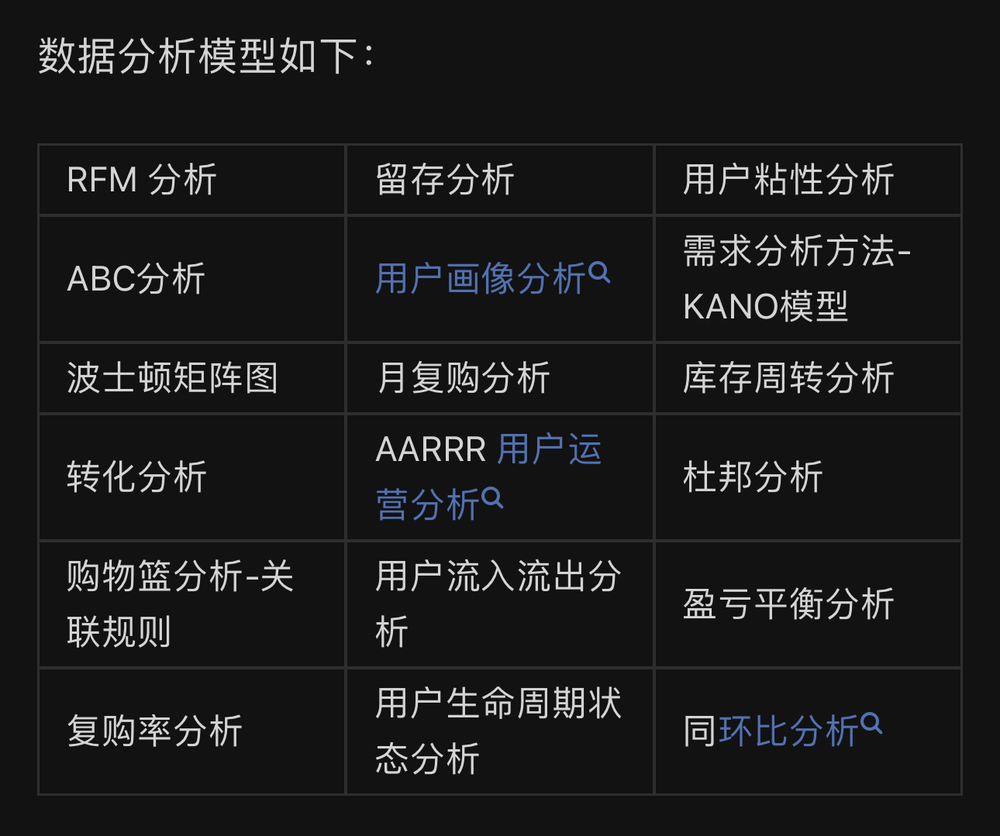
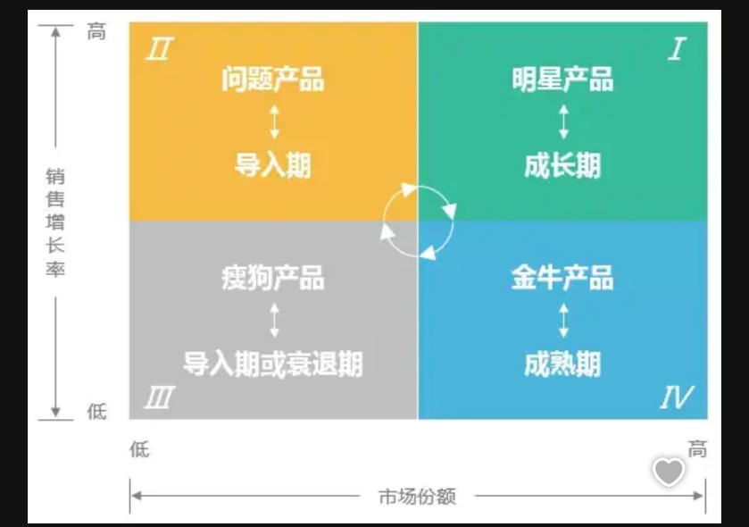

# Data Analysis Model

## 1. RMF模型(Recency, Frequency, Monetary)
recency: 最近一次消费时间\
frequency: 消费频率\
monetary: 消费金额\
\
RFM模型是一种用户行为分析模型，它通过一个用户的消费行为来描述该用户的价值状况。
该模型使用以上三个指标判断客户价值并对客户进行分类，以便制定相应的营销策略。

eg: 假设你是一家在线零售商，你想了解你的客户并制定更有效的市场营销策略。你已经收集了一些交易数据，包括客户的购买日期、购买次数和购买总金额。

**最近性 (Recency)**: 首先，你计算每个客户最后一次购买的日期。例如，客户A上次购买是在3个月前，客户B上次购买是在1个月前。

**频率 (Frequency)**: 接下来，你计算每个客户的购买频率，即在一段时间内购买的次数。例如，客户A在过去一年内购买了3次，客户B购买了5次。

**货币价值 (Monetary Value)**: 最后，你计算每个客户的购买总金额。例如，客户A的购买总金额是1000美元，客户B的购买总金额是1500美元。

现在，你有了每个客户的 RFM 数据，你可以将客户分成不同的组。例如：

高价值客户: 最近性高、频率高、货币价值高的客户。
重复购买客户: 频率高、货币价值中等的客户，但最近性可能较低。
潜在回流客户: 最近性较高，但频率和货币价值较低的客户。
流失客户: 最近性、频率和货币价值都较低的客户。
基于这些客户分组，你可以采取不同的市场营销策略。例如，你可以向高价值客户提供折扣或奖励，以鼓励他们继续购买。对于潜在回流客户，你可以发送特别的促销信息，以激励他们再次购买。这样，RFM 模型帮助你更好地理解和管理你的客户群体。

## 2. ABC分析
核心思想：少数类项目贡献大部分价值。\
主要目标是根据它们的价值和重要性，将物品分为三个主要类别：A、B 和 C 类。

A 类物品：这些物品通常具有高价值和高重要性。尽管它们在库存中的数量相对较少，但它们对组织来说至关重要。A 类物品的管理需要特别关注，以确保它们的供应和库存充足。

B 类物品：这类物品的价值和重要性介于 A 类和 C 类之间。它们通常具有适中的销售额或库存价值。对于 B 类物品，管理不需要像 A 类那样频繁，但仍需要定期关注。

C 类物品：C 类物品通常是库存中的大部分，但它们的价值和重要性相对较低。它们的销售额或库存价值相对较小，因此对于这些物品的管理可以更宽松。

ABC 分析帮助组织更好地了解和管理其库存。它使组织能够优化资源分配，确保重要物品的供应，并降低库存成本。这一方法在供应链和库存管理中起着关键作用，有助于提高效率和降低成本。

## 3. Boston Consulting Group Matrix
BCG 矩阵是一种经典的产品组合分析工具，它通过分析产品的市场占有率和市场增长率，将产品分为四个象限：明星、金牛、问题和瘦狗。

**明星 (Stars)**: 明星是市场增长率高且相对市场份额大的产品或业务线。这些产品通常需要大量投资来支持其增长，因为它们有潜力成为未来的现金奶牛。<u>管理者通常愿意在这些产品上投入资金</u>，以实现更大的市场份额。

**现金奶牛 (Cash Cows)**: 现金奶牛是市场份额大但市场增长率相对较低的产品或业务线。它们通常产生稳定的现金流，可以用于支持其他产品或业务线的发展。<u>管理者的目标是最大化现金奶牛的利润</u>，并将其用于其他领域的投资。

**问题儿童 (Question Marks)**: 问题儿童是市场增长率高，但市场份额相对较小的产品。它们具有潜力，但也需要大量的投资来实现市场份额的增长。<u>管理者需要决定是否继续支持这些产品以将其转化为明星，还是削减投资</u>。

**犬 (Dogs)**: 犬是市场增长率低且市场份额小的产品或业务线。它们通常不具备增长潜力，因此<u>管理者可能会考虑逐步减少投资，甚至退出市场</u>。

BCG 矩阵的目标是帮助组织了解其产品组合的现状，以便更明智地分配资源和制定战略决策。不同的产品或业务线需要不同的策略，根据其在矩阵中的位置来确定。

## 4.漏斗分析
漏斗分析是一种分析流程的方法，它将流程中的每个步骤视为漏斗中的一层。它可以帮助你了解流程中的每个步骤的转化率，以及哪些步骤需要改进。
用于了解和优化用户在网站、应用或其他平台上的行为，并衡量用户从一个阶段到另一个阶段的转化率。这种分析通常应用于数字营销、电子商务和用户体验优化等领域。

以下是转化分析的一些关键概念和步骤：

**定义转化目标**：首先，需要明确定义转化目标。这可以是用户注册、产品购买、点击广告等。不同业务和网站可能有不同的转化目标。

**创建转化漏斗**：转化漏斗是一系列步骤或事件，用户在其中从一个阶段转化到另一个阶段。例如，漏斗可以包括浏览产品页面、将产品添加到购物车、进行结账等步骤。

**数据收集**：收集与转化目标和漏斗相关的数据。这可能包括网站分析工具、用户跟踪和日志数据等。

**分析数据**：分析数据以了解用户在漏斗的不同阶段的行为。这涉及到查看转化率、跳出率、流失率以及可能影响用户转化的因素。

**优化**：基于分析的结果，制定策略和优化措施，以提高转化率。这可以包括改进页面设计、提供更好的用户体验、测试不同变体等。

**跟踪和监控**：定期跟踪和监控转化率，以确保优化措施的有效性，并根据实时数据做出调整。

转化分析有助于企业了解用户行为和需求，从而改进产品和服务，提高用户满意度，并增加收入。它是数字营销和在线业务的关键组成部分，可以帮助组织更好地实现其业务目标。

## 5.购物篮分析
购物篮分析是一种分析消费者购买行为的方法，它通过分析消费者购买的产品来识别产品之间的关联性。它可以帮助组织了解消费者的购买偏好，从而制定更有效的营销策略。
购物篮分析的关键概念包括：

**频繁项集（Frequent Itemset）**：频繁项集是指在一次或多次购物交易中一起出现的产品或服务的集合。这些集合出现的频率高于预定的阈值。

**关联规则（Association Rules）**：关联规则是指发现的频繁项集之间的关系。例如，如果在购物交易中频繁地发生了“购买咖啡”和“购买牛奶”的情况，那么可以建立一个关联规则，指出这两个产品之间可能存在关联。

_支持度（Support）_：支持度是指某个频繁项集在所有交易中出现的频率。支持度越高，表示该项集越常见。

_置信度（Confidence）_：置信度是指一个关联规则的可靠性。它表示在一个购买了某个产品的交易中，还会购买另一个产品的概率。高置信度表示规则更可信。

_提升度（Lift）_：提升度用于衡量两个产品之间的独立性。提升度大于1表示两个产品之间存在正相关关系，小于1表示负相关，等于1表示独立。

购物篮分析的应用包括制定交叉销售策略，推荐系统的改进，库存管理，广告定位以及促销活动的优化。通过了解顾客购物行为和关联规则，企业可以更好地满足顾客需求，并提高销售效益。

## 6.AARRR模型
AARRR 模型是一种分析用户行为的方法，它将用户的生命周期分为五个阶段：获取、激活、保留、推荐和收入。它可以帮助组织了解用户的行为和需求，从而制定更有效的营销策略。\
AARRR 模型的五个阶段是：

Acquisition（获取）：这是用户首次发现和访问产品或服务的阶段。在这个阶段，关注如何吸引潜在用户，例如通过广告、社交媒体、搜索引擎优化等手段来引导用户进入产品或服务。

Activation（激活）：一旦用户进入产品或服务，关键是如何激发他们的兴趣，使他们愿意继续使用。这可能包括引导用户完成注册、创建个人资料或进行初次互动。

Retention（留存）：在用户使用产品或服务后，关键是如何使他们留在产品中，并反复使用。留存阶段关注如何提供有价值的内容、功能和体验，以留住用户。

Revenue（收入）：一旦用户开始使用产品，重点转向如何实现收入。这可以通过不同的方式实现，如付费订阅、广告收入、交易手续费等。

Referral（推荐）：最后一个阶段是如何鼓励现有用户向其他人推荐产品或服务。这可以通过提供奖励、分享功能、口碑营销等方式来实现。

"AARRR" 模型有助于企业了解用户旅程中的各个关键阶段，从而制定策略和措施来优化每个阶段，提高用户的转化率和忠诚度。不同类型的产品或服务可能在不同阶段有不同的重点，因此可以根据具体情况进行调整和优化。这个模型在互联网市场营销和产品管理中具有广泛的应用。

## 7. 复购率分析
复购率分析是一种分析客户行为的方法，它通过分析客户的购买行为来识别复购率。它可以帮助组织了解客户的购买偏好，从而制定更有效的营销策略。

**复购率**：复购率是指在一段时间内购买多次的客户所占的比例。例如，如果在一年内购买了两次的客户有 100 人，而总客户数为 1000 人，则复购率为 10%。用于说明用户忠诚度，或说明商品的用户粘性

## 8. 留存分析
留存分析是一种用于衡量用户或客户在一段时间内保持使用产品或服务的能力的方法。这种分析通常用于互联网、移动应用、软件和订阅服务等领域，以帮助企业了解用户留存率，即在特定时间段后继续使用产品或服务的用户比例。留存率是一个重要的指标，因为它可以衡量用户的忠诚度和产品质量，也可以影响企业的盈利能力。

定义时间段：首先，您需要明确定义留存分析的时间段。通常，留存分析可以根据不同的时间段来进行，如日留存、周留存、月留存等。每个时间段都可以提供不同的见解。

计算留存率：根据您选择的时间段，计算在第一次使用后在特定时间段内继续使用产品或服务的用户比例。通常，留存率可以通过以下公式计算：

**_留存率_** = `（特定时间段内仍在使用的用户数 / 初始用户数） * 100`

留存分析有助于企业了解用户的满意度和忠诚度，从而制定战略来提高用户留存率，减少用户流失率。这对于维护现有用户、增加用户价值和提高盈利能力非常重要。留存分析还可以用来比较不同时间段和用户群体之间的表现，以便更好地了解用户行为和需求。

## 9. 用户画像分析
用户画像分析是一种分析用户行为的方法，它通过分析用户的特征和行为来识别用户画像。它可以帮助组织了解用户的行为和需求，从而制定更有效的营销策略。
主要思想为：**用户信息标签化**

通过对用户人口属性：年龄、性别、地域、职业、收入、教育程度，\
行为特征：活跃度、忠诚度等指标进行分析。\
从而创建用户画像，帮助企业了解用户的行为和需求，从而制定更有效的营销策略。

## 10. 用户流入流出分析
用户流入流出分析是一种用于理解用户行为的方法，特别是在网站、应用或在线平台上的用户增长和减少情况。这种分析有助于企业了解用户的获取渠道、留存率、流失原因以及用户转化情况，从而制定更有效的用户增长战略。

定义用户流入和流出：首先，需要明确定义什么被视为用户的流入和流出。用户的流入可以是指新用户的注册或首次访问，而用户的流出可以是指不再访问或注销的用户。

分析用户流入：分析新用户的流入情况，包括流入渠道、注册方式、首次访问来源等。这有助于了解用户是如何发现和加入平台的。

分析用户流出：分析用户的流出情况，包括流失率、流出原因、最后一次访问时间等。这有助于确定为什么用户选择离开平台。

留存率分析：计算留存率，即用户在不同时间段内的保留情况。留存率可以帮助了解用户的忠诚度和平台吸引力。

用户转化分析：分析用户的转化路径，即从流入到注册、从注册到活跃、从活跃到付费等转化过程。这有助于识别瓶颈和改进转化率。

## 11. 用户生命周期状态分析
对用户进行生命周期状态分析，来了解企业当前市场竞争力，并对不同类别客户实施不同营销动作。

例如用两个维度：最近一次登录距今时间、第一次登录距今时间，将用户分为四类：新用户、活跃用户、不活跃用户、一次性用户。

新用户：最近一次登录距今时间小于30天，第一次登录距今时间小于30天。近期内购买过。\
活跃用户：最近一次登录距今时间小于30天，第一次登录距今时间大于30天。近期仍有购买行为。\
不活跃用户：最近一次登录距今时间大于30天，第一次登录距今时间大于30天。近期不会再有购买行为。\
一次性用户：短时间内登录/购买商品，近期不在继续购买

## 12. 用户粘性分析
用户粘性分析是一种用于评估用户与产品、应用或服务的互动程度和频率的方法。它有助于了解用户对于特定产品或平台的忠诚度，以及他们是否愿意重复使用或保持与该产品的互动。用户粘性通常被视为用户参与和忠诚度的指标

定义互动指标：首先，需要明确定义用于评估用户粘性的互动指标。这可以包括用户登录频率、使用产品的时间、点击率、留存率、购买频率等。

计算互动指标：根据所选的互动指标，计算用户的互动频率和程度。这可以涵盖不同时间段的分析，例如每日、每周或每月。

用户分群：将用户分为不同的群体，根据其互动模式和频率。这有助于了解不同用户群体之间的差异。

分析用户粘性：分析用户的互动情况，包括互动频率、持续时间、深度等。这有助于评估用户的忠诚度和参与程度。

识别问题和机会：通过用户粘性分析，可以识别互动低的用户群体和互动高的用户群体。这有助于发现问题和机会，以改进产品或服务。

## 14. KANO模型
Kano模型是一种质量管理和产品开发方法，旨在帮助企业理解客户需求和期望，以更好地满足客户的期望并提高产品或服务的质量。

Kano模型将产品或服务的特性分为以下几个类别：

基本要素（Must-Be Quality）：这是产品或服务的基本要求，客户认为它们必须存在，但并不会特别感到满意。如果这些基本要素缺失或不满足，客户会非常不满意，但它们的存在不会引发额外的满意度。

性能要素（Performance Quality）：这些特性与满意度呈线性关系。客户对它们的期望越高，满意度也越高，但它们的缺失不会引发不满意度。

魅力要素（Attractive Quality）：这些是超出客户期望的特性，可以让客户感到惊喜和满意。它们通常不被客户提前期望，但一旦存在，可以显著提高满意度。

一维要素（One-Dimensional Quality）：这是介于性能和魅力之间的特性，它们的存在会提高满意度，但缺失会引发不满意度。

反向要素（Indifferent Quality）：这些特性对客户的满意度没有显著影响，客户对它们的有无基本不关心

## 15. 库存周转分析
库存周转分析是一种用于衡量公司库存管理效率的方法。它旨在帮助公司确定其库存的周转率，也就是库存项在特定时间段内被销售和替换的速度。高周转率通常被认为是库存管理效率的指标，因为它表明公司能够迅速卖出库存，减少滞留成本。

以下是进行库存周转分析的一般步骤：

计算平均库存：首先，计算在考察期间内的平均库存水平。这可以通过将期初库存和期末库存相加，然后除以2来得到。

计算销售成本：确定考察期间内销售的总成本。这通常包括直接成本（采购成本）和间接成本（如运输成本）。

计算库存周转率：使用以下公式计算库存周转率：`库存周转率 = 销售成本/平均库存`

分析结果：高库存周转率表明公司能够有效地管理库存，快速销售产品，减少库存成本。低库存周转率可能表明公司面临库存积压问题，需要采取措施来提高库存管理效率。

比较和改进：将库存周转率与行业标准或竞争对手进行比较，以确定公司在库存管理方面的相对表现。如果库存周转率较低，公司可能需要改进供应链、库存采购和销售策略，以提高效率。

库存周转分析有助于公司优化库存策略，降低库存成本，提高资金周转率，并确保产品的及时供应。这对于维持公司的财务健康和竞争力至关重要。

## 16. 杜邦分析
杜邦分析，也称为杜邦财务分析，是一种用于评估公司财务绩效的方法，它将公司的财务指标分解成不同的组成部分，以便更深入地了解其盈利能力和资产利用效率。这种分析方法通常使用杜邦方程式，也称为杜邦模型，以帮助投资者、分析师和管理者了解公司的经营情况。

杜邦方程式通常采用以下形式：` ROE=净利润率×资产周转率×杠杆比率`\
**ROE（Return on Equity）**：股东权益回报率，衡量股东权益的盈利能力。\
**净利润率**：表示公司每销售1美元产品或提供服务所获得的净利润。\
**资产周转率**：表示公司每美元总资产的销售额。\
**杠杆比率**：表示公司债务与股东权益的比例。

通过杜邦分析，可以深入了解公司的盈利模式。以下是一些杜邦分析的常见应用和示例：

- 盈利能力分析：通过分析净利润率，可以确定公司在销售过程中实现的净利润，进一步了解其盈利能力。

- 资产利用效率分析：资产周转率反映了公司如何有效地使用其资产来产生销售收入。高资产周转率可能表明公司在资产管理方面做得很好。

- 杠杆分析：杠杆比率揭示了公司的财务杠杆程度。高杠杆比率可能增加风险，但也可能增加回报。

- 综合分析：将这些组成部分组合在一起，通过ROE来评估公司整体的盈利和资产管理效率。

## 17. 同环比分析
同比：同比是指与上一年同一时间段相比较。通常为了消除季节变动的影响。\
`(本期数-去年同期数)/去年同期数*100%`

环比：环比是指与上一时间段相比较，通常是上一个月或上一个季度。\
`(本期数-上个周期数)/上个周期数*100%`