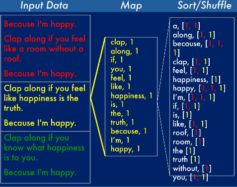
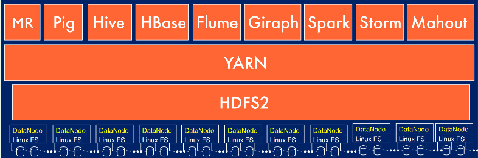
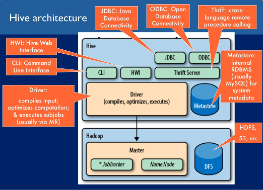

# <big>Distributed System Concepts</big>

学习路线：\
Hadoop---Hive---Spark---Flink\
其中Flink主要是实时处理，而Hadoop和spark等都是离线处理。

# 1. 分布式计算框架
## 0. Google File System(GFS)<big>
1. GFS（Google 文件系统）是谷歌（Google）公司开发的分布式文件系统，旨在支持大规模数据存储和处理。GFS 是一种高度可扩展、容错性强、适用于大规模数据的文件系统，它为谷歌的各种应用程序和服务提供了可靠的存储基础架构。

以下是 GFS 的一些关键特点和概念：
- 分布式文件系统： GFS 是一种分布式文件系统，它可以在多台服务器上存储和管理大量的数据。这使得它能够应对大规模数据存储和处理的需求。
- 容错性： GFS 具有强大的容错性能力。它通过在多个服务器上复制数据块，并监控数据块的状态，以便在发生故障时自动恢复数据。
- 高性能： GFS 被设计用于支持高吞吐量和低延迟的数据访问，以满足谷歌的搜索引擎和其他大型分布式应用程序的性能需求。
- 大文件支持： GFS 主要针对大型文件进行了优化，例如 Web 索引和日志文件。它能够有效地存储和管理多个文件，每个文件都可以具有非常大的大小。
- 简单的一致性模型： GFS 提供了一种简单的一致性模型，不强制实时一致性，而是提供了松散的一致性模型，这使得在大规模分布式环境中更容易实现高性能。
- 扩展性： GFS 被设计为可以轻松扩展，以适应不断增长的数据存储需求。它可以在不中断服务的情况下增加存储容量。

2. GFS的架构
GFS 由三个主要组件组成：主节点（Master Server）、块服务器（Chunk Server）和客户端（Client）。以下是 GFS 的基本架构：
- 主节点（Master Server）：主节点是 GFS 的中心组件，它负责管理整个文件系统。主节点维护文件系统的元数据，包括文件和块的名称、位置、副本等。主节点还负责监控块服务器的状态，并在块服务器发生故障时执行数据恢复。
- 块服务器（Chunk Server）：块服务器是存储数据块的服务器。它们负责存储和检索数据块，并向主节点报告数据块的状态。块服务器通常是普通的 Linux 服务器，它们通过本地文件系统存储数据块。
- 客户端（Client）：客户端是使用 GFS 的应用程序。它们可以通过主节点访问文件系统，并与块服务器直接通信以读取和写入数据块。

3. GFS的工作原理
GFS 的工作流程如下：
- 客户端向主节点请求文件系统操作，例如读取或写入文件。
- 主节点将文件系统操作转换为块操作，并将块操作发送到适当的块服务器。
- 块服务器执行块操作，并将结果返回给主节点。
- 主节点将结果返回给客户端。
- 客户端执行文件系统操作，并将结果返回给应用程序。
- 主节点还负责监控块服务器的状态，并在块服务器发生故障时执行数据恢复。

GFS 的设计和实现为分布式系统领域的发展提供了重要的经验和启示，它为后来的分布式文件系统如Hadoop HDFS、Amazon S3等奠定了基础。请注意，虽然 GFS 是由谷歌开发的，但它的概念和原理对于理解分布式文件系统的工作原理和挑战都非常有价值。

Apache HBase(on HDFS) 是收到BigTable(on GFS) 的启发而开发的。

## BigTable
1. BigTable是谷歌（Google）公司开发的分布式、可扩展的数据库系统，主要用于存储大量结构化数据。它支持高吞吐量和低延迟的数据读取和写入操作，非常适合用于大规模的数据分析和机器学习任务。
2. BigTable是NoSQL数据库，它使用键值对存储数据。

## Spanner
Spanner 是 Google 开发的一个**全球分布式数据库**，它结合了关系数据库的强一致性特性和非关系数据库的水平扩展能力。Spanner 的设计使其能够在全球范围内跨多个数据中心提供高性能、高可用性和强一致性的数据库服务。

Spanner 的主要特点包括：

- 全球分布式：Spanner 支持跨区域和跨数据中心的数据分布，能够在全球范围内提供服务。
- 强一致性：与许多分布式数据库只提供最终一致性不同，Spanner 提供外部一致性和跨行事务的强一致性。这意味着即使在全球分布式的环境中，Spanner 也能保证事务的原子性、一致性、隔离性和持久性（ACID）。
- SQL 查询：Spanner 支持标准的 SQL 查询语言，使得它对于习惯于使用传统关系数据库的开发者更加友好。
- 高可用性：通过数据的自动复制和分区，Spanner 能够提供高可用性和灾难恢复功能。
- 时间戳定序技术：Spanner 使用一种称为 TrueTime 的技术来处理分布式系统中的时间问题，确保事务的一致性和顺序。

## F1
F1 是谷歌（Google）公司开发的分布式关系数据库，用于存储谷歌的广告系统数据。F1 结合了关系数据库的强一致性特性和分布式数据库的水平扩展能力，能够在全球范围内跨多个数据中心提供高性能、高可用性和强一致性的数据库服务。

## 1. Hadoop
Hadoop的组成：HDFS(分布式文件系统)，YARN(资源调度框架)，MapReduce(分布式计算框架)

Hadoop的架构：中心和主从架构，主节点NameNode作为Master负责管理集群，从节点DataNode作为Slave负责存储数据和计算任务

- HDFS：Hadoop Distributed File System，分布式文件系统，用于存储大数据。本质上是一个文件系统，将一个大文件划分为小文件库存储在各个机器上(DataNode),
    通过NameNode管理各个DataNode，提供文件系统的访问接口。
  - NameNode：管理各个DataNode，提供文件系统的访问接口，是一个独立进程
  - DataNode：存储文件的数据块，是一个独立进程
  - SecondaryNameNode：辅助NameNode，定期将NameNode的元数据备份到本地磁盘，是一个独立进程
- YARN：Yet Another Resource Negotiator，资源调度框架，用于管理集群资源
- MapReduce：分布式计算框架，用于分布式计算
    - map: 将输入的数据切分为若干个小数据，然后将小数据分发到各个机器上进行计算
    - shuffle: 将map的输出结果按照key进行排序，然后将相同key的value进行合并
    - reduce: 将shuffle的结果进行合并，得到最终的结果
  

优点： 不用传输数据，每次计算只需要将对应任务(算法)分发到数据所在的服务器上进行计算，然后将结果返回即可。\
缺点： 由于每次计算时的结果都要写入本地磁盘，所以效率很低，而且只能进行批处理，不能进行实时计算。

下面是Hadoop生态圈以及各个组件的关系图：
- Pig: 一个用于批量数据处理的平台，它使用一种名为Pig Latin的高级编程语言编写，这些程序最终会被编译成可以由Hadoop执行的MapReduce程序序列。

- **_Hive_**: 一个数据仓库软件，允许在分布式存储上读写非常大的数据集，并通过一种类似SQL的语言（称为HQL）进行管理。

- YARN: 全称是Yet Another Resource Negotiator，它是一个集群资源管理和作业调度器，作为中间件层在HDFS（及其升级版HDFS2&3）和这里列出的其他各种应用之间提供服务。

- Mahout: Apache开发的一个可扩展的机器学习平台，它在Hadoop/Spark之上运行，提供了用于大数据集上进行聚类、分类和协同过滤等高速运算的工具。

- Hoya/**_HBase_**: Hoya是一个用于在YARN上运行HBase集群的工具。HBase是Hadoop的非关系型（NoSQL）分布式数据库，与Google的Bigtable相当。

- **_Storm_**: 由Twitter最初开发（现为Apache项目）的一个分布式实时流处理系统。Storm允许创建连续运行的事件驱动处理网络（有向无环图），与MapReduce的批处理方式相比，它能够实现实时处理。

- Giraph: 一个图数据库，运行MapReduce作业来处理图数据。Giraph被Facebook广泛用于处理社交网络数据，与Google的Pregel图处理系统相当。

- _**Spark**_: 一个高性能的分析引擎/框架，用于大规模数据处理，可以在YARN（及AWS EC2、Kubernetes等平台）上运行。它使用内存技术和执行计划优化来实现显著的速度提升，并且具有高容错性，因此比Mapreduce快得多。

## 2. Spark
1. Spark是一个分布式计算框架，可以进行批处理，也可以进行实时计算，而且效率比MapReduce高很多。
2. spark基于内存计算，提高了大数据处理的实时性，保证高容错性和高伸缩性。
3. spark的核心是RDD(弹性分布式数据集)，是一个抽象的数据集，可以对其进行各种操作，包括map，reduce，join等，这些操作都是在内存中进行的，所以效率很高。
4. spark的运行模式有两种：local模式和cluster模式
    - local模式：在本地运行，不需要启动集群
    - cluster模式：在集群上运行，需要启动集群
5. spark使用函数式编程，将数据集合转换成流(stream)，每个元素一次经过需要的函数，最后得到结果。时间复杂度为O(n)，空间复杂度为O(1)。\
相比面向对象的编程，函数式编程更加简洁，更加高效，更加容易实现并行计算。
6. 引入惰性计算机制，只有当需要输出结果时，才会进行计算，这样可以减少不必要的计算，提高效率。
7. _**spark streaming**_: Apache Spark生态系统的一个组件，用于处理**实时数据流**。它允许你从各种数据源（如Kafka、Flume、HDFS、Socket等）实时获取数据，并进行高吞吐量的处理和分析。Spark Streaming提供了一种微批处理的模型，它将实时数据切分成小的批次，然后对每个批次应用Spark的批处理引擎。
8. 流计算（Stream Processing）: 是一种用于处理实时数据流的计算模型，它允许数据在进入系统时立即进行处理和分析，而不需要等待数据存储在批处理或离线存储中。流计算通常用于实时监控、实时分析、实时决策和事件驱动应用程序中。

## 3. Flink
1. Flink是一个分布式流处理框架，采用真正的流处理模型。
2. Flink的核心是DataStream，是一个抽象的数据集，可以对其进行各种操作，包括map，reduce，join等，这些操作都是在内存中进行的，所以效率很高。
3. Flink可以与多个数据源集成，包括Kafka、HDFS、Kinesis等。

## 4. Kafka
Kafka 是一个分布式的流处理平台和**消息队列系统**，最初由LinkedIn开发，并作为Apache项目开源。
它被设计用于高吞吐量、可扩展性和容错性，用于处理和存储实时数据流，
通常用于日志收集、事件流处理、监控、报警和大规模数据流处理等场景

## 5.  _**Hive**_
Hive是一个基于Hadoop的数据仓库工具软件，可以将结构化的数据文件映射为一张数据库表，并提供简单的sql查询功能，可以将sql语句转换为MapReduce任务进行运行。

Hive的核心是将**sql**语句转换为MapReduce任务进行运行，所以效率很低，而且只能进行批处理，不能进行实时计算。

实际上hive本身可看作sql语义解析器(将sql转换成mapreduce),本身hive没有计算能力，只能借助外部框架如Map
Reduce、Spark等进行计算。

Hive架构图：\

## 6. Cascading
Cascading 是一个开源的数据处理框架，用于构建和执行复杂的数据处理管道。它是一个用 Java 编写的框架，旨在简化大规模数据处理任务的开发和执行。Cascading 提供了一种高级的抽象层，允许开发人员定义数据流和数据转换的逻辑，而无需深入关注底层的数据处理细节。

以下是 Cascading 的一些关键特点和用途：

数据流程定义：使用 Cascading，开发人员可以通过构建数据流程（也称为数据管道）来定义数据处理任务。这些数据流程由多个数据处理步骤组成，每个步骤执行特定的数据转换或计算。

基于 DAG（有向无环图）：Cascading 使用有向无环图（DAG）来表示数据流程，这有助于确保数据处理任务的正确顺序执行，并优化性能。

支持多种数据源和目标：Cascading 支持多种数据源和数据目标，包括本地文件、数据库、Hadoop HDFS（分布式文件系统）、Hive 等。这使得可以从不同来源获取数据，并将结果写入不同的目标。

易于集成：Cascading 可以轻松集成到现有的 Java 应用程序中，也可以与其他大数据工具和框架（如 Apache Hadoop、Apache Spark）一起使用。

构建复杂的数据处理逻辑：开发人员可以使用 Cascading 定义复杂的数据处理逻辑，包括数据筛选、变换、聚合等操作，以满足各种数据处理需求。

# 4. ETL技术
ETL（提取、转换、加载）是一种用于数据集成和数据处理的关键技术，通常用于将数据从一个数据源提取，进行必要的转换，然后加载到目标数据存储中。ETL技术在数据仓库、数据湖、数据集成、数据分析等领域起着重要的作用。以下是ETL技术的基本概念和步骤：

1. 提取（Extract）：\
提取是指<u>从一个或多个数据源中收集数据的过程</u>。数据源可以包括数据库、日志文件、API、外部数据服务等。
提取可以包括增量提取（只提取新数据）、全量提取（提取全部数据）或者按特定条件进行过滤。
提取的数据通常以原始格式提取，并暂存到一个临时存储区域。

2. 转换（Transform）：\
转换是指对提取的数据进行<u>清洗、处理和结构化</u>的过程，以满足目标数据存储的要求。
转换可以包括数据清理、数据格式转换、字段映射、计算衍生字段、数据合并、数据分割等操作。
数据转换通常需要编写转换规则和脚本，以确保数据的一致性和质量。

3. 加载（Load）：\
加载是<u>将经过提取和转换的数据加载到目标数据存储中的过程</u>。目标数据存储可以是数据仓库、数据湖、数据库、云存储等。
数据加载可以包括插入、更新、删除等操作，具体取决于目标存储的类型和需求。
数据加载需要考虑性能、容错性和数据完整性。

ETL技术的关键目标包括数据清洗、数据整合、数据质量保障和数据可用性。ETL流程通常由ETL工具或自定义脚本来执行，以自动化和简化数据处理任务。一些常见的ETL工具包括Apache Nifi、Talend、Informatica、Apache Spark等。

**常用ETL工具：** Kettle，DataX(阿里巴巴)，Sqoop(用于Hadoop和关系型数据库之间的数据传输)，Flume(用于Hadoop和非结构化数据之间的数据传输)

# 5. 数据仓库（Data Warehouse）
数据仓库是一个面向主题的、集成的、相对稳定的、反映历史变化的数据集合，用于支持管理决策。

离线数据仓库（Offline Data Warehouse）和实时数据仓库（Real-time Data Warehouse）是两种不同的数据仓库体系结构，用于存储和处理企业数据，但它们在数据处理和访问方面有一些显著的区别。

1. 离线数据仓库（Offline Data Warehouse）：\
离线数据仓库通常是基于批处理的，它处理已经存储在数据仓库中的数据。
数据处理是周期性的，通常按照每日、每周或每月的批次处理数据。
离线数据仓库主要用于历史数据分析、报表生成和决策支持。
数据在批处理过程中经过清洗、转换和加载（ETL），以满足分析和报告的需求。
离线数据仓库通常使用传统的数据仓库技术，如关系型数据库和OLAP（联机分析处理）。

2. 实时数据仓库（Real-time Data Warehouse）：\
实时数据仓库是基于流处理的，它可以在数据到达时立即处理数据。
数据处理是连续的，实时数据仓库可以即时响应新数据的到达。
实时数据仓库用于监控、实时分析、实时报告和决策支持。
数据处理通常以流处理或复杂事件处理（CEP）的方式进行，以实现低延迟和实时性。
实时数据仓库可能使用分布式流处理引擎，如Apache Kafka、Apache Flink、Apache Spark Streaming等，以处理数据流。

# 6. 大数据架构
大数据架构是指用于存储和处理大数据的软件系统架构，通常包括数据采集、数据存储、数据处理、数据分析和数据可视化等组件。

##### 1. lambda架构：
lambda架构是一种用于大数据处理的通用架构，它将批处理和流处理结合起来，以实现低延迟和高吞吐量的数据处理。
lambda架构通常包括三个层次：批处理层、速度层和服务层。
    - 批处理层：用于批量处理历史数据，通常使用Hadoop MapReduce、Apache Spark等技术。
    - 速度层：用于处理实时数据，通常使用Apache Storm、Apache Flink等技术。
lambda架构主要是离线数仓+实时数仓结合。

##### 2. kappa架构：

Kappa架构是一种简化的大数据架构，它专注于使用实时流处理来处理数据，而不需要维护两个独立的层。\
Kappa架构使用流处理引擎（如Apache Kafka和Flink）来处理实时数据流，然后将数据存储在持久化存储中（如Hadoop HDFS或云存储）以供查询和分析。\
Kappa架构的一个主要优势是它的简化性，因为它只使用了一个数据处理流程，而不需要维护复杂的批处理和速度处理逻辑。</big>