# <big>Hadoop and Hive</big>

# <big>PART 1: Hadoop</big>

# 1. HDFS
## 1. HDFS的部署(本地虚拟机)<big>
1. 首先，通过克隆得到的三个虚拟机node1，2，3，分别作为三个节点，其中node1作为主节点，node2，3作为从节点。\
主节点:内存为4gb，配置为NameNode，SecondaryNameNode， DataNode
从节点：内存为2gb，配置为DataNode

2. 上传Hadoop安装包到node1，
解压安装包到之前创建好的文件夹：`tar -zxvf hadoop-3.3.4.tar.gz -C /export/server/`\
cd到/export/server内构建软连接：`ln -s /export/server/hadoop-3.3.4 hadoop` 构建为hadoop方便使用\
cd到hadoop安装包内：`cd hadoop`\
查看hadoop文件的内容：


3. 修改配置文件/etc，应用自定义设置\
下述文件均存在于`$HADOOP_HOME/etc/hadoop`目录下
- workers: 从节点的ip地址
```
cd /export/server/hadoop/etc/hadoop
vim workers
# 填入以下内容
node1
node2
node3
```
- hadoop-env.sh: 配置环境变量
```
# 填入以下内容
export JAVA_HOME=/usr/lib/jvm/java-1.8.0-openjdk-1.8.0.292.b10-0.el7_9.x86_64--->由于设置过软连接，该命令可写为：
export JAVA_HOME=/export/server/jdk # 指明jdk环境位置

export HADOOP_HOME=/export/server/hadoop # 指明hadoop环境位置
export HADOOP_CONF_DIR=$HADOOP_HOME/etc/hadoop # 指明hadoop配置文件目录位置
export HADOOP_LOG_DIR=$HADOOP_HOME/logs # 指明hadoop运行日志文件目录位置
```
- core-site.xml: hadoop核心配置信息
```
<configuration>
    <property>
        <name>fs.defaultFS</name>
        <value>hdfs://node1:8020</value>
    </property>
    
    <property>
        <name>io.file.buffer.size</name>
        <value>131072</value>
    </property>
</configuration>
```
由于该文件是xml文件，需要设置kv对，其中name为key，value为value，\
上述配置中，fs.defaultFS指明了hdfs内部的地通讯址，表名DataNode和node1的通讯地址为8020，node1是NameNode所在机器\
该配置固定了node1必须启动NameNode进程。\
io.file.buffer.size指明了文件缓冲区大小。
- hdfs-site.xml: HDFS的核心配置信息
```
<configuration>
  <property>
    <name>dfs.datanode.data.dir.perm</name>
    <value>700</value>
  </property>
  <property>
    <name>dfs.namenode.name.dir</name>
    <value>/data/nn</value>
  </property>
  <property>
    <name>dfs.namenode.hosts</name>
    <value>node1,node2,node3</value>
  </property>
<property>
    <name>dfs.blocksize</name>
    <value>268435456</value>
  </property>
  <property>
    <name>dfs.namenode.handler.count</name>
    <value>100</value>
  </property>
  <property>
    <name>dfs.datanode.data.dir</name>
    <value>/data/dn</value>
  </property>
</configuration>
```


4. 准备数据的文件目录，创建文件夹


所以应该在node1节点创建文件夹：
```
mkdir -p /data/nn #表示nameNode的数据存储目录
mkdir /data/dn  #表示dataNode的数据存储目录
```
在node2，3节点创建文件夹：
```
mkdir -p /data/dn
```

5. 分发Hadoop到各个节点\
分发-在node1节点执行：
```
cd /export/server
# 注意：scp命令只能复制原文件到其他node，不可以复制软连接（看作快捷方式）
scp -r hadoop-3.3.4 node2:`pwd`/  #注意不是单引号！！！
scp -r hadoop-3.3.4 node3:`pwd`/

```
软连接-在node2执行:
```
ln -s /export/server/hadoop-3.3.4 hadoop
```
软连接：在node3执行:
```
ln -s /export/server/hadoop-3.3.4 hadoop
```

6. 配置环境变量：三台机器均执行
```
cd /export/server
vim /etc/profile
# 在文件末尾添加以下内容
export HADOOP_HOME=/export/server/hadoop
export PATH=$PATH:$HADOOP_HOME/bin:$HADOOP_HOME/sbin
# 保存退出，再生效环境变量
source /etc/profile
```

7. 授权Hadoop用户，以root身份在三个机器均执行
为了保证安全，不应该每次用root启动，而应该使用普通用户hadoop启动整个服务，因此需要授权hadoop用户
```
# chown表示修改文件的所有者，-R表示递归修改，语法：chown -R 用户名:用户组 文件名
chown -R hadoop:hadoop /data
chown -R hadoop:hadoop /export
```

8. 格式化整个文件系统
前期准备完成，现在对整个文件系统执行初始化

格式化namenode，在node1执行：
```
# 确保以hadoop用户执行
su - hadoop
# 格式化namenode
hadoop namenode -format
```

**启动hdfs集群**：
```
#启动
start-dfs.sh
#关闭
stop-dfs.sh
```
只需要在node1一键启动后，即可通过`jps`命令查看进程，发现node1有NameNode，DataNode和SecondaryNameNode，
node2，3均启动了DataNode进程，说明启动成功。

9. 验证HDFS集群，通过web页面查看
```
http://node1:9870
```
出现以下网页说明集群启动成功


</big>

## 2. HDFS的部署(云服务器)<big>
在云服务器的上部署HDFS与本地相同，只是需要用finalshell连接到所购买的云服务器，然后在finalshell上执行同样的配置：\
- 在node1上传解压hadoop安装包
- 在node1构建软连接
- 在node1修改配置文件：workers，hadoop-env.sh，core-site.xml，hdfs-site.xml
- 在node1创建文件夹：/data/nn，/data/dn；在node2，3创建文件夹：/data/dn
- 在node1分发hadoop到node2，3，并在node2，3构建软连接
- 在node1，2，3配置环境变量
- 在node1，2，3授权hadoop用户
- 在node1格式化namenode
- 在node1启动hdfs集群

完成上述配置，即可启动HDFS云服务器集群，可通过相应云服务器官网查找自己的云服务器的ip地址，
使用**public id**然后通过web页面查看该ip地址，验证集群是否启动成功。

ps：云服务器如何保存服务器状态？\
1. 通过云服务器官方提供的快照功能，可能收费
2. 通过打包已配置好的hadoop安装包来保存该状态，即打包此时node1上的hadoop文件：
`tar -zcvf hadoop-ok.tar.gz hadoop-3.3.4`\ 
该命令表示将已经配置好的hadoop-3.3.4文件压缩未hadoop-ok文件进行保存，当出现意外时直接解压该文件，重新配置主机名映射即可完成hadoop的部署</big>

### AWS EMR
AWS EMR是亚马逊云上的Hadoop集群，可以直接使用，不需要自己配置，但是需要收费。
下面是配置EMR的步骤：（可以看lsde-workshop-wk9）
1. 登录AWS，选择EMR服务
2. 创建集群create cluster
3. 选择软件配置，选择Hadoop，Hive，Spark，Pig，Hue，HBase，ZooKeeper，Ganglia，Zeppelin
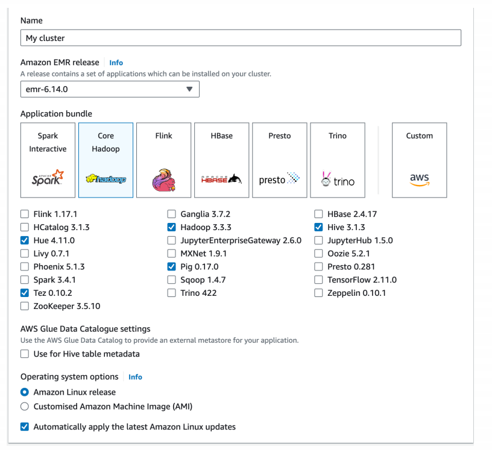
4. 选择硬件配置，选择实例类型，实例数量，实例配置
5. 设置key pair，用于ssh连接
6. 集群配置：配置primary instance和core instance

主节点（Primary instances）：\
主节点负责协调集群的运行，管理 Hadoop 服务和分布式数据处理任务。
它运行软件组件，例如 YARN 的资源管理器，以及 Hadoop 的 NameNode 和 JobTracker 服务。
主节点也运行 Web 接口，如 Hadoop 的 ResourceManager 和 NameNode 的 Web UI，让您可以查看集群的状态和性能。
在一个小型或测试环境中，主节点也可以充当核心和任务节点的角色，但在生产环境中通常不这样做，以确保稳定性。

核心节点（Core instances）：\
核心节点存储 Hadoop 文件系统（HDFS）上的数据，并处理数据计算任务。
它们运行数据节点服务，存储数据并允许数据在集群内部移动。
核心节点对于集群的数据持久性和稳定性至关重要，因为它们负责维护和处理存储在 HDFS 上的数据。
任务节点（Task instances）（虽然在您的截图中未提到，但通常与核心节点一起讨论）：

在配置 EMR 集群时，主节点始终只有一个，而核心节点和任务节点可以有多个，
具体数量取决于您的计算和存储需求。通常建议使用多个核心节点以提高数据的冗余和可靠性。
如果勾选了“Use multiple primary nodes”选项，EMR 将配置多个主节点以增加集群的可用性，
但这通常用于更高级的配置和具有特定可用性需求的应用场景。

完成cluster的创建后，可以得到一个包含指定个node的cluster，每个node都为EC2实例，
可以通过ec2页面查看。

eg：下面是一个用EMR集群运行wordcount的例子：
首先在根目录创建一个文件夹，将下载好的txt文件（即需要进行wordcount的内容）放入；\
然后将该文件夹通过`hdfs dfs -put`命令上传到hdfs的指定目录下；\
然后在主节点运行mapper.py和reducer.py文件，将结果输出到hdfs的指定目录下；\
```
# 注意：下面所有code应该写在同一行内
hadoop jar /export/server/hadoop-3.3.4/share/hadoop/tools/sources/hadoop-streaming-3.3.4-sources.jar 
-files mapper.py,reducer.py 
-mapper mapper.py 
-reducer reducer.py 
-input books-input 
-output books-output
```
- hadoop jar ...表示启动流式处理的jar包；可以用find先找到该jar包的位置
- -files 该参数表示告诉hadoop执行任务时需要用到的文件
- -mapper和-reducer指定了map和reduce阶段各自的执行文件
- -input和-output指定了输入和输出的文件夹

下面时mapreduce过程：


执行完上述命令后，可以在hdfs的指定目录下查看结果文件：

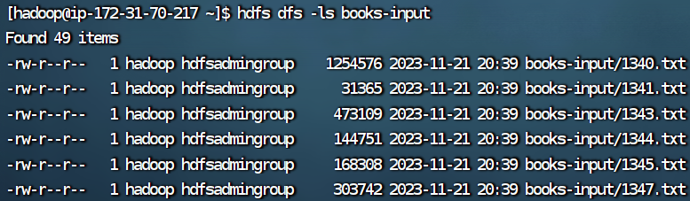
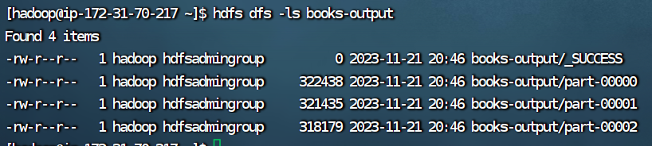

books-output为结果文件，part-00000为结果文件的内容，此时该文件仍在hdfs上，需要下载到本地查看结果：
```
hdfs dfs -get books-output
``` 
该命令将hdfs上的books-output文件夹下载到本地（当前文件夹），此时可以在本地查看结果文件：


## 3. HDFS基本操作
### 1. HDFS集群启停操作<big>
一键启动/关闭只用在node1就可以启动/关闭所有集群\
root用户无法启动，需要切换到hadoop用户，然后执行以下命令：
- 一键启动：`$HADOOP_HOME/sbin/start-dfs.sh`
- 一键关闭：`$HADOOP_HOME/sbin/stop-dfs.sh`

单进程启停:单独控制所在机器的进程启停（由于之前环境变量配置过path，将下面的文件夹加入了path，所以在任何目录都可以直接启动这些进程）
- $HADOOP_HOME/sbin/hadoop-daemon.sh
- 用法：`hadoop-daemon.sh start|status|stop namenode|secondarynamenode|datanode` 
- $HADOOP_HOME/bin/hdfs
- 用法：`hdfs --daemon start|stop|status namenode|secondarynamenode|datanode`

### 2. HDFS文件系统
#### 1.HDFS文件系统构成
同Linux一样，HDFS文件系统也以‘/’作为根目录的组织形式存在；有时需要区分linux和hdfs文件路径：

查看hdfs文件系统的**根目录**：`hdfs dfs -ls /`

HDFS的命令行接口不提供类似于 Unix/Linux 中的 cd（更改当前目录）命令。
在 HDFS 中，您不能更改“当前工作目录”，因为每个操作都需要使用绝对路径或相对于您的 HDFS 根目录的路径来指定文件或目录的位置。


#### 2. HDFS文件系统操作
Hadoop提供了两套命令体系：
- `hadoop fs [operations]`
- `hdfs dfs [operations]`
两者都可用，hdfs为新版命令，operations为需要进行的操作，于linux的相关操作类似。

下面为具体命令，只需要加上前缀(hadoop fs/hdfs dfs)即可使用\
- `-mkdir [-p] <path>`:创建文件夹
- `-ls [-R/-h] [<path>...]`:查看指定目录下的内容
  - -h表示以人类可读的方式显示文件大小
  - -R表示递归显示子目录下的内容
- `-put [-f] [-p]  <localsrc> ... <dst>`:上传文件到HDFS
  - -f表示强制覆盖
  - -p表示保留文件的权限,所有权和时间戳
  - eg：`hdfs dfs -put -f words.txt /itcast`
  - eg：`hdfs dfs -put -f file:///etc/profile hdfs://node1:8020/itcast`
- `-cat <src> ...`:查看文件内容;
  - eg：`hdfs dfs -cat /itcast/words.txt`
  - 读取大文件可以配合管道符：`hdfs dfs -cat /itcast/words.txt | more`
- `-get [-p] [-f] [-ignorecrc] [-crc] <src> ... <localdst>`:下载文件到本地
  - -p表示保留文件的权限,所有权和时间戳
  - -f表示强制覆盖
  - -ignorecrc表示忽略crc校验
  - -crc表示生成crc校验文件
  - 默认下载路径为：linux系统的当前目录
  - eg：`hdfs dfs -get -f /test.txt .` '.' 表示linux系统的当前目录
- `-cp [-f]  <src> ... <dst>`:拷贝hdfs文件
  - -f表示强制覆盖
    - eg：`hdfs dfs -cp -f /itcast/words.txt /itcast/words2.txt`
- `-appendToFile <localsrc> ... <dst>`:追加数据到hdfs文件，将所有给定本地文件的内容追加到给定dst文件。 dst如果文件不存在，将创建该文件
  - eg：`hdfs dfs -appendToFile 2.txt 3.txt /1.txt`

注意：hdfs文件系统无法直接修改文件内容，只能通过追加的方式修改文件内容，或者删除文件后从Linux本地上传新文件\
这是因为hdfs文件系统的特性，hdfs文件系统是一个分布式文件系统，文件被分成多个块，
每个块被复制到多个节点上，每个块的大小默认为128M，
这样的特性决定了hdfs文件系统无法直接修改文件内容，只能通过追加的方式修改文件内容，
或者删除文件后从Linux本地上传新文件。

- `-mv <src> ... <dst>`:移动文件，可以用来重命名文件
  - eg：`hdfs dfs -mv /itcast/words.txt /itcast/words2.txt`
- `-rm [-f] [-r] [-skipTrash] <src> ...`:删除文件
  - -f表示强制删除
  - -r表示递归删除
  - -skipTrash表示跳过回收站
  - eg：`hdfs dfs -rm -r /test111`

**ps**:回收站功能默认关闭，如果要开启需要在core-site.xml内配置：
```
<property>
<name>fs.trash.interval</name>
<value>1440</value>
</property>
 
<property>
<name>fs.trash.checkpoint.interval</name>
<value>120</value>
</property>
```
无需重启集群，在哪个机器配置的，在哪个机器执行命令就生效。
回收站默认位置在：/user/用户名(hadoop)/.Trash

还可以通过web页面查看文件系统\
但是在网页是以匿名用户进行访问，没有任何权限，只能简单浏览文件系统，无法进行任何操作。</big>


#### 4. HDFS文件系统权限
HDFS文件系统于linux类似都存在superuser，linux的是root，而hdfs系统是：启动namenode的用户（我的练习中是hadoop用户）


```
#修改文件用户和组：
hdfs dfs chown [-R] [OWNER][:[GROUP]] PATH

#修改文件权限：(777表示权限模式)
hdfs dfs chmod [-R] 777 /xxx.txt
```

#### *5. 使用pycharm插件Big Data Tools连接HDFS
1. 在pycharm中安装Big Data Tools插件
2. 配置Windows环境变量：HADOOP_HOME，PATH
3. 使用Big Data Tools连接HDFS，可以选取用url或者hadoop配置文件连接

连接好后可以使用该插件进行文件的上传下载等操作，也可以直接在pycharm中进行代码的编写，运行等操作。\
在 PyCharm 中使用 Big Data Tools 插件查看 HDFS 上的 Python 文件时，通常不能直接在 PyCharm 中运行这些文件，因为它们位于远程的 Hadoop 分布式文件系统上。\
PyCharm 主要是作为本地开发环境使用，而 HDFS 是为存储和处理大量分布式数据而设计的系统。\
要运行存储在 HDFS 上的 Python 脚本，你通常需要使用 Hadoop 生态系统中的其他工具，\
例如 Apache Spark 或 Apache Hadoop Streaming。\
这些工具允许你在 Hadoop 集群上执行 Python 代码， 处理存储在 HDFS 上的数据。

#### 6. HDFS文件储存原理

HDFS文件系统是一个分布式文件系统，文件被分成多个块，每个块被复制到多个节点上，
每个块的大小默认为128M，这样的特性决定了hdfs文件系统无法直接修改文件内容，
只能通过追加的方式修改文件内容，或者删除文件后从Linux本地上传新文件。

通过多个副本的方式保证了数据的安全性，每个副本都复制到不同的节点上，当某个节点出现故障时，
可以从其他节点上获取数据，保证了数据的可靠性。

1. 副本块数量配置\
可以在hdfs-site.xml中配置如下属性,value为副本块数量\
如果需要自定义这个属性，请修改每一台服务器的hdfs-site.xml文件，并设置此属性
```
<property>
  <name>dfs.replication</name>
  <value>3</value>
</property>
```

- 除了配置文件外，我们还可以在上传文件的时候，临时决定被上传文件以多少个副本存储。\
`hadoop fs -D dfs.replication=2 -put test.txt /tmp/`\
使用-put命令时添加参数dfs.replication，就可以在上传文件的时候，临时设置其副本数为2

- 对于已经存在HDFS的文件，修改dfs.replication属性不会生效，如果要修改已存在文件可以通过命令\
`hadoop fs -setrep [-R] 2 path`\
如上命令，指定path的内容将会被修改为2个副本存储。\
-R选项可选，使用-R表示对子目录也生效。

2. fsck命令\
fsck命令用于检查HDFS文件系统的状态，包括文件的副本数量，文件块的大小等信息。
```
hdfs fsck path [-files [-blocks [-locations]]]

# fsck可以检查指定路径是否正常
-files可以列出路径内的文件状态
-files -blocks  输出文件块报告（有几个块，多少副本）
-files -blocks -locations 输出每一个block的详情

eg: hdfs fsck /itcast/words.txt -files -blocks -locations
该命令表示检查/itcast/words.txt文件的状态，同时列出文件的块报告和每一个块的详情
```

3. 块大小的配置\
块大小的配置在hdfs-site.xml中，value为块大小，单位为字节\
如果需要自定义这个属性，请修改每一台服务器的hdfs-site.xml文件，并设置此属性
```
<property>
  <name>dfs.blocksize</name>
  <value>268435456</value>
</property>
```
上面配置块大小为256M，如果要修改已存在文件的块大小，可以通过命令：
```
hadoop fs -D dfs.blocksize=134217728 -put test.txt /tmp/
```

4. NameNode对块的管理\
- NameNode基于edits log和fsimage两个文件来管理块的信息，edits log文件记录了NameNode的所有操作，
而fsimage文件记录了NameNode的元数据信息，包括文件的副本数量，文件的块大小等信息。
- 存在多个edits文件保证不会有某个edits文件过大，导致读取效率低下。\
将全部edits文件合并成，即可得到一个fsimage文件。

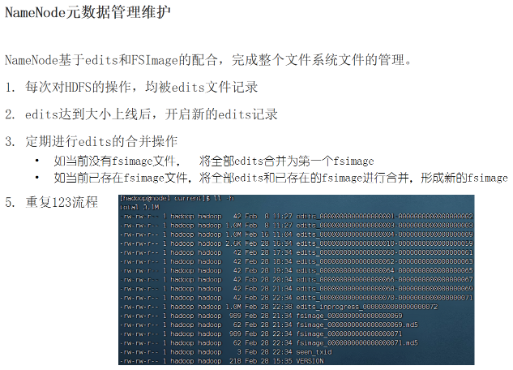

对于元数据的合并，是一个定时过程，基于：
- dfs.namenode.checkpoint.period，默认3600（秒）即1小时
- dfs.namenode.checkpoint.txns，默认1000000，即100W次事务

只要有一个达到条件就执行。\
检查是否达到条件，默认60秒检查一次，基于：
- dfs.namenode.checkpoint.check.period，默认60（秒）

5. SecondaryNameNode的作用\
SecondaryNameNode会通过http从NameNode拉取数据（edits和fsimage）
然后合并完成后提供给NameNode使用。

### 3. HDFS文件系统的读写原理
#### 1. 数据写入

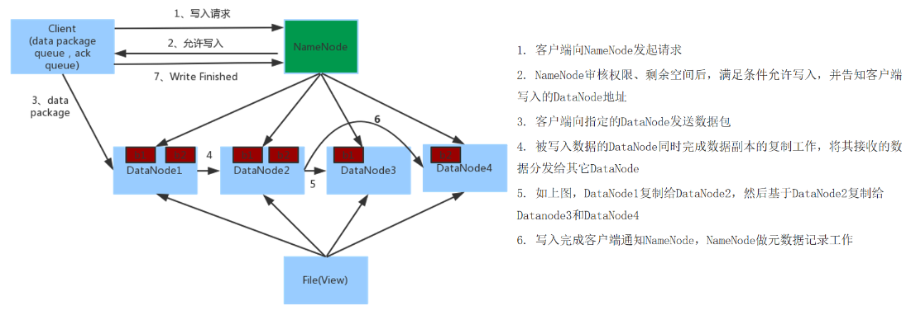

- **NameNode不负责数据写入**，只负责元数据记录和权限审批
- 客户端直接向**1台DataNode**写数据，这个DataNode一般是离客户端最近（网络距离）的那一个
- 数据块副本的复制工作，由DataNode之间自行完成（构建一个PipLine，按顺序复制分发，如图1给2, 2给3和4）

#### 2. 数据读取

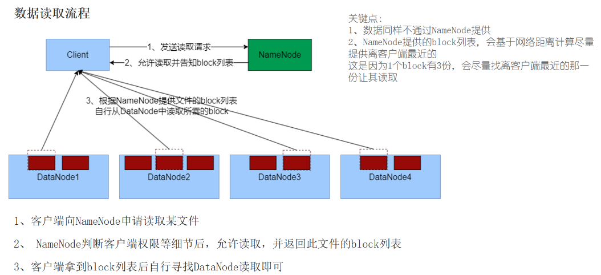

总结：不论读写，NameNode都不参与，只负责元数据记录和权限审批。\
对于读写流程，简单概括为：
- NameNode做授权判断（是否能写、是否能读）
- 客户端直连DataNode进行写入（由DataNode自己完成副本复制）、客户端直连DataNode进行block读取
  - 写入，客户端会被分配找离自己最近的DataNode写数据
  - 读取，客户端拿到的block列表，会是网络距离最近的一份

# 2. Yarn
## 1. Yarn的作用
Yarn是一个资源调度平台，用于管理集群中的资源，为用户提交的应用程序分配资源。
当上传map task和reduce task时，yarn会根据资源情况，为map task和reduce task分配资源。

一般情况都需要Yarn才可以执行mapreduce任务。除非是本地模式，即仅在一个服务器上执行mapreduce任务。

## 2. Yarn的架构
### 1. 核心架构-ReourceManager+NodeManager
1. 与HDFS类似，Yarn也使用master/slave架构，由一个master节点和多个slave节点组成。
- master节点：ResourceManager，负责资源的调度和分配
- slave节点：NodeManager，负责资源的管理和监控

2. Yarn容器
Yarn中的资源分配和调度都是基于容器（container）的，每个容器都有自己的内存和CPU资源，每个容器都是一个进程。

由NodeManger先占用一定资源，再将这部分资源提供给程序运行，程序运行结束后，释放资源。

### 2. 辅助架构-ProxysServer+JobHistoryServer
1. Web ProxysServer
- 用于代理ResourceManager和NodeManager的web页面，使得用户可以通过web页面访问Yarn集群
- 通过web页面可以查看集群的资源使用情况，任务运行情况等
- 通过web代理服务器可以减少被网络攻击的风险

2. JobHistoryServer
- 用于存储任务运行的历史信息，提供Web UI界面，可查看程序日志
- 保存历史数据，随时查看历史运行程序信息

## 3. MapReduce & Yarn的部署
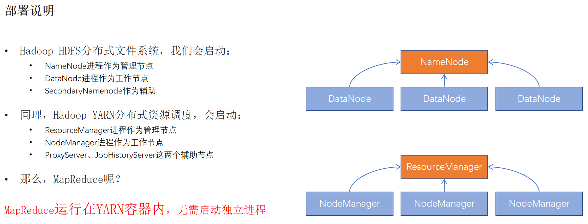
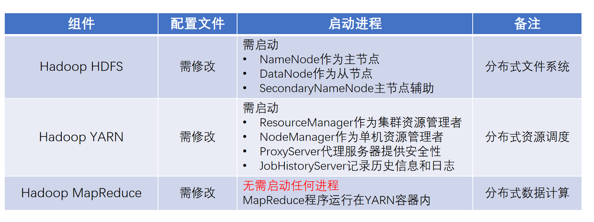

<big>集群规划如下(3台机器)：
- node1：ResourceManager，NodeManager, JobHistoryServer，Web ProxysServer
- node2：NodeManager
- node3：NodeManager

### 1. MapReduce的配置
在`$HADOOP_HOME/etc/hadoop`目录下，修改配置文件：

1.mapred-env.sh
```
#设置jdk路径
export JAVA_HOME=/export/server/jdk

#设置JobHistoryServer的进程内存为1G
export HADOOP_JOB_HISTORYSERVER_HEAPSIZE=1024

#设置日志级别为INFO，表示只用info或者更高级别的日志信息会被记录；
#如果设置为DEBUG，则会记录所有级别的日志信息，包括DEBUG、INFO、WARN、ERROR、FATAL
#RFA是输出方式，通常代表 RollingFileAppender，意
#味着日志将被输出到文件中，并且文件可以在达到特定大小后滚动。
export HADOOP_ROOT_LOGGER=INFO,RFA
```

2.mapred-site.xml
```xml
<configuration>
<property>
    <name>mapreduce.framework.name</name>
    <value>yarn</value>
    <description></description>
  </property>

  <property>
    <name>mapreduce.jobhistory.address</name>
    <value>node1:10020</value>
    <description></description>
  </property>


  <property>
    <name>mapreduce.jobhistory.webapp.address</name>
    <value>node1:19888</value>
    <description></description>
  </property>


  <property>
    <name>mapreduce.jobhistory.intermediate-done-dir</name>
    <value>/data/mr-history/tmp</value>
    <description></description>
  </property>


  <property>
    <name>mapreduce.jobhistory.done-dir</name>
    <value>/data/mr-history/done</value>
    <description></description>
  </property>
<property>
  <name>yarn.app.mapreduce.am.env</name>
  <value>HADOOP_MAPRED_HOME=$HADOOP_HOME</value>
</property>
<property>
  <name>mapreduce.map.env</name>
  <value>HADOOP_MAPRED_HOME=$HADOOP_HOME</value>
</property>
<property>
  <name>mapreduce.reduce.env</name>
  <value>HADOOP_MAPRED_HOME=$HADOOP_HOME</value>
</property>
  
</configuration>
```

### 2. Yarn的配置
1.yarn-env.sh
```shell
#设置jdk路径
export JAVA_HOME=/export/server/jdk
#设置HADOOP_HOME的环境变量
export HADOOP_HOME=/export/server/hadoop
#设置HADOOP_CONF_DIR的环境变量
export HADOOP_CONF_DIR=$HADOOP_HOME/etc/hadoop
#设置日志文件的环境变量
export HADOOP_LOG_DIR=$HADOOP_HOME/logs
```

2.yarn-site.xml
```xml
<configuration>

<!-- Site specific YARN configuration properties -->
<property>
    <name>yarn.log.server.url</name>
    <value>http://node1:19888/jobhistory/logs</value>
    <description></description>
</property>

  <property>
    <name>yarn.web-proxy.address</name>
    <value>node1:8089</value>
    <description>proxy server hostname and port</description>
  </property>


  <property>
    <name>yarn.log-aggregation-enable</name>
    <value>true</value>
    <description>Configuration to enable or disable log aggregation</description>
  </property>

  <property>
    <name>yarn.nodemanager.remote-app-log-dir</name>
    <value>/tmp/logs</value>
    <description>Configuration to enable or disable log aggregation</description>
  </property>


<!-- Site specific YARN configuration properties -->
  <property>
    <name>yarn.resourcemanager.hostname</name>
    <value>node1</value>
    <description></description>
  </property>

  <property>
    <name>yarn.resourcemanager.scheduler.class</name>
    <value>org.apache.hadoop.yarn.server.resourcemanager.scheduler.fair.FairScheduler</value>
    <description></description>
  </property>

  <property>
    <name>yarn.nodemanager.local-dirs</name>
    <value>/data/nm-local</value>
    <description>Comma-separated list of paths on the local filesystem where intermediate data is written.</description>
  </property>


  <property>
    <name>yarn.nodemanager.log-dirs</name>
    <value>/data/nm-log</value>
    <description>Comma-separated list of paths on the local filesystem where logs are written.</description>
  </property>


  <property>
    <name>yarn.nodemanager.log.retain-seconds</name>
    <value>10800</value>
    <description>Default time (in seconds) to retain log files on the NodeManager Only applicable if log-aggregation is disabled.</description>
  </property>


  <property>
    <name>yarn.nodemanager.aux-services</name>
    <value>mapreduce_shuffle</value>
    <description>Shuffle service that needs to be set for Map Reduce applications.</description>
  </property>
</configuration>
```

在设置好配置文件后，需要分发到其他节点：
```shell
#在node1上执行
scp mapred-env.sh mapred-site.xml yarn-env.sh yarn-site.xml node2:/export/server/hadoop/etc/hadoop
scp mapred-env.sh mapred-site.xml yarn-env.sh yarn-site.xml node3:/export/server/hadoop/etc/hadoop

#或者使用当前目录`pwd`/作为目标路径
#需要保证此时在node1的/export/server/hadoop/etc/hadoop目录下
scp mapred-env.sh mapred-site.xml yarn-env.sh yarn-site.xml node2:`pwd`/
scp mapred-env.sh mapred-site.xml yarn-env.sh yarn-site.xml node3:`pwd`/
```
## 4. Yarn的启动

```shell
#一键启动/关闭yarn集群
start/stop-yarn.sh 
#控制单独节点某个进程启动/关闭
yarn --daemon start|stop resourcemanager|nodemanager|proxyserver


#控制单独节点JobHistoryServer进程启动/关闭
--daemon start/stop historyserver
```
查看Web UI界面：
- ResourceManager：http://node1:8088

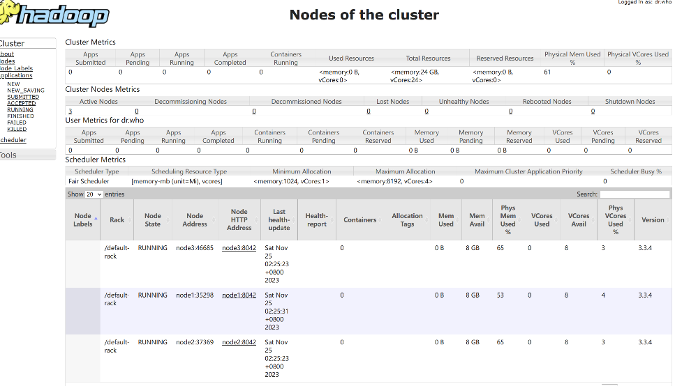

## 5. 提交MapReduce任务到Yarn运行
Yarn本身作为资源调度框架，不负责任务的运行，但会提供资源供许多程序运行，如：\
MapReduce、Spark、Hive、HBase等，这些程序都可以运行在Yarn上。

### MapReduce示例程序
Hadoop官方内置了一些预设的MapReduce任务，可以直接使用，\
如：wordcount(单词计数)、grep(查找)、sort(排序),pi(蒙特卡洛法圆周率计算)等。\
这些内置的示例MapReduce代码程序位于`$HADOOP_HOME/share/hadoop/mapreduce/hadoop-mapreduce-examples-3.3.4.jar`\

可以通过`hadoop jar`命令提交MapReduce任务，命令格式如下：
```shell
hadoop jar jar包路径 [main类] [参数]
```
#### wordcount 示例
功能：给定数据输入路径（HDFS路径），给定结果输出路径（HDFS路径），\
统计输入路径下所有文件中的单词出现次数，将结果输出到输出路径下。

可以使用之前的books-input文件夹作为输入路径，将结果输出到books-output2文件夹下：
```shell
hadoop jar $HADOOP_HOME/share/hadoop/mapreduce/hadoop-mapreduce-examples-3.3.4.jar \
wordcount hdfs://node1:8020/wordcount/books-input hdfs://node1:8020/wordcount/books-output2
```
- 参数1：`wordcount` 表示使用内置的wordcount程序
- 参数2：`hdfs://node1:8020/wordcount/books-input` 表示输入路径
- 参数3：`hdfs://node1:8020/wordcount/books-output2` 表示输出路径，必须保证输出文件夹原本是不存在的

执行完上述命令后，可以在Web UI界面查看任务运行情况.


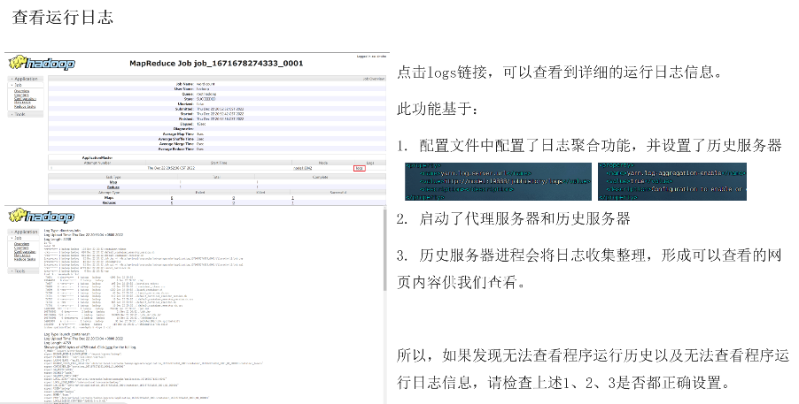

#### PI 示例
功能：给定一个参数N，N为圆内随机点的个数，计算圆周率的近似值。

Monte Carlo方法：\
假设有一个半径为1的圆，以及一个边长为2的正方形，正方形的中心与圆的中心重合，\
则正方形的四个顶点分别为(1,1)、(1,-1)、(-1,1)、(-1,-1)。\
在正方形内部随机产生N个点，落在圆内的点的个数为M，则有：\
pi*1^2/2*2=M/N，即`pi=4*M/N`，这样就可以通过随机点的个数来近似计算圆周率。

下面是一个python实现的蒙特卡洛法计算圆周率的程序：
```python
import random
import sys
from operator import add

def inside(p):
    x, y = random.random(), random.random()
    return x*x + y*y < 1
```


```shell
hadoop jar $HADOOP_HOME/share/hadoop/mapreduce/hadoop-mapreduce-examples-3.3.4.jar pi 10 1000
```
- 参数1：`pi` 表示使用内置的pi程序
- 参数2：`10` 表示设置几个map task
- 参数3：`1000` 表示随机点的个数

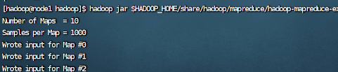


## MapReduce实例演示
### 项目实例1：wordcount
step 1:准备需要count的txt文件数据，这里使用从一个网站直接下载。\
在node1：`/export/server/wordcount`下创建books-input文件夹，vim创建download_books.sh文件，写入以下内容：
```
#!/bin/bash
# 下载数据
for i in {1000..1100}
do
    wget 'http://www.gutenberg.org/files/$i/$i-0.txt'
done
```
使用chmod命令使该文件可执行\
在books-input文件夹下执行`./download_books.sh`，下载数据

step 2: 编写mapper.py和reducer.py文件：
```
# mapper.py
#!/usr/bin/env python
import sys
import string
for line in sys.stdin:
  line = line.strip()
  words = line.split()
  for w in words:
    table = w.maketrans('', '', string.punctuation)
    w = w.translate(table).lower()
    print(w, '\t', 1)
```
```
# reducer.py
#!/usr/bin/env python3
from collections import defaultdict
import sys
word_count = defaultdict(int)
for line in sys.stdin:
  try:
    line = line.strip()
    word_then_count = line.split()
    word_count[word_then_count[0]] += int(word_then_count[1])
  except:
    continue
for word, count in word_count.items():
  print(word, count)
```
同样需要使用chmod命令使这两个文件可执行\
可以通过下面命令查看mapper是否正常运行：
```
printf 'I love Hadoop\n Do you love Hadoop?' | ./mapper.py
```
可以通过下面命令查看reducer是否正常运行：
```
printf 'I love Hadoop\n Do you love Hadoop?' | ./mapper.py | sort -k1,1 | ./reducer.py
```


step 3: 将books-input文件夹上传到hdfs的指定目录下：
```
# 在hdfs的根目录`/`下创建wordcount文件夹，其中创建文件夹books-input；
# 将本地books-input中的所有txt文件上传到hdfs的/wordcount/books-input文件夹下

hdfs dfs -mkdir /wordcount/books-input
hdfs dfs -put books-input/**.txt /wordcount/books-input
```
step 4：找到hadoop-streaming-3.3.4-sources.jar的位置：
```
find / -name hadoop-streaming-3.3.4-sources.jar
```
该文件在/export/server/hadoop-3.3.4/share/hadoop/tools/lib/hadoop-streaming-3.3.4.jar


step 5：执行mapreduce任务：
```shell
# 注意：下面所有code应该写在同一行内
hadoop jar /export/server/hadoop-3.3.4/share/hadoop/tools/lib/hadoop-streaming-3.3.4.jar 
-files mapper.py,reducer.py 
-mapper mapper.py 
-reducer reducer.py 
-input /wordcount/books-input 
-output books-output
```
- hadoop jar ...表示启动流式处理的jar包；可以用find先找到该jar包的位置
- -files 该参数表示告诉hadoop执行任务时需要用到的文件
- -mapper和-reducer指定了map和reduce阶段各自的执行文件
- -input和-output指定了输入和输出的文件夹
  - input的路径必须提前在hdfs建立；output的路径不能提前存在，否则会报错。

step 6：查看结果文件：
通过get命令将hdfs的输出结果文件夹books-output下载到本地，然后查看结果文件：
```
hdfs dfs -get books-output
```
books-output中有一个part-00000文件，即为结果文件，可以通过cat或more命令查看结果：

注意：有时候可能不止一个part文件(part-00000,part-00001...)，这是因为hadoop会将结果文件分成多个part文件，
可以通过getmerge命令将多个part文件合并成一个文件：
```
hdfs dfs -getmerge books-output/part-* ../wordcount/books-output.txt
```
getmerge命令只是进行concatenated，即没有进行排序；\
如果需要fully ordered，可能要使用其他MapReduce流程
