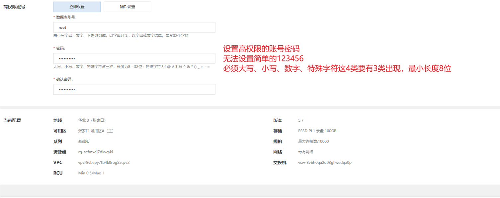

# Hadoop and Hive
# 1. Hadoop
## 1. HDFS的部署(本地虚拟机)<big>
1. 首先，通过克隆得到的三个虚拟机node1，2，3，分别作为三个节点，其中node1作为主节点，node2，3作为从节点。\
主节点:内存为4gb，配置为NameNode，SecondaryNameNode， DataNode
从节点：内存为2gb，配置为DataNode

2. 上传Hadoop安装包到node1，
解压安装包到之前创建好的文件夹：`tar -zxvf hadoop-3.3.4.tar.gz -C /export/server/`\
cd到/export/server内构建软连接：`ln -s /export/server/hadoop-3.3.4 hadoop` 构建为hadoop方便使用\
cd到hadoop安装包内：`cd hadoop`\
查看hadoop文件的内容：


3. 修改配置文件/etc，应用自定义设置\
下述文件均存在于`$HADOOP_HOME/etc/hadoop`目录下
- workers: 从节点的ip地址
```
cd /export/server/hadoop/etc/hadoop
vim workers
# 填入以下内容
node1
node2
node3
```
- hadoop-env.sh: 配置环境变量
```
# 填入以下内容
export JAVA_HOME=/usr/lib/jvm/java-1.8.0-openjdk-1.8.0.292.b10-0.el7_9.x86_64--->由于设置过软连接，该命令可写为：
export JAVA_HOME=/export/server/jdk # 指明jdk环境位置

export HADOOP_HOME=/export/server/hadoop # 指明hadoop环境位置
export HADOOP_CONF_DIR=$HADOOP_HOME/etc/hadoop # 指明hadoop配置文件目录位置
export HADOOP_LOG_DIR=$HADOOP_HOME/logs # 指明hadoop运行日志文件目录位置
```
- core-site.xml: hadoop核心配置信息
```
<configuration>
    <property>
        <name>fs.defaultFS</name>
        <value>hdfs://node1:8020</value>
    </property>
    
    <property>
        <name>io.file.buffer.size</name>
        <value>131072</value>
    </property>
</configuration>
```
由于该文件是xml文件，需要设置kv对，其中name为key，value为value，\
上述配置中，fs.defaultFS指明了hdfs内部的地通讯址，表名DataNode和node1的通讯地址为8020，node1是NameNode所在机器\
该配置固定了node1必须启动NameNode进程。\
io.file.buffer.size指明了文件缓冲区大小。
- hdfs-site.xml: HDFS的核心配置信息
```
<configuration>
  <property>
    <name>dfs.datanode.data.dir.perm</name>
    <value>700</value>
  </property>
  <property>
    <name>dfs.namenode.name.dir</name>
    <value>/data/nn</value>
  </property>
  <property>
    <name>dfs.namenode.hosts</name>
    <value>node1,node2,node3</value>
  </property>
<property>
    <name>dfs.blocksize</name>
    <value>268435456</value>
  </property>
  <property>
    <name>dfs.namenode.handler.count</name>
    <value>100</value>
  </property>
  <property>
    <name>dfs.datanode.data.dir</name>
    <value>/data/dn</value>
  </property>
</configuration>
```


4. 准备数据的文件目录，创建文件夹


所以应该在node1节点创建文件夹：
```
mkdir -p /data/nn #表示nameNode的数据存储目录
mkdir /data/dn  #表示dataNode的数据存储目录
```
在node2，3节点创建文件夹：
```
mkdir -p /data/dn
```

5. 分发Hadoop到各个节点\
分发-在node1节点执行：
```
cd /export/server
# 注意：scp命令只能复制原文件到其他node，不可以复制软连接（看作快捷方式）
scp -r hadoop-3.3.4 node2:`pwd`/  #注意不是单引号！！！
scp -r hadoop-3.3.4 node3:`pwd`/

```
软连接-在node2执行:
```
ln -s /export/server/hadoop-3.3.4 hadoop
```
软连接：在node3执行:
```
ln -s /export/server/hadoop-3.3.4 hadoop
```

6. 配置环境变量：三台机器均执行
```
cd /export/server
vim /etc/profile
# 在文件末尾添加以下内容
export HADOOP_HOME=/export/server/hadoop
export PATH=$PATH:$HADOOP_HOME/bin:$HADOOP_HOME/sbin
# 保存退出，再生效环境变量
source /etc/profile
```

7. 授权Hadoop用户，以root身份在三个机器均执行
为了保证安全，不应该每次用root启动，而应该使用普通用户hadoop启动整个服务，因此需要授权hadoop用户
```
# chown表示修改文件的所有者，-R表示递归修改，语法：chown -R 用户名:用户组 文件名
chown -R hadoop:hadoop /data
chown -R hadoop:hadoop /export
```

8. 格式化整个文件系统
前期准备完成，现在对整个文件系统执行初始化

格式化namenode，在node1执行：
```
# 确保以hadoop用户执行
su - hadoop
# 格式化namenode
hadoop namenode -format
```

**启动hdfs集群**：
```
#启动
start-dfs.sh
#关闭
stop-dfs.sh
```
只需要在node1一键启动后，即可通过`jps`命令查看进程，发现node1有NameNode，DataNode和SecondaryNameNode，
node2，3均启动了DataNode进程，说明启动成功。

9. 验证HDFS集群，通过web页面查看
```
http://node1:9870
```
出现以下网页说明集群启动成功


</big>

## 2. HDFS的部署(云服务器)<big>
在云服务器的上部署HDFS与本地相同，只是需要用finalshell连接到所购买的云服务器，然后在finalshell上执行同样的配置：\
- 在node1上传解压hadoop安装包
- 在node1构建软连接
- 在node1修改配置文件：workers，hadoop-env.sh，core-site.xml，hdfs-site.xml
- 在node1创建文件夹：/data/nn，/data/dn；在node2，3创建文件夹：/data/dn
- 在node1分发hadoop到node2，3，并在node2，3构建软连接
- 在node1，2，3配置环境变量
- 在node1，2，3授权hadoop用户
- 在node1格式化namenode
- 在node1启动hdfs集群

完成上述配置，即可启动HDFS云服务器集群，可通过相应云服务器官网查找自己的云服务器的ip地址，
使用**public id**然后通过web页面查看该ip地址，验证集群是否启动成功。

ps：云服务器如何保存服务器状态？\
1. 通过云服务器官方提供的快照功能，可能收费
2. 通过打包已配置好的hadoop安装包来保存该状态，即打包此时node1上的hadoop文件：
`tar -zcvf hadoop-ok.tar.gz hadoop-3.3.4`\ 
该命令表示将已经配置好的hadoop-3.3.4文件压缩未hadoop-ok文件进行保存，当出现意外时直接解压该文件，重新配置主机名映射即可完成hadoop的部署</big>

## 3. HDFS基本操作
### 1. HDFS集群启停操作<big>
一键启动/关闭只用在node1就可以启动/关闭所有集群
- 一键启动：`$HADOOP_HOME/sbin/start-dfs.sh`
- 一键关闭：`$HADOOP_HOME/sbin/stop-dfs.sh`

单进程启停:单独控制所在机器的进程启停（由于之前环境变量配置过path，将下面的文件夹加入了path，所以在任何目录都可以直接启动这些进程）
- $HADOOP_HOME/sbin/hadoop-daemon.sh
- 用法：`hadoop-daemon.sh start|status|stop namenode|secondarynamenode|datanode` 
- $HADOOP_HOME/bin/hdfs
- 用法：`hdfs --daemon start|stop|status namenode|secondarynamenode|datanode`

### 2. HDFS文件系统
#### 1.HDFS文件系统构成
同Linux一样，HDFS文件系统也以‘/’作为根目录的组织形式存在；有时需要区分linux和hdfs文件路径：


#### 2. HDFS文件系统操作
Hadoop提供了两套命令体系：
- `hadoop fs [operations]`
- `hdfs dfs [operations]`
两者都可用，hdfs为新版命令，operations为需要进行的操作，于linux的相关操作类似。

下面为具体命令，只需要加上前缀(hadoop fs/hdfs dfs)即可使用\
- `-mkdir [-p] <path>`:创建文件夹
- `-ls [-R/-h] [<path>...]`:查看指定目录下的内容
  - -h表示以人类可读的方式显示文件大小
  - -R表示递归显示子目录下的内容
- `-put [-f] [-p]  <localsrc> ... <dst>`:上传文件到HDFS
  - -f表示强制覆盖
  - -p表示保留文件的权限,所有权和时间戳
  - eg：`hdfs dfs -put -f words.txt /itcast`
  - eg：`hdfs dfs -put -f file:///etc/profile hdfs://node1:8020/itcast`
- `-cat <src> ...`:查看文件内容;
  - eg：`hdfs dfs -cat /itcast/words.txt`
  - 读取大文件可以配合管道符：`hdfs dfs -cat /itcast/words.txt | more`
- `-get [-p] [-f] [-ignorecrc] [-crc] <src> ... <localdst>`:下载文件到本地
  - -p表示保留文件的权限,所有权和时间戳
  - -f表示强制覆盖
  - -ignorecrc表示忽略crc校验
  - -crc表示生成crc校验文件
  - eg：`hdfs dfs -get -f /test.txt .` '.' 表示linux系统的当前目录
- `-cp [-f]  <src> ... <dst>`:拷贝hdfs文件
  - -f表示强制覆盖
    - eg：`hdfs dfs -cp -f /itcast/words.txt /itcast/words2.txt`
- `-appendToFile <localsrc> ... <dst>`:追加数据到hdfs文件，将所有给定本地文件的内容追加到给定dst文件。 dst如果文件不存在，将创建该文件
  - eg：`hdfs dfs -appendToFile 2.txt 3.txt /1.txt`

注意：hdfs文件系统无法直接修改文件内容，只能通过追加的方式修改文件内容，或者删除文件后从Linux本地上传新文件\
这是因为hdfs文件系统的特性，hdfs文件系统是一个分布式文件系统，文件被分成多个块，
每个块被复制到多个节点上，每个块的大小默认为128M，
这样的特性决定了hdfs文件系统无法直接修改文件内容，只能通过追加的方式修改文件内容，
或者删除文件后从Linux本地上传新文件。

- `-mv <src> ... <dst>`:移动文件，可以用来重命名文件
  - eg：`hdfs dfs -mv /itcast/words.txt /itcast/words2.txt`
- `-rm [-f] [-r] [-skipTrash] <src> ...`:删除文件
  - -f表示强制删除
  - -r表示递归删除
  - -skipTrash表示跳过回收站
  - eg：`hdfs dfs -rm -r /test111`

**ps**:回收站功能默认关闭，如果要开启需要在core-site.xml内配置：
```
<property>
<name>fs.trash.interval</name>
<value>1440</value>
</property>
 
<property>
<name>fs.trash.checkpoint.interval</name>
<value>120</value>
</property>
```
无需重启集群，在哪个机器配置的，在哪个机器执行命令就生效。
回收站默认位置在：/user/用户名(hadoop)/.Trash

还可以通过web页面查看文件系统\
但是在网页是以匿名用户进行访问，没有任何权限，只能简单浏览文件系统，无法进行任何操作。</big>



#### 4. HDFS文件系统权限
HDFS文件系统于linux类似都存在superuser，linux的是root，而hdfs系统是：启动namenode的用户（我的练习中是hadoop用户）


```
#修改文件用户和组：
hdfs dfs chown [-R] [OWNER][:[GROUP]] PATH

#修改文件权限：(777表示权限模式)
hdfs dfs chmod [-R] 777 /xxx.txt
```