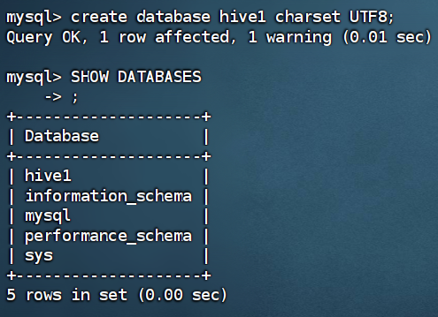
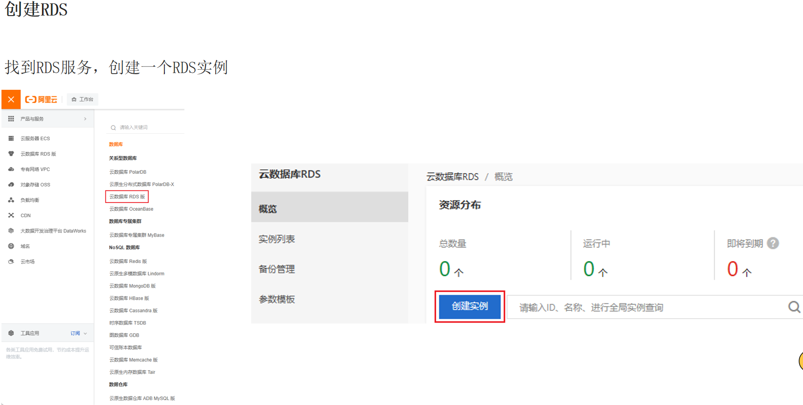
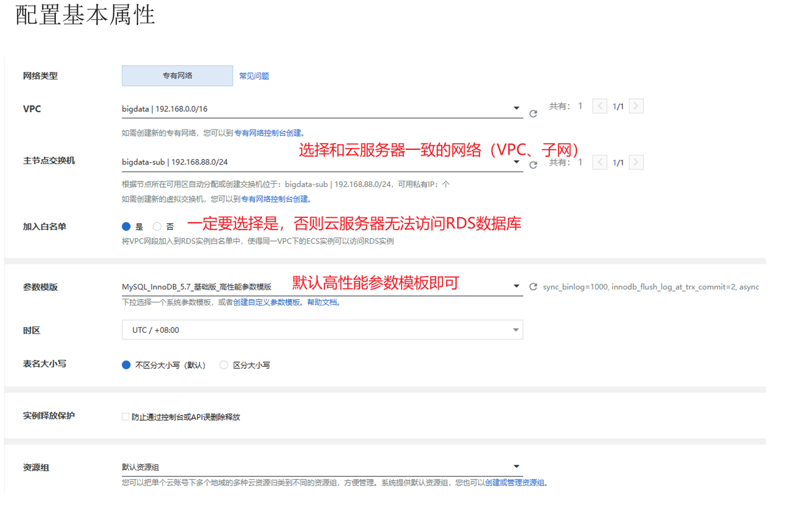
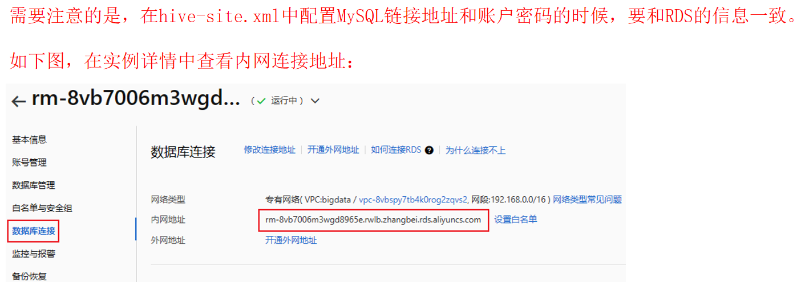

# Hive Basics


- [1. Hive Introduction](#1-hive-introduction)
- [2. Hive Deployment](#2-hive-deployment)
  - [2.1. Hive on VMware](#21-hive-on-vmware)
  - [2.2. Hive on Alibaba Cloud](#22-hive-on-alibaba-cloud)
  - [2.3. Hive on AWS](#23-hive-on-aws)


# 1. Hive Introduction
分布式SQL引擎：Hive是基于Hadoop的一个数据仓库工具，可以将结构化的数据文件映射为一张数据库表，
并提供完整的SQL查询功能，可以将SQL语句转换为MapReduce任务进行运行。

## Hive basic components


- Metastore：Hive元数据储存，包括表名、表所属的数据库、表的列和分区及其属性、表的属性（是否为外部表、表的数据所在目录等）、表的数据所在目录等。
- Driver：Hive的核心组件，即SQL解析器。负责接收用户的HQL语句，编译生成执行计划，调用执行引擎执行生成的任务，最后将执行结果返回给用户。
- 用户接口：用户可以通过命令行、WebUI、JDBC/ODBC等方式访问Hive。

# 2. Hive Deployment
## 2.1. Hive on VMware
首先，Hive是单机工具，不需要像Hadoop一样搭建集群，只需要在一台机器上安装即可。\
其次，虽然Hive是单机工具，但是它可以提交分布式运行的MapReduce任务。\
同时，Hive的元数据是存储在关系型数据库中的，所以我们需要先安装一个关系型数据库（如MySQL）

将Hive本体和元数据服务所需的MySQL数据库安装在同一台机器上(node1)


### 安装MySQL到node1
#### MySQL 5.7
1. 导入rpm密钥
```bash
rpm --import https://repo.mysql.com/RPM-GPG-KEY-mysql-2022
```

2. 安装MySQL yum源
```bash
rpm -Uvh http://repo.mysql.com/mysql57-community-release-el7-7.noarch.rpm
```

3. yum安装MySQL
```bash
yum -y install mysql-community-server
```

4. 启动MySQL以及设置开机启动
```bash
systemctl start mysqld
systemctl enable mysqld
```

5. 检查MySQL服务状态
```bash
systemctl status mysqld
```
#### MySQL 登录命令
```bash
mysql -u root -p # -u指定用户名，-p指定密码
```

6. 第一次启动MySQL，会在日志文件中生成root用户的一个随机密码，使用下面命令查看该密码
```bash
grep 'temporary password' /var/log/mysqld.log
```

7. 如果你想设置简单密码，需要关闭MySQL的密码安全策略
```bash
set global validate_password_policy=LOW;  # 密码安全级别低
set global validate_password_length=4;  # 密码长度最低4位即可
```


8. 然后就可以用新密码登陆了（设置中使用简单密码，为了方便，生产中不要这样做）
```sql
# 设置登录密码
ALTER USER 'root'@'localhost' IDENTIFIED BY '123456';
# 设置授权root用户可以远程登陆，并设置密码为123456
grant all privileges on *.* to root@"%" identified by '123456' with grant option;
# 刷新权限
flush privileges; 
```

#### MySQL 8.0
在 MySQL 8.0 中，您需要使用不同的变量名称来修改密码验证策略和长度：

```sql
FLUSH PRIVILEGES; # 刷新权限
SET GLOBAL validate_password.policy = 'LOW';
SET GLOBAL validate_password.length = 4;
```
在 MySQL 8.0 中，您需要使用以下步骤来创建用户并授予权限：

1. 创建用户：
   ```sql
   CREATE USER 'root'@'%' IDENTIFIED BY '123456';
   ```

2. 授予权限：
   ```sql
   GRANT ALL PRIVILEGES ON *.* TO 'root'@'%' WITH GRANT OPTION;
   ```

3. 刷新权限：
   ```sql
   FLUSH PRIVILEGES;
   ```


### 配置Hadoop
Hive的运行依赖于Hadoop，同时涉及到HDFS的读写，所以需要配置Hadoop的代理用户
即设置hadoop用户允许代理其他用户。

配置如下内容在Hadoop的配置文件`core-site.xml`中，并分发到所有节点，最后重启Hadoop集群
```xml
<property>
    <name>hadoop.proxyuser.hadoop.hosts</name>
    <value>*</value>
</property>
<property>
    <name>hadoop.proxyuser.hadoop.groups</name>
    <value>*</value>
</property>
```
### 安装Hive到node1
切换到hadoop用户
```shell
su - hadoop
```
1.下载Hive安装包：
```
http://archive.apache.org/dist/hive/hive-3.1.3/apache-hive-3.1.3-bin.tar.gz
```
解压到node1服务器的：/export/server/内
```shell
tar -zxvf apache-hive-3.1.3-bin.tar.gz -C /export/server/
```
设置软连接
```shell
ln -s /export/server/apache-hive-3.1.3-bin /export/server/hive
```

2.下载MySQL驱动包：\
https://repo1.maven.org/maven2/mysql/mysql-connector-java/5.1.34/mysql-connector-java-5.1.34.jar

将下载好的驱动jar包，放入：Hive安装文件夹的lib目录内
```
mv mysql-connector-java-5.1.34.jar /export/server/apache-hive-3.1.3-bin/lib/
```

### 配置Hive
配置环境变量：
- 在Hive的conf目录下，创建hive-env.sh文件，内容如下：
```shell
export HADOOP_HOME=/export/server/hadoop # Hadoop安装目录
export HIVE_CONF_DIR=/export/server/hive/conf # Hive配置文件目录
export HIVE_AUX_JARS_PATH=/export/server/hive/lib # Hive依赖的jar包目录
```
- 在Hive的conf目录下，创建hive-site.xml文件，内容如下：
```xml
<configuration>
  <property>
    <name>javax.jdo.option.ConnectionURL</name>
    <value>jdbc:mysql://node1:3306/hive?createDatabaseIfNotExist=true&amp;useSSL=false&amp;useUnicode=true&amp;characterEncoding=UTF-8</value>
  </property>
  <property>
    <name>javax.jdo.option.ConnectionDriverName</name>
    <value>com.mysql.jdbc.Driver</value>
  </property>
  <property>
    <name>javax.jdo.option.ConnectionUserName</name>
    <value>root</value>
  </property>
  <property>
    <name>javax.jdo.option.ConnectionPassword</name>
    <value>123456</value>
  </property>
  <property>
    <name>hive.server2.thrift.bind.host</name>
    <value>node1</value>
  </property>
  <property>
    <name>hive.metastore.uris</name>
    <value>thrift://node1:9083</value>
  </property>
  <property>
    <name>hive.metastore.event.db.notification.api.auth</name>
    <value>false</value>
  </property>
</configuration>
```

### 初始化Hive元数据
现在Hive的配置完成，启动之前，需要初始化Hive的元数据，即在MySQL中创建Hive的元数据数据库。
- 在MySQL中创建Hive的元数据数据库：hive
```sql
create database hive default charset utf8;
```


使用`show databases;`查看数据库列表，可以看到新建的数据库hive

- 执行元数据初始化脚本
```shell
cd /export/server/hive/bin
./schematool -initSchema -dbType mysql -verbos # -dbType指定数据库类型，-verbose显示详细信息
```
初始化完成后，可以在MySQL的hive库中看到74张元数据管理表

### 启动Hive(使用user=hadoop)
首先需要更改apache-hive-3.1.3-bin的权限，否则会报错
```shell
chown -R hadoop:hadoop apache-hive-3.1.3-bin hive
```
- 创建一个hive的日志文件夹： 
```
mkdir /export/server/hive/logs
```
**启动元数据管理服务**（必须启动，否则无法工作）\
前台启动：
```
bin/hive --service metastore 
```
后台启动：
```
nohup /bin/hive --service metastore >> logs/metastore.log 2>&1 &
```
前台和后台启动的区别：\
前台启动，终端会一直占用，不能再输入命令，只能关闭终端才能停止服务\
后台启动，终端可以继续输入命令，但是关闭终端后，服务也会停止

**启动客户端**，二选一（当前先选择Hive Shell方式）\
Hive Shell方式（可以直接写SQL）： 
```shell
/export/server/hive/bin/hive
```
Hive ThriftServer方式（不可直接写SQL，需要外部客户端链接使用）： 
```
bin/hive --service hiveserver2`
```

## 2.2. Hive on Alibaba Cloud








完成RDS创建后，可进行配置Hive。与VMware配置Hive的步骤相同，只是需要将MySQL的IP地址改为RDS的IP地址。


使用ssh连接到云服务器，进行Hive的配置
- 启动Hadoop相关服务
- 上传Hive安装包以及MySQL驱动包，并解压Hive安装包，将MySQL驱动包放入Hive的lib目录
- 配置Hive的环境变量：hive/conf/hive-env.sh
- 配置Hive的配置文件：hive/conf/hive-site.xml
    - 修改MySQL的连接地址为RDS的内网地址：jdbc:mysql://.....
    - 修改javax.jdo.option.ConnectionPassword为RDS的密码
- 在RDS安装MySQL客户端（不是server）：`yum install mysql``
- 在mysql客户端中创建Hive的元数据数据库：`create database hive default charset utf8;`
- 在hive/bin目录下，执行元数据初始化脚本：`./schematool -initSchema -dbType mysql -verbos`
- 创建一个hive的日志文件夹：`mkdir /export/server/hive/logs`
- 修改整体文件权限：`chown -R hadoop:hadoop /export`
- 启动Hive元数据管理服务：`nohup bin/hive --service metastore>> logs/metastore.log 2>&1 &` 使用后台启动
- 启动Hive客户端：`bin/hive`

## 2.3. Hive on AWS
在AWS（Amazon Web Services）上使用Hive通常涉及以下几个步骤：

### 1. 设置AWS环境
- **开通AWS账户**：如果还没有AWS账户，您需要先注册一个。
- **选择服务**：AWS提供了多种服务来运行Hive，包括Amazon EMR（Elastic MapReduce）和EC2（Elastic Compute Cloud）。
  
### 2. 使用Amazon EMR（推荐）
Amazon EMR是一个托管的Hadoop框架服务，它预装了Hive和其他Hadoop生态系统组件。

- **创建EMR集群**：
  - 登录AWS控制台，进入EMR服务。
  - 点击“创建集群”。
  - 在配置选项中选择Hive作为应用程序。
  - 选择合适的EC2实例类型和数量。
  - 设置其他必要的配置（如VPC，IAM角色等）。
  - 启动集群。

- **连接EMR集群**：
  - 使用SSH连接到EMR集群的主节点。
  - 也可以通过AWS管理控制台的EMR部分访问Hive。

- **运行Hive查询**：
  - 通过SSH连接到EMR主节点后，可以直接在命令行中启动Hive shell。
  - 使用标准的Hive语法编写和执行查询。

### 3. 使用EC2实例（手动设置）
如果您需要更多的控制权，可以在EC2实例上手动安装和配置Hive。

- **创建EC2实例**：
  - 在AWS控制台中选择EC2服务并创建一个新的实例。
  - 选择合适的操作系统（如Amazon Linux，Ubuntu等）。
  - 设置安全组以允许SSH访问。

- **安装Hadoop和Hive**：
  - 通过SSH连接到您的EC2实例。
  - 手动安装Hadoop和Hive。
  - 配置Hive以连接到Hadoop集群。

- **运行Hive**：
  - 通过SSH在EC2实例上运行Hive shell。
  - 执行您的Hive查询。

### 4. 安全和存储
- **设置IAM（Identity and Access Management）角色**：为EMR或EC2实例配置适当的IAM角色，以确保安全访问AWS资源。
- **使用Amazon S3**：通常，Hive在AWS上会与Amazon S3一起使用，用于存储数据。

### 5. 监控和管理
- 使用AWS CloudWatch监控EMR或EC2的性能。
- 使用AWS控制台管理EMR集群或EC2实例。

使用EMR是在AWS上运行Hive的最简单方法，因为它提供了一个预配置的环境，减少了手动设置的需要。但如果您需要更高的定制性和控制力，可以选择在EC2上手动部署Hive。

# 3. Hive SQL
启动metastore服务后，可以使用Hive Shell方式连接到Hive，直接写SQL语句。

从hive执行的SQL语句，会被转换为MapReduce任务，然后提交到Hadoop集群运行。
可以通过yarn的webUI查看任务的运行情况。

Hive的数据存储在HDFS的：`/user/hive/warehouse`目录下，每个数据库对应一个目录，每个表对应一个目录。

# 4. DataGrip
使用DataGrip连接Hive，可以直接写SQL语句，也可以使用可视化界面操作。
首先要用hiveserver2方式启动Hive：
```shell
bin/hive --service metastore # 启动元数据管理服务
bin/hive --service hiveserver2 # 启动Hive ThriftServer
```
或者后台启动：
```shell
nohup bin/hive --service metastore >> logs/metastore.log 2>&1 &
nohup bin/hive --service hiveserver2 >> logs/hiveserver2.log 2>&1 &
```
启动完成后，可以在DataGrip中连接Hive。