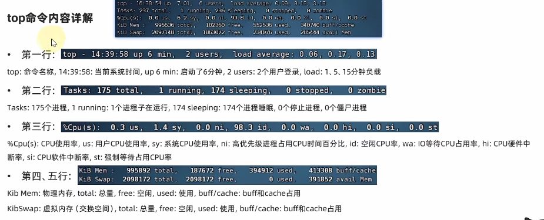

# Linux and Virtual Machines
## 1. 环境配置
### 1. 虚拟机 VM
1. 虚拟机是一种虚拟的计算机系统，它是在一台物理计算机上模拟出来的另一台计算机，可以在虚拟机上安装操作系统，运行应用程序，就像在真实计算机上一样。\
2. 通过虚拟机安装linux系统，可以在windows系统上运行linux系统。
3. 虚拟机快照：可以将虚拟机的状态保存为快照，然后在需要的时候恢复到快照状态，可以方便的进行实验和测试。

### 2. VMware Workstation
1. VMware Workstation是一款虚拟机软件，可以在windows系统上安装虚拟机，然后在虚拟机上安装linux系统。\
使用vmware并通过finalshell进行连接：\
在虚拟机桌面右键，打开终端oepn terminal，输入`ifconfig`查看虚拟机的ip地址，然后在windows系统上打开finalshell，输入虚拟机的ip地址，用户名和密码，即可连接到虚拟机。

2. 注意：如果虚拟机重启，ip地址会发生变化，需要重新连接。\
可以固定ip地址，通过修改`/etc/sysconfig/network-scripts/ifcfg-ens33`文件，将`BOOTPROTO`改为`static`，然后添加`IPADDR`和`GATEWAY`，重启网络服务`service network restart`，即可固定ip地址。

3. 虚拟机快照：在左侧选择虚拟机，右键选择快照，然后选择快照管理器，可以对虚拟机进行快照的管理。
### 3. CentOS 7
CentOS是一种基于Red Hat Enterprise Linux（RHEL）源代码的免费开源的操作系统，是一种Linux发行版。\
将使用vmware安装CentOS 7系统。
### 4. FinalShell
FinalShell是一款远程连接软件，可以在windows系统上连接linux系统，进行远程操作。\
由于用vmware操作linux系统会跨越原本windos系统，不够方便，所以使用第三方连接软件finalshell连结到linux系统。\

### 5. WSL 
1. WSL（Windows Subsystem for Linux）是一种在windows系统上运行linux系统（一般为ubuntu发行版本）的技术，可以在windows系统上运行linux系统，而不需要虚拟机。\
2. WSL是win系统自带功能，可以在控制面板中打开，然后在应用商店中下载linux系统，即可在windows系统上运行linux系统。\
3. 打开方式：控制面板->程序->启用或关闭windows功能->勾选适用于Linux的Windows子系统->重启电脑->应用商店->搜索linux->下载并安装->运行即可。

## 2. Linux基础命令
### 1. 目录结构
Linux不像windox有多个盘，只有一个根目录（顶级目录），Linux系统的目录结构如下：
```
/：根目录
/bin：存放二进制可执行文件
/boot：存放启动Linux系统时使用的一些核心文件
/dev：存放设备文件
/etc：存放系统配置文件
/home：存放用户主目录
/lib：存放系统库文件
/media：挂载目录
/mnt：挂载目录
/opt：存放第三方软件
/proc：存放进程信息
/root：root用户的主目录
```
eg: `/home/username/xxx`表示username用户的xxx目录

### 2. 基本命令<big>
1. 基本格式：`command [-options] [parameter]`\
command：命令名, [-options]：选项, [parameter]：参数\
eg: `ls -a /home/username`表示显示username用户主目录下的所有文件，包括隐藏文件。
2. ls命令 `ls [-a -l -h] [path]`
- ls：显示当前目录下的文件
- ls -a：显示当前目录下的所有文件，包括隐藏文件
- ls -l：显示当前目录下的文件的详细信息
- ls -h：显示当前目录下的文件的详细信息，文件大小以人类可读的方式显示
- ls的参数可以组合使用：`ls -alh`，会得到三个参数的共同效果

Home目录和工作目录：\
Home目录：每个用户都有一个Home目录，用于存放用户的文件，Home目录的路径为`/home/username`，其中username为用户名。\
工作目录：用户当前所在的目录，可以通过`pwd`命令查看当前所在的目录，可以通过`cd`命令切换工作目录。\
比如：Linux用户yhb的Home目录为`/home/yhb`，工作目录为`/home/yhb`，可以通过`cd /home/yhb`命令切换到Home目录，也可以通过`cd`命令切换到Home目录。
3. cd命令 `cd [path]`: 切换目录\
返回上级目录：`cd ..`\
pwd命令 `pwd`：查看当前所在的工作目录\
4. mkdir命令 `mkdir [-p] [path]`：创建目录\
mkdir：创建一个名为xxx的目录\
mkdir -p：如果上级目录不存在，则会自动创建上级目录\
5. 绝对路径和相对路径\
绝对路径：从根目录开始的路径，如`/home/username/xxx`\
相对路径：从当前目录开始的路径，如`xxx`， 路径描述无需以/开头，表示当前目录下的xxx目录\
特殊路径符号：\
- `.`：表示当前目录，如`cd ./xxx`表示切换到当前目录下的xxx目录
- `..`：表示上一级目录，如`cd ../xxx`表示切换到上一级目录下的xxx目录
- `~`：表示Home目录，如`cd ~/xxx`表示切换到Home目录下的xxx目录
6. 文件操作命令
- touch命令 `touch [path]`：创建文件，如`touch test.txt`表示创建一个名为test.txt的文件
- cat命令 `cat [path]`：查看文件内容，如`cat test.txt`表示查看test.txt文件的内容
- more命令 `more [path]`：当文件内容较多，分页显示文件内容，如`more test.txt`表示分页显示test.txt文件的内容，通过空格键翻页，通过q键退出
- cp命令 `cp [-r] [path1] [path2]`：复制文件或目录，如`cp test1.txt test2.txt`表示将test1.txt文件复制为test2.txt文件\
    - cp -r：复制目录/文件夹，如`cp -r test1 test2`表示将test1文件夹复制为test2文件夹
- mv命令 `mv [path1] [path2]`：移动文件或目录，如`mv test1.txt test2.txt`表示将test1.txt文件移动为test2.txt文件
    - mv -r：移动目录/文件夹，如`mv -r test1 test2`表示将test1文件夹移动为test2文件夹
- rm命令 `rm [-r -f] [path]`：删除文件或目录，如`rm test.txt`表示删除test.txt文件
    - rm -r：删除目录/文件夹，如`rm -r test`表示删除test文件夹
    - rm -f：强制删除，不提示，如`rm -f test.txt`表示强制删除test.txt文件
    - rm支持通配符：`*test`表示删除以test结尾的文件，`test*`表示删除以test开头的文件，`*test*`表示删除包含test的文件
7. 查找命令
- which命令 `which [command]`：查找命令的位置，如`which ls`表示查找ls命令的位置
- find命令 `find [path] -name [filename]`：查找文件，如`find /home/username -name test.txt`表示在username用户的Home目录下查找名为test.txt的文件
  - find 支持通配符
  - find 按文件大小查找：`find /home/username -size +10M`表示在username用户的Home目录下查找大于10M的文件
8. grep命令 `grep [options] [pattern] [path]`：在文件中查找匹配的字符串，如`grep -n "hello" test.txt`表示在test.txt文件中查找hello字符串，并显示行号
  - grep -n：显示匹配的行号
  - grep -v：显示不匹配的行
  - grep -i：忽略大小写
  - grep -r：递归查找
  - grep -w：匹配整个单词
  - grep -c：统计匹配的行数
  - grep -A：显示匹配行及后面的n行
  - grep -B：显示匹配行及前面的n行
  - grep -C：显示匹配行及前后的n行
9. wc命令 `wc [options] [path]`：统计文件的行数、单词数、字节数，如`wc -l test.txt`表示统计test.txt文件的行数
  - wc -l：统计行数
  - wc -w：统计单词数
  - wc -c：统计字节数
  - wc -m：统计字符数
10. 管道符 `|`：将前一个命令的输出作为后一个命令的输入，如`ls -l | grep "test"`表示将ls -l命令的输出作为grep "test"命令的输入，然后在输出中查找test字符串
11. echo命令 `echo [string]`：输出字符串，如`echo "hello world"`表示输出hello world字符串(类似print)
- echo 反引号command反引号: 将命令的输出作为字符串输出，如`echo 反引号ls -l反引号`表示输出ls -l命令的输出
- echo > filename：将输出覆盖写入到文件中，如`echo "hello world" > test.txt`表示将hello world字符串输出到test.txt文件中，原文件的内容会被覆盖
- echo >> filename：将输出追加写入到文件中，如`echo "hello world" >> test.txt`表示将hello world字符串输出到test.txt文件中，原文件的内容不会被覆盖
12. tail命令 `tail [options] [path]`：显示文件的末尾内容，如`tail -n 5 test.txt`表示显示test.txt文件的末尾5行
  - tail -n：显示末尾n行
  - tail -f：实时显示文件的末尾内容

### 3. vi\vim编辑器
1. vi是一种文本编辑器，可以用于编辑文件，vi编辑器有三种模式：命令模式、插入模式、底行模式。
2. vim是vi的增强版，功能更加强大，可以用于编辑文件，vim编辑器有三种模式：命令模式、插入模式、底行模式。

使用vim编辑器：`vim filename`，即可打开vim编辑器，然后可以进行编辑。\
如果文件不存在，会自动创建文件。如果文件存在，会自动打开文件。\
#### 1. 命令模式(command mode)
命令模式是vi/vim的默认模式，可以通过`Esc`键进入命令模式，也可以通过`Ctrl + [`键进入命令模式。\
命令模式下可以进行光标移动、复制粘贴、删除、查找替换等操作。所敲的按键，编辑器都会当做命令来执行，不会显示在屏幕上。不能自由编辑文本，只能执行命令。\
命令模式快捷键：
- `i`: 进入插入模式
- `a`: 进入插入模式，光标在当前字符的后面
- `o`: 进入插入模式，光标在当前行的下一行
- `O`: 进入插入模式，光标在当前行的上一行
- `x`: 删除光标所在的字符
- `dd`: 删除光标所在的行
- `yy`: 复制光标所在的行
- `p`: 粘贴
- `u`: 撤销
- `Ctrl + r`: 恢复

#### 2. 插入模式(insert mode)
插入模式可以进行文本编辑，可以通过`i`键进入插入模式，也可以通过`a`键进入插入模式。该模式可以正常输入文本\
插入模式下可以进行文本编辑，所敲的按键，编辑器都会当做文本来处理，会显示在屏幕上。不能执行命令。
#### 3. 底行模式(last line mode)
底行模式可以进行保存、退出、查找替换等操作，可以通过`:`键进入底行模式。\
底行模式快捷键：
- `:w`: 保存
- `:q`: 退出
- `:wq`: 保存并退出
- `:q!`: 强制退出
- `:set nu`: 显示行号
- `:set nonu`: 不显示行号</big>


## 3. Linux用户管理
### 1. 用户管理<big>
1. Linux是一种多用户的操作系统，可以同时有多个用户登录系统，每个用户都有自己的Home目录，可以在自己的Home目录下进行操作，不能访问其他用户的Home目录。

2. Linux系统中有一个root用户，拥有最高权限，可以访问所有用户的Home目录，可以对系统进行管理。
   (1) root用户的Home目录为`/root`，其他用户的Home目录为`/home/username`，其中username为用户名。
   (2) root用户的用户名为root，其他用户的用户名可以通过`whoami`命令查看。
   (3) 普通用户无法在根目录下创建文件夹，只有root用户可以在根目录下创建文件夹。
3. 切换用户：`su - username`，其中username为用户名，切换到username用户，需要输入密码。\
切换到root用户：`su - root`，需要输入root用户的密码。\
切换用户后，可以通过`exit`命令切换回原用户。或者快捷键`Ctrl + d`。
4. `sudo`命令：可以临时切换到root用户，执行命令后，会提示输入当前用户的密码，输入密码后，会临时切换到root用户，执行命令，然后会自动切换回原用户。\
eg: `sudo yum install xxx`表示临时切换到root用户，然后执行`yum install xxx`命令，然后自动切换回原用户。\
yum命令：用于安装软件，可以通过`yum install xxx`命令安装xxx软件。\
sudo命令需要root用户授权(先切换到root用户)，才能使用，执行`visudo`,会自动通过vim编辑器打开文件，然后在文件中添加`username ALL=(ALL) ALL, NOPASSWD:ALL`，其中username为用户名，表示username用户可以使用sudo命令,并且不需要密码，
然后使用`wq`保存。\
授权后切换到username用户，即可使用sudo命令，不需要输入密码。
### 2. 用户和用户组
1. linux系统可以配置多个用户和用户组，每个用户都属于一个或几个用户组，用户组可以包含多个用户。
2. 用户组管理：
- `groupadd`命令：创建用户组，如`groupadd group1`表示创建一个名为group1的用户组
- `groupdel`命令：删除用户组，如`groupdel group1`表示删除名为group1的用户组
3. 用户管理：
- `useradd [-g/-d]`命令：创建用户，如`useradd user1`表示创建一个名为user1的用户
  - `useradd -g group1 user1`表示创建一个名为user1的用户，并将user1用户添加到group1用户组中,
  - `useradd -d /home/user1 user1`表示创建一个名为user1的用户，并将user1用户的Home目录设置为/home/user1
- `userdel`命令：删除用户，如`userdel user1`表示删除名为user1的用户
- `id`命令：查看用户信息，如`id user1`表示查看名为user1的用户的信息
- `passwd`命令：修改用户密码，如`passwd user1`表示修改名为user1的用户的密码
- `usermod`命令：修改用户信息，
  - `usermod -aG root user1`表示将user1用户添加到sudo (root)用户组中
  - `usermod -g group1 user1`表示将user1用户添加到group1用户组中
  - `usermod -d /home/user1 user1`表示将user1用户的Home目录设置为/home/user1
- `getent` 命令：查看用户组信息，
  - `getent group`表示查看所有用户组的信息，得到4份信息，分别为用户组名、密码、用户组id
  - `getent passwd`表示查看所有用户的信息,得到7份信息，分别为用户名、密码、用户id、用户组id、用户描述、用户Home目录、用户shell

### 3. 权限管理
1. Linux系统中，每个文件或目录都有权限.
2. 权限分为三种：读、写、执行，分别用r、w、x表示，每种权限用数字表示，r=4，w=2，x=1，没有权限用0表示，三种权限相加，得到数字，即为权限数字。

eg: `drwxr-xr-x`表示权限数字为755，其中第一个字符d表示是目录，后面三个字符rwx表示拥有者的权限，中间三个字符r-x表示所属组的权限，最后三个字符r-x表示其他用户的权限。\


3. 权限管理命令：
注意：只有文件/文件夹所属用户或者root用户才能修改权限
- `chmod`命令：修改权限，如`chmod 755 test.txt`表示将test.txt文件的权限修改为755
  - `chmod -r` 对文件夹内全部内容应用相同操作
  - `chmod u=rwx,g=rx,o=rx test.txt`表示将test.txt文件的权限修改为755, u表示user，g表示所属组，o表示其他用户
  - `chmod +x test.txt`表示给test.txt文件的所属用户添加可执行权限，这个命令常用于创建一个需要执行的文件后给与其可执行权限
- `chown`命令：修改所属用户,需要root用户权限
    - `chown user1 test.txt`表示将test.txt文件的所属用户修改为user1
    - `chown user1:group1 test.txt`表示将test.txt文件的所属用户和所属组修改为group1
</big>

## 4. 实用技巧<big>
* `ctrl + c`: 强制终止当前程序
* `ctrl + d`: 退出当前登录的账户，或推出某些特定程序页面
* `ctrl + l`: 清屏 或者 `clear` 命令
* `ctrl + a`: 光标移动到行首
* `ctrl + e`: 光标移动到行尾
* `ctrl + 键盘左键`: 向左跳一个单词，`ctrl + 键盘右键`：向右跳一个单词
* `ctrl + u`: 删除光标前的内容
* `ctrl + k`: 删除光标后的内容
* `ctrl + w`: 删除光标前的一个单词
* `ctrl + y`: 粘贴
* `ctrl + r`: 搜索历史命令
* `historu`: 查看历史执行过的命令
* `!n`: 执行历史中的第n条命令
* `!!`: 执行上一条命令
* `!xxx`: 执行最近一条以xxx开头的命令</big>

## 5. Linux 软件管理
### 1. 软件安装<big>
1. CentOs软件安装\
`yum [-y] [install] [remove] [serach] app_name` \
`yum`命令：用于安装软件，可以通过`yum install xxx`命令安装xxx软件。\
`yum`命令的参数：
- `-y`：安装软件时，不需要确认，直接安装
- `install`：安装软件
- `remove`：删除软件
- `search`：搜索软件

2. Ubuntu软件安装
`apt-get [-y] [install] [remove] [serach] app_name` \
可以通过`apt-get install xxx`命令安装xxx软件。</big>\

### 2. 软件控制
1. <big>`systemctl [start] [stop] [status] [enable] [disable] service_name` </big>\
参数说明：
- `start`：启动服务
- `stop`：停止服务
- `status`：查看服务状态
- `enable`：设置开机启动
- `disable`：取消开机启动</big>

systemctl用于控制部分第三方软件和系统内置服务。部分第三方软件安装后没有自动集成到systemctl中，可以手动添加：

2. <big>软链接\
ln命令用于创建链接文件，链接文件分为硬链接和软链接，软链接又称为符号链接，软链接类似于windows中的快捷方式，软链接指向的是源文件的路径，而不是源文件本身。\
语法：`ln -s [源文件] [目标文件]`\
参数说明：
- `-s`：创建软链接
- `源文件`：源文件的路径
- `目标文件`：软链接目的地的路径
建立软链接后，可以通过`ls -l`命令查看软链接，软链接的第一个字符为`l`，表示是软链接，后面的数字表示源文件的权限，然后是源文件的所属用户和所属组，最后是源文件的名称。\
</big>

### 3. 日期和时间<big>
1. `date`命令：查看日期和时间
格式：`date [-d] [+format]`\
参数说明：
- `-d`：指定日期和时间
- `+format`：指定日期和时间的格式
  - `%Y`：年, `%m`：月, `%d`：日, `%H`：时, `%M`：分, `%S`：秒
eg: `date +%Y-%m-%d`表示以`年-月-日`的格式显示日期和时间
2. date命令进行日期和时间的计算,使用-d参数
- `date -d "+1 day"`：表示在当前日期和时间的基础上加1天
- `date -d "-2 year"`：表示在当前日期和时间的基础上减2年
3. 修改时区
首先需要修改为root用户，然后执行`timedatectl set-timezone Asia/Shanghai`命令，即可将时区修改为上海时区。\
可以使用ntp程序自动同步时间，执行`yum install ntp`命令安装ntp程序\
设置ntp开机自动启动：`systemctl enable ntpd`\
设置ntp联网校准时间：`ntpdate -u ntp.aliyun.com` 使用阿里云服务器校准</big>\

### 4. IP地址与域名<big>
#### 1. IP地址
ip地址指的是网络地址，每台计算机都有一个ip地址，用于在网络中唯一标识一台计算机。\
格式为：`xxx.xxx.xxx.xxx`，其中xxx为0-255的数字，每个xxx之间用`.`分隔。\
可以使用`127.0.0.1` 或 `localhost`表示本机地址。用于查看本机情况\
1. `ifconfig`命令：查看ip地址，位于主网卡ens33下
2. `hostname`命令：查看主机名
   - `hostnamectl set-hostname xxx`：修改主机名为xxx,需要root用户权限
#### 2. 域名
1. 域名指的是网站的名称，域名是由多个单词组成，每个单词之间用`.`分隔，域名的最后一个单词为顶级域名，如`.com`、`.cn`、`.org`等，域名的倒数第二个单词为二级域名，如`baidu.com`、`google.com`、`taobao.com`等，域名的倒数第三个单词为三级域名，如`www.baidu.com`、`www.google.com`、`www.taobao.com`等。
2. 域名解析：域名解析指的是将域名解析为ip地址，域名解析需要通过DNS服务器进行解析，DNS服务器是一种域名解析服务器，可以将域名解析为ip地址。
3. 域名解析的过程：\
(1) 在浏览器中输入域名，浏览器会向DNS服务器发送域名解析请求。\
(2) DNS服务器会将域名解析为ip地址，然后将ip地址返回给浏览器。\
(3) 浏览器通过ip地址访问网站。

首先会访问本机地址本，即hosts文件，如果hosts文件中没有对应的域名和ip地址，会向DNS服务器发送域名解析请求。\
再联网去DNS服务器查询，如果DNS服务器中没有对应的域名和ip地址，会向DNS服务器发送域名解析请求，直到找到对应的域名和ip地址，然后将ip地址返回给浏览器。\

本机地址本：
  - windows系统：`C:\Windows\System32\drivers\etc\hosts`
  - linux系统：`/etc/hosts`
3. 设置主机名和IP地址的本地映射
管理员身份用记事本打开windows系统的hosts文件，添加`IP hostname`，其中IP为ip地址，hostname为主机名，然后保存即可。\
添加映射后使用FinalShell连接时可以不用ip地址而是用主机名进行连接

#### 3. 配置固定IP地址
当前虚拟机的Linux系统，ip地址时通过DHCP自动获取的，如果虚拟机重启，ip地址会发生变化，可以通过配置固定ip地址，使得虚拟机重启后ip地址不会发生变化。
注意：现在版本的vmware中，虚拟机重启后ip地址不会发生变化，不需要配置固定ip地址。</big>

### 5. 网络传输<big>
1.`ping`命令：测试指定网络服务器是否为可联通状态
- `ping [-c num] ip`：测试指定ip地址是否为可联通状态, -c num表示检查次数，若不选则默认一直检查
- `ping [-c num] hostname`：测试指定主机名是否为可联通状态

2.`wget`命令：非交互式网络下载工具，可以在命令行中从指定的url下载文件
   - `wget [-b] url`：下载指定url的文件, -b表示后台下载

无论下载是否完成，都会在当前目录下创建一个文件，文件名为下载的文件名，如果下载未完成，文件大小为0，下载完成后，文件大小为下载文件的大小。\

3.`curl`命令：发送http请求，可用于下载文件，获取信息等。
   - `curl [-O] url`：下载指定url的文件, -O用于下载文件。

4.端口\
(1) ip地址只能锁定计算机，而无法锁定具体程序，所以程序直接的网络通信需要通过端口来实现。

(2) Linux系统可以支持65535个端口，其中0-1023为系统端口，1024-49151为注册端口，通常用于程序，49152-65535为动态端口，通常用于当程序
对外进行网络连接时临时使用。

(3) 通过nmap命令查看端口占用情况： `nmap ip`

(4) 通过netstat命令查看端口占用情况： `netstat -an | grep 端口号`\
</big>

### 6.进程管理<big>
1. 进程：进程是计算机中的程序关于某数据集合上的一次运行活动，是系统进行资源分配和调度的基本单位，是操作系统结构的基础。\
每个程序被运行时，操作系统会为该程序创建一个进程，进程是程序的一次执行过程，是系统进行资源分配和调度的基本单位，有独有的PID\
2. 进程管理命令
- `ps`命令：查看进程
  - `ps -ef`：e表示查看全部进程，f表示查看进程的详细信息
  - `ps -ef | grep xxx`：查看所有进程，并查找包含xxx的进程
  
- `kill`命令：杀死进程
  - `kill PID`：杀死指定PID的进程
  - `kill -9 PID`：强制杀死指定PID的进程
  - `killall xxx`：杀死所有名为xxx的进程

### 7. 主机状态<big>
1. `top`命令：查看主机状态，默认5秒刷新一次
  - `top`：查看主机状态
  - `top -d 2`：每隔2秒刷新一次主机状态
  - `top -u username`：查看指定用户的主机状态
  - `top -p PID`：查看指定PID的进程的主机状态
  - `top -c`：显示产生进程的完整命令
  - `top -H`：显示线程信息
  - `top -i`：不显示闲置或僵尸进程
  - `top -n`：显示指定刷新数后退出
  - `top -b`：以批处理模式运行top，该模式将top的输出写入标准输出流，而不是终端


ps:top命令以交互式运行（非-b启动），可用以下命令进行交互式控制
  - `h`：显示帮助
  - `c`：显示进程的完整命令
  - `P`：根据CPU使用率排序
  - `M`：根据内存使用率排序
  - `T`：根据时间/累计时间排序

2. 磁盘信息监控
- `df`命令：查看磁盘信息
  - `df -h`：以人类可读的方式显示磁盘信息
- `iostat`命令：查看磁盘IO信息
  - `iostat -x [num1] [num2]` 显示完整信息,num1表示刷新间隔，num2表示查看次数
- `sar`命令：查看网络相关统计
    - `sar -n DEV [num1] [num2]` -n查看网络，DEV表示查看网络接口,num1表示刷新间隔，num2表示查看次数</big>
</big>
### 8. 环境变量
1. 环境变量：环境变量是一些动态的值，可以影响shell命令的运行，环境变量可以通过`env`命令查看。
2. PATH环境变量：PATH环境变量是一种特殊的环境变量，用于指定shell命令的搜索路径，当执行shell命令时，会在PATH环境变量指定的路径中查找命令，如果找到命令，则执行命令，如果找不到命令，则提示命令不存在。
3. `$`符号：`$`符号用于获取环境变量的值，如`echo$PATH`表示获取PATH环境变量的值，并用echo打印出来
- 一般如果想找到某个环境变量的值，可以使用`echo$环境变量名`命令，将返回绝对路径
4. `export 变量名=变量值`：用于自行**临时**设置环境变量。
永久配置环境变量：
- `vim ~/.bashrc`：打开bashrc文件，在该文件内使用export语句添加环境变量，并保存
  - `source ~/.bashrc`：使配置生效
- `vim /etc/profile`：打开profile文件，在该文件内使用export语句添加环境变量，并保存
  - `source /etc/profile`：使配置生效

### 9. 文件上传下载<big>
1. 通过FinalShell上传下载文件\
上传：将本地电脑文件拖拽到FinalShell中，即可上传文件\
下载：将FinalShell中的文件右键下载，下载地址为download文件夹

注意：即使在FinalShell里使用su -root命令切换为root权限，但是FinalShell的登录用户
仍然是普通用户；需要将连接用户设置为root用户才可以得到最大权限。

2. 在FinalShell的文件列表找到需要上传的地址，将本地电脑文件拖拽进去即可上传
3. rz，sz命令
通过`yum install lrzsz`命令安装rz，sz命令
- `rz`：将本地文件上传到服务器
- `sz file_name`：将服务器文件下载到本地

**注意**使用rz命令上传速度很慢，如果是大文件一般使用拖拽方式直接上传更快</big>

### 10. 压缩和解压<big>
Linux系统常用压缩格式：tar、gzip，zip；

(1) .tar文件：tar文件是一种归档文件，可以将多个文件或目录打包成一个文件，但是没有压缩功能，只是将多个文件或目录打包成一个文件，文件后缀为.tar\
(2) .gz文件：gz文件是一种压缩文件，可以将一个文件压缩成一个文件，文件后缀为.gz\
(3) .tar.gz文件：tar.gz文件是一种压缩文件，可以将多个文件或目录打包成一个文件，并且压缩，文件后缀为.tar.gz\
(4) .zip文件：zip文件是一种压缩文件，可以将多个文件或目录打包成一个文件，并且压缩，文件后缀为.zip

1. `tar [-c -v -x -f -z -C]`命令：用于压缩和解压文件 
 `-c` 创建压缩文件\
 `-v` 显示压缩过程\
 `-x` 解压文件\
 `-f` 指定压缩文件名，使用时必须在最后一位\
 `-z` 压缩文件为tar.gz格式,不指定该参数则为普通tarball归档文件\
 `-C` 指定解压目录,需要和其他参数分开写如：`tar -zxvf file.tar.gz -C /home/username`\

常用组合：
- `tar -cvf file.tar file1 file2`：将file1和file2打包成file.tar文件
- `tar -zcvf file.tar.gz file1 file2`：将file1和file2打包成file.tar.gz文件
- `tar -xvf file.tar`：解压file.tar文件

2. `zip [-r] file.zip file1 file2`命令：用于压缩和解压文件
- `-r` 递归压缩目录下的所有文件,即被压缩的文件中如果包含文件夹,则将目录下的所有文件都压缩到压缩文件中
3. `unzip  file.zip [-d] path`命令：用于解压zip文件
- `-d` 指定解压目录,需要和其他参数分开写如：`unzip file.zip -d /home/username`</big>


## 6. Linux 部署
### 1. MySQL 8.x在 CentOS 的安装


mysql允许root用户远程登录，可以通过远程登陆来管理mysql数据库，需要修改mysql的配置文件，修改配置文件后，需要重启mysql服务，才能生效。


### 2. 集群化配置虚拟机的前置准备
#### 1. 虚拟机克隆
1. 首先关闭当前Base虚拟机，然后进行完整克隆。对克隆后的虚拟机固定ip地址，然后修改主机名，最后修改hosts文件，将主机名和ip地址进行映射，即可实现虚拟机之间的互相访问。


将ip地址分别设置为“192.168.88.101/102/103” 代表3个克隆虚拟机

2. 在Windows系统的hosts文件中添加映射：\
打开hosts文件：`C:\Windows\System32\drivers\etc\hosts`\
添加映射：
```
192.168.88.101 node1
192.168.88.102 node2
192.168.88.103 node3
```
在linux系统的hosts文件中添加映射：
`vim /etc/hosts`\
添加映射:与windows一致即可

3. 配置SSH免密登录
由于后续需要远程登陆以及远程执行命令，需要在多个服务器切换，为方便起见，配置三台node服务器的绵密互相SSH登录：\
- 在每台机器执行：`ssh-keygen -t rsa -b 4096` 表示生成密钥对，然后一路回车即可，生成的密钥对在`~/.ssh`目录下，其中`id_rsa`为私钥，`id_rsa.pub`为公钥。
- 在每台机器都执行：\
```
ssh-copy-id node1
ssh-copy-id node2
ssh-copy-id node3
```
执行完后三个服务器之间完成root用户之间免密互通，可以通过`ssh node1`命令切换到node1服务器（主机），然后执行`exit`命令切换回原服务器。

4. 创建Hadoop用户并配置免密互通登录
由于实际开发中，不会使用root用户进行开发，所以需要创建一个Hadoop用户，然后配置免密登录，方便开发。\
- 在每台机器执行：`useradd hadoop`创建hadoop用户
- 在每台机器执行：`passwd hadoop`设置hadoop用户密码：123456
- 在每台机器均切换到hadoop用户：`su - hadoop`，执行`ssh-keygen -t rsa -b 4096`命令生成密钥对
- 在每台机器执行：
```
ssh-copy-id node1
ssh-copy-id node2
ssh-copy-id node3
```
与root用户免密互通类似，此时三个hadoop用户也可以通过`ssh node1`命令切换到node1服务器（主机）进行免密互通

#### 2. JDK部署
1. JDK指的是Java Development Kit，是Java开发工具包，包含了Java开发所需要的各种工具，如Java编译器、Java运行环境、Java文档生成器等。\
由于大数据很多软件都需要java环境支持，所以需要预先在三台服务器上部署JDK环境。
2. JDK环境配置


```
mkdir -p /export/server
tar -zxvf jdk-8u361-linux-x64.tar.gz -C /export/server
ln -s /export/server/jdk1.8.0_361 /export/server/jdk

vim /etc/profile
#在文件末尾添加以下内容
export JAVA_HOME=/export/server/jdk
export PATH=$PATH:$JAVA_HOME/bin

source /etc/profile
rm -f /usr/bin/java
ln -s /export/server/jdk/bin/java /usr/bin/java
```

#### 3.防火墙，SELinux和时间同步
1. 关闭防火墙和SELinux
由于集群化软件之间需要通过端口互相通讯，为了避免网络不同问题，可以简单的直接在集群内部关闭防火墙\
```
systemctl stop firewalld
systemctl disable firewalld
```
SELinux是一种安全机制，可以限制用户对文件的访问,来提高系统稳定。当前可以直接关闭，避免后面运行问题。
```
vim /etc/sysconfig/selinux
#将第七行 SELINUX=enforcing 改为 SELINUX=disabled
#保存推出后重启虚拟机即可
```
上述代码操作需要在每台虚拟机都执行

2. 修改时区并配置自动时间同步
以下操作在所有虚拟机均执行\
安装ntp程序：`yum install ntp`\
更新时区：
```
rm -f /etc/localtime 删除系统原本时间信息
sudo ln -s /usr/share/zoneinfo/Asia/Shanghai /etc/localtime 创建软链接将上海时区连接到系统时间
```
同步时间：`ntpdate -u ntp.aliyun.com`\
设置开机自动启动：`systemctl start-->enable ntpd`

<big>完成上述操作后虚拟机集群配置已经基本完成，最好执行快照操作保存当前状态，以便后续使用。</big>

### 4. 通过云平台部署虚拟化集群
#### 1，阿里云平台
(1) 概念\
- vpc: virtual private cloud，虚拟专有网络，是一种隔离的网络环境，可以在该网络环境中创建云资源，如云服务器、云数据库等。
- 子网：子网是vpc的一部分，可以在子网中创建云资源，如云服务器、云数据库等。
- 安全组：安全组是一种虚拟防火墙，用于控制云服务器的网络访问，可以通过安全组设置云服务器的入站和出站规则，从而控制云服务器的网络访问。
- 云服务器：云服务器是一种虚拟化的服务器，可以在云服务器上部署应用程序，如部署Hadoop集群。\
    - 阿里云服务器ECS：Elastic Compute Service，弹性计算服务，是阿里云提供的云服务器

(2)主要流程：\
配置vpc和子网：创建专有网络\


配置安全组：\


购买云服务器ECS：\
- 在ECS购买界面，确认操作系统和储存容量等信息，指定VPC和子网，设置内网IP地址为：192.168.88.101/102/103对应三个node的虚拟机
- 分配之前创建好的安全组，并点击**分配公网ipv4地址**
- 进入下一步，选择登录使用ssh密钥对，并用root权限登录，点击创建密钥对会下载密钥对文件，妥善保存该文件。


(3) 同样的方法为node2和3创建ECS服务器


(4) 配置云服务器\
之前对本地虚拟机进行了一系列操作如关闭防火墙，配置免密登录等，现在对云服务器只需进行以下配置：\
- 配置SSH免密登录
- 配置JDK环境
- 配置hosts文件完成主机名映射

#### 2. AWS
一般使用AWS EC2(Elastic Compute Cloud)创建云服务器，AWS EC2是一种弹性计算服务.\
关于EC2的创建在AWS tips Module 6 Compute 中有详细介绍 。

**EC2创建**
1. 选择操作系统，选择Amazon Linux 2 AMI (HVM), SSD Volume Type
2. 选择实例类型，选择t2.micro
3. 创建key pair，选择创建新的key pair，输入名称，然后下载密钥对文件(.ppk)，妥善保存该文件
4. Network Settings-->选择vpc为‘Work VPC’
   - 配置Firewall:创建security groups；注意配置inbound rules；outbound一般默认即可
   
5. 可以在advanced details--user data中添加脚本，脚本的内容可以用于配置云服务器，如配置JDK环境，配置SSH免密登录等。
比如：
```
#!/bin/bash  # 这是脚本的 shebang 行，它告诉系统这个脚本应该用 /bin/bash 解释器执行。
yum -y install httpd # 使用 YUM 包管理器自动（无需确认）安装 Apache HTTP 服务器。
systemctl enable httpd # 使 httpd 服务在系统启动时自动启动。
systemctl start httpd # 启动 httpd 服务。
echo '<html><h1>Hello from our Server!</h1></html>' > /var/www/html/index.html
# 将一些 HTML 内容写入 /var/www/html/index.html 文件，以便在浏览器中访问。
```

**SSH连接EC2**


putty连接：
host name：ec2-user@'Public DNS (IPv4)'\
比如此时我的host name应该为：`ec2-user@ec2-3-94-31-222.compute-1.amazonaws.com`

finalshell连接：

主机名：public DNS (IPv4)\
用户名：ec2-user\
认证：可以用ppk或pem文件的key pair