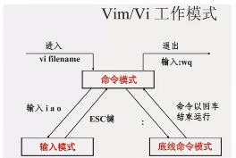
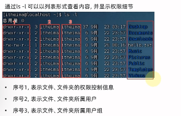
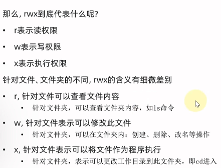

# Linux Basic Tutorial
## 1. 环境配置
### 1. 虚拟机 VM
1. 虚拟机是一种虚拟的计算机系统，它是在一台物理计算机上模拟出来的另一台计算机，可以在虚拟机上安装操作系统，运行应用程序，就像在真实计算机上一样。\
2. 通过虚拟机安装linux系统，可以在windows系统上运行linux系统。
3. 虚拟机快照：可以将虚拟机的状态保存为快照，然后在需要的时候恢复到快照状态，可以方便的进行实验和测试。

### 2. VMware Workstation
1. VMware Workstation是一款虚拟机软件，可以在windows系统上安装虚拟机，然后在虚拟机上安装linux系统。\
使用vmware并通过finalshell进行连接：\
在虚拟机桌面右键，打开终端oepn terminal，输入`ifconfig`查看虚拟机的ip地址，然后在windows系统上打开finalshell，输入虚拟机的ip地址，用户名和密码，即可连接到虚拟机。

2. 注意：如果虚拟机重启，ip地址会发生变化，需要重新连接。\
可以固定ip地址，通过修改`/etc/sysconfig/network-scripts/ifcfg-ens33`文件，将`BOOTPROTO`改为`static`，然后添加`IPADDR`和`GATEWAY`，重启网络服务`service network restart`，即可固定ip地址。

3. 虚拟机快照：在左侧选择虚拟机，右键选择快照，然后选择快照管理器，可以对虚拟机进行快照的管理。
### 3. CentOS 7
CentOS是一种基于Red Hat Enterprise Linux（RHEL）源代码的免费开源的操作系统，是一种Linux发行版。\
将使用vmware安装CentOS 7系统。
### 4. FinalShell
FinalShell是一款远程连接软件，可以在windows系统上连接linux系统，进行远程操作。\
由于用vmware操作linux系统会跨越原本windos系统，不够方便，所以使用第三方连接软件finalshell连结到linux系统。\

### 5. WSL 
1. WSL（Windows Subsystem for Linux）是一种在windows系统上运行linux系统（一般为ubuntu发行版本）的技术，可以在windows系统上运行linux系统，而不需要虚拟机。\
2. WSL是win系统自带功能，可以在控制面板中打开，然后在应用商店中下载linux系统，即可在windows系统上运行linux系统。\
3. 打开方式：控制面板->程序->启用或关闭windows功能->勾选适用于Linux的Windows子系统->重启电脑->应用商店->搜索linux->下载并安装->运行即可。

## 2. Linux基础命令
### 1. 目录结构
Linux不像windox有多个盘，只有一个根目录（顶级目录），Linux系统的目录结构如下：
```
/：根目录
/bin：存放二进制可执行文件
/boot：存放启动Linux系统时使用的一些核心文件
/dev：存放设备文件
/etc：存放系统配置文件
/home：存放用户主目录
/lib：存放系统库文件
/media：挂载目录
/mnt：挂载目录
/opt：存放第三方软件
/proc：存放进程信息
/root：root用户的主目录
```
eg: `/home/username/xxx`表示username用户的xxx目录

### 2. 基本命令
1. 基本格式：`command [-options] [parameter]`\
command：命令名, [-options]：选项, [parameter]：参数\
eg: `ls -a /home/username`表示显示username用户主目录下的所有文件，包括隐藏文件。
2. ls命令 `ls [-a -l -h] [path]`
- ls：显示当前目录下的文件
- ls -a：显示当前目录下的所有文件，包括隐藏文件
- ls -l：显示当前目录下的文件的详细信息
- ls -h：显示当前目录下的文件的详细信息，文件大小以人类可读的方式显示
- ls的参数可以组合使用：`ls -alh`，会得到三个参数的共同效果

Home目录和工作目录：\
Home目录：每个用户都有一个Home目录，用于存放用户的文件，Home目录的路径为`/home/username`，其中username为用户名。\
工作目录：用户当前所在的目录，可以通过`pwd`命令查看当前所在的目录，可以通过`cd`命令切换工作目录。\
比如：Linux用户yhb的Home目录为`/home/yhb`，工作目录为`/home/yhb`，可以通过`cd /home/yhb`命令切换到Home目录，也可以通过`cd`命令切换到Home目录。
3. cd命令 `cd [path]`: 切换目录\
pwd命令 `pwd`：查看当前所在的工作目录\
4. mkdir命令 `mkdir [-p] [path]`：创建目录\
mkdir：创建一个名为xxx的目录\
mkdir -p：如果上级目录不存在，则会自动创建上级目录\
5. 绝对路径和相对路径\
绝对路径：从根目录开始的路径，如`/home/username/xxx`\
相对路径：从当前目录开始的路径，如`xxx`， 路径描述无需以/开头，表示当前目录下的xxx目录\
特殊路径符号：\
- `.`：表示当前目录，如`cd ./xxx`表示切换到当前目录下的xxx目录
- `..`：表示上一级目录，如`cd ../xxx`表示切换到上一级目录下的xxx目录
- `~`：表示Home目录，如`cd ~/xxx`表示切换到Home目录下的xxx目录
6. 文件操作命令
- touch命令 `touch [path]`：创建文件，如`touch test.txt`表示创建一个名为test.txt的文件
- cat命令 `cat [path]`：查看文件内容，如`cat test.txt`表示查看test.txt文件的内容
- more命令 `more [path]`：当文件内容较多，分页显示文件内容，如`more test.txt`表示分页显示test.txt文件的内容，通过空格键翻页，通过q键退出
- cp命令 `cp [-r] [path1] [path2]`：复制文件或目录，如`cp test1.txt test2.txt`表示将test1.txt文件复制为test2.txt文件\
    - cp -r：复制目录/文件夹，如`cp -r test1 test2`表示将test1文件夹复制为test2文件夹
- mv命令 `mv [path1] [path2]`：移动文件或目录，如`mv test1.txt test2.txt`表示将test1.txt文件移动为test2.txt文件
    - mv -r：移动目录/文件夹，如`mv -r test1 test2`表示将test1文件夹移动为test2文件夹
- rm命令 `rm [-r -f] [path]`：删除文件或目录，如`rm test.txt`表示删除test.txt文件
    - rm -r：删除目录/文件夹，如`rm -r test`表示删除test文件夹
    - rm -f：强制删除，不提示，如`rm -f test.txt`表示强制删除test.txt文件
    - rm支持通配符：`*test`表示删除以test结尾的文件，`test*`表示删除以test开头的文件，`*test*`表示删除包含test的文件
7. 查找命令
- which命令 `which [command]`：查找命令的位置，如`which ls`表示查找ls命令的位置
- find命令 `find [path] -name [filename]`：查找文件，如`find /home/username -name test.txt`表示在username用户的Home目录下查找名为test.txt的文件
  - find 支持通配符
  - find 按文件大小查找：`find /home/username -size +10M`表示在username用户的Home目录下查找大于10M的文件
8. grep命令 `grep [options] [pattern] [path]`：在文件中查找匹配的字符串，如`grep -n "hello" test.txt`表示在test.txt文件中查找hello字符串，并显示行号
  - grep -n：显示匹配的行号
  - grep -v：显示不匹配的行
  - grep -i：忽略大小写
  - grep -r：递归查找
  - grep -w：匹配整个单词
  - grep -c：统计匹配的行数
  - grep -A：显示匹配行及后面的n行
  - grep -B：显示匹配行及前面的n行
  - grep -C：显示匹配行及前后的n行
9. wc命令 `wc [options] [path]`：统计文件的行数、单词数、字节数，如`wc -l test.txt`表示统计test.txt文件的行数
  - wc -l：统计行数
  - wc -w：统计单词数
  - wc -c：统计字节数
  - wc -m：统计字符数
10. 管道符 `|`：将前一个命令的输出作为后一个命令的输入，如`ls -l | grep "test"`表示将ls -l命令的输出作为grep "test"命令的输入，然后在输出中查找test字符串
11. echo命令 `echo [string]`：输出字符串，如`echo "hello world"`表示输出hello world字符串(类似print)
- echo 反引号command反引号: 将命令的输出作为字符串输出，如`echo 反引号ls -l反引号`表示输出ls -l命令的输出
- echo > filename：将输出覆盖写入到文件中，如`echo "hello world" > test.txt`表示将hello world字符串输出到test.txt文件中，原文件的内容会被覆盖
- echo >> filename：将输出追加写入到文件中，如`echo "hello world" >> test.txt`表示将hello world字符串输出到test.txt文件中，原文件的内容不会被覆盖
12. tail命令 `tail [options] [path]`：显示文件的末尾内容，如`tail -n 5 test.txt`表示显示test.txt文件的末尾5行
  - tail -n：显示末尾n行
  - tail -f：实时显示文件的末尾内容

### 3. vi\vim编辑器
1. vi是一种文本编辑器，可以用于编辑文件，vi编辑器有三种模式：命令模式、插入模式、底行模式。
2. vim是vi的增强版，功能更加强大，可以用于编辑文件，vim编辑器有三种模式：命令模式、插入模式、底行模式。

使用vim编辑器：`vim filename`，即可打开vim编辑器，然后可以进行编辑。\
如果文件不存在，会自动创建文件。如果文件存在，会自动打开文件。\
#### 1. 命令模式(command mode)
命令模式是vi/vim的默认模式，可以通过`Esc`键进入命令模式，也可以通过`Ctrl + [`键进入命令模式。\
命令模式下可以进行光标移动、复制粘贴、删除、查找替换等操作。所敲的按键，编辑器都会当做命令来执行，不会显示在屏幕上。不能自由编辑文本，只能执行命令。\
命令模式快捷键：
- `i`: 进入插入模式
- `a`: 进入插入模式，光标在当前字符的后面
- `o`: 进入插入模式，光标在当前行的下一行
- `O`: 进入插入模式，光标在当前行的上一行
- `x`: 删除光标所在的字符
- `dd`: 删除光标所在的行
- `yy`: 复制光标所在的行
- `p`: 粘贴
- `u`: 撤销
- `Ctrl + r`: 恢复

#### 2. 插入模式(insert mode)
插入模式可以进行文本编辑，可以通过`i`键进入插入模式，也可以通过`a`键进入插入模式。该模式可以正常输入文本\
插入模式下可以进行文本编辑，所敲的按键，编辑器都会当做文本来处理，会显示在屏幕上。不能执行命令。
#### 3. 底行模式(last line mode)
底行模式可以进行保存、退出、查找替换等操作，可以通过`:`键进入底行模式。\
底行模式快捷键：
- `:w`: 保存
- `:q`: 退出
- `:wq`: 保存并退出
- `:q!`: 强制退出
- `:set nu`: 显示行号
- `:set nonu`: 不显示行号



## 3. Linux用户管理
### 1. 用户管理
1. Linux是一种多用户的操作系统，可以同时有多个用户登录系统，每个用户都有自己的Home目录，可以在自己的Home目录下进行操作，不能访问其他用户的Home目录。
2. Linux系统中有一个root用户，拥有最高权限，可以访问所有用户的Home目录，可以对系统进行管理。
   (1) root用户的Home目录为`/root`，其他用户的Home目录为`/home/username`，其中username为用户名。
   (2) root用户的用户名为root，其他用户的用户名可以通过`whoami`命令查看。
   (3) 普通用户无法在根目录下创建文件夹，只有root用户可以在根目录下创建文件夹。
3. 切换用户：`su - username`，其中username为用户名，切换到username用户，需要输入密码。\
切换到root用户：`su - root`，需要输入root用户的密码。\
切换用户后，可以通过`exit`命令切换回原用户。或者快捷键`Ctrl + d`。
4. `sudo`命令：可以临时切换到root用户，执行命令后，会提示输入当前用户的密码，输入密码后，会临时切换到root用户，执行命令，然后会自动切换回原用户。\
eg: `sudo yum install xxx`表示临时切换到root用户，然后执行`yum install xxx`命令，然后自动切换回原用户。\
yum命令：用于安装软件，可以通过`yum install xxx`命令安装xxx软件。\
sudo命令需要root用户授权(先切换到root用户)，才能使用，执行`visudo`,会自动通过vim编辑器打开文件，然后在文件中添加`username ALL=(ALL) ALL, NOPASSWD:ALL`，其中username为用户名，表示username用户可以使用sudo命令,并且不需要密码，
然后使用`wq`保存。\
授权后切换到username用户，即可使用sudo命令，不需要输入密码。
### 2. 用户和用户组
1. linux系统可以配置多个用户和用户组，每个用户都属于一个或几个用户组，用户组可以包含多个用户。
2. 用户组管理：
- `groupadd`命令：创建用户组，如`groupadd group1`表示创建一个名为group1的用户组
- `groupdel`命令：删除用户组，如`groupdel group1`表示删除名为group1的用户组
3. 用户管理：
- `useradd [-g/-d]`命令：创建用户，如`useradd user1`表示创建一个名为user1的用户
  - `useradd -g group1 user1`表示创建一个名为user1的用户，并将user1用户添加到group1用户组中,
  - `useradd -d /home/user1 user1`表示创建一个名为user1的用户，并将user1用户的Home目录设置为/home/user1
- `userdel`命令：删除用户，如`userdel user1`表示删除名为user1的用户
- `id`命令：查看用户信息，如`id user1`表示查看名为user1的用户的信息
- `passwd`命令：修改用户密码，如`passwd user1`表示修改名为user1的用户的密码
- `usermod`命令：修改用户信息，
  - `usermod -g group1 user1`表示将user1用户添加到group1用户组中
  - `usermod -d /home/user1 user1`表示将user1用户的Home目录设置为/home/user1
- `getent` 命令：查看用户组信息，
  - `getent group`表示查看所有用户组的信息，得到4份信息，分别为用户组名、密码、用户组id
  - `getent passwd`表示查看所有用户的信息,得到7份信息，分别为用户名、密码、用户id、用户组id、用户描述、用户Home目录、用户shell

### 3. 权限管理
1. Linux系统中，每个文件或目录都有权限.
2. 权限分为三种：读、写、执行，分别用r、w、x表示，每种权限用数字表示，r=4，w=2，x=1，没有权限用0表示，三种权限相加，得到数字，即为权限数字。

eg: `drwxr-xr-x`表示权限数字为755，其中第一个字符d表示是目录，后面三个字符rwx表示拥有者的权限，中间三个字符r-x表示所属组的权限，最后三个字符r-x表示其他用户的权限。




3. 权限管理命令：
注意：只有文件/文件夹所属用户或者root用户才能修改权限
- `chmod`命令：修改权限，如`chmod 755 test.txt`表示将test.txt文件的权限修改为755
  - `chmod -r` 对文件夹内全部内容应用相同操作
  - `chmod u=rwx,g=rx,o=rx test.txt`表示将test.txt文件的权限修改为755, u表示user，g表示所属组，o表示其他用户
- `chown`命令：修改所属用户,需要root用户权限
    - `chown user1 test.txt`表示将test.txt文件的所属用户修改为user1
    - `chown user1:group1 test.txt`表示将test.txt文件的所属用户和所属组修改为group1
