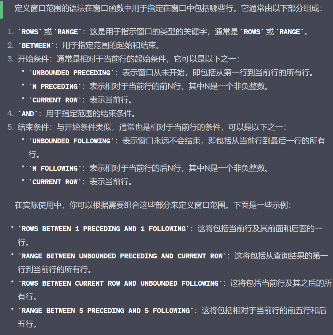
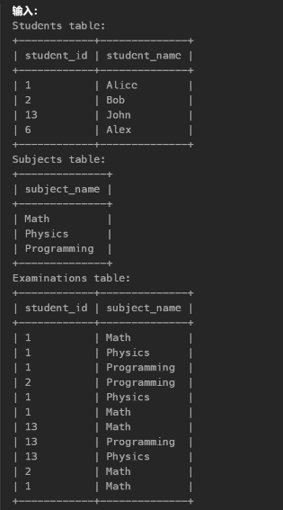
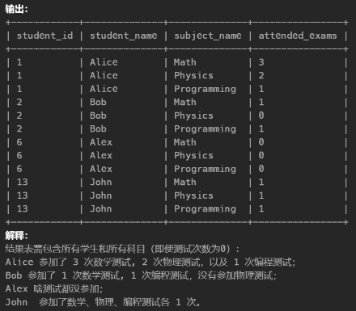
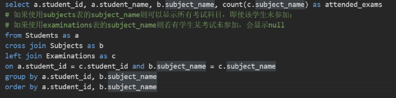

# SQL Tips
## 0. 执行顺序
SQL语句的执行顺序如下：
1. `from`：从表中获取数据
2. `where`：对数据进行过滤
3. `group by`：按照指定的列对数据进行分组
4. `having`：对分组后的数据进行过滤
5. `select`：选取指定的列
6. `order by`：对数据进行排序
7. `limit`：限制返回的数据行数

#### limit的写法
- `limit N`：返回前N行
- `limit N,M`：从第N行开始，返回M行
- `limit M offset N`：从第N行开始，返回M行
- `limit M N`: 从第M行开始，返回N行

#### group by规则
- `group by`语句必须出现在`where`语句之后，`order by`语句之前。
- `group by`语句中的列必须是`select`语句中出现的列，或者是聚合函数的参数。
- `group by`语句中的列可以是`select`语句中出现的列的别名。但where语句中不能使用别名。


## 1.使用`with`创建虚拟表
`with`语句可以创建一个虚拟表，该表只在当前查询中有效，可以在`with`语句中使用`select`语句，也可以使用`union`语句。\
`with`语句的基本语法如下：
```
with table_name as (
    select ...
    from ...
    where ...
)
select ...
from table_name
where ...
```
`with`语句的主要作用是将复杂的查询分解为多个简单的查询，提高查询的可读性和可维护性。
并且使用with可以避免子查询的嵌套，提高查询效率。

## 2. regexp 匹配
`regexp`是正则表达式匹配，可以用来匹配字符串，常用于模糊查询。\
`regexp`的基本语法如下：
```
select ...
from ...
where col regexp 'pattern'
```
其中`pattern` 的语法规则如下：

### 1. 字符匹配:
- `a`：匹配字母 a。
- `123`：匹配连续的数字 123。
- `[a-z]`：匹配任何小写字母。
- `[A-Z]`：匹配任何大写字母。
- `[0-9]`：匹配任何数字。
- `.`：匹配任何字符（除了换行符 \n）。
### 2. 特殊字符:
- `\`：用于转义后续字符，使其匹配其字面意义，例如 \\ 匹配反斜杠字符 \。
- `^`：匹配字符串的开头。
- `$`：匹配字符串的结尾。
- `|`：用于表示“或”的关系，例如 cat|dog 匹配 "cat" 或 "dog"。
- `()`：用于分组表达式，改变优先级和创建子模式。
### 3. 重复次数:
- `*`：匹配前一个元素零次或多次，例如 a* 匹配零个或多个字母 a。
- `+`：匹配前一个元素一次或多次，例如 a+ 匹配一个或多个字母 a。
- `?`：匹配前一个元素零次或一次，例如 a? 匹配零个或一个字母 a。
- `{n}`：精确匹配前一个元素 n 次，例如 a{3} 匹配三个字母 a。
- `{n,}`：匹配前一个元素至少 n 次，例如 a{2,} 匹配至少两个字母 a。
- `{n,m}`：匹配前一个元素至少 n 次但不超过 m 次，例如 a{2,4} 匹配 2 到 4 个字母 a。
### 4.字符类:
- [abc]：匹配字符集中的任何一个字符，例如 [abc] 匹配 a、b 或 c。
- [^abc]：匹配不在字符集中的任何一个字符，例如 [^abc] 匹配除了 a、b 和 c 之外的字符。
- [a-z]：匹配字符范围内的任何一个字符，例如 [a-z] 匹配任何小写字母。
- [A-Z0-9]：匹配字符范围内的任何一个字符，例如 [A-Z0-9] 匹配大写字母和数字。
### 5.预定义字符类:
- `\d`：匹配任何数字字符，等同于 [0-9]。
- `\D`：匹配任何非数字字符，等同于 [^0-9]。
- `\w`：匹配任何字母、数字或下划线字符，等同于 [a-zA-Z0-9_]。
- `\W`：匹配任何非字母、非数字和非下划线字符，等同于 [^a-zA-Z0-9_]。
- `\s`：匹配任何空白字符，例如空格、制表符、换行符等。
- `\S`：匹配任何非空白字符。
### 6. 边界: 需要用\转义
- \b：匹配单词边界，用于确保匹配的内容是一个独立的单词。
  - 例如，`\\bno\\b` 匹配 "no"，而不匹配 "nor"。
- \B：匹配非单词边界。
### 7. 量词贪婪与非贪婪:
- `*` 和 `+` 默认是贪婪的，尽可能匹配更多字符。
- `*?` 和 `+?` 是非贪婪的，尽可能匹配更少字符。

eg:\
````
where col regexp '^[a-zA-Z][a-zA-Z0-9_.-]*\\@leetcode\\.com$'
````
该语句会返回表中email列满足：\
以字母（可以是小写或大写字母）开头。
后面可以是零个或多个字母、数字、下划线、句点或连字符。
最后以 "@leetcode.com" 结尾。
如"bob_123@leetcode.com"的邮件地址

## 3. like 模糊匹配
`like`是模糊匹配，可以用来匹配字符串，常用于模糊查询。\
`like`的基本语法如下：
```
where col like 'pattern'
```

其中`pattern` 的语法规则如下：
- `%`（百分号）：表示匹配任意长度的任意字符。例如，'a%' 匹配以字母 'a' 开头的任何字符串。
- `_`（下划线）：表示匹配任何单个字符。例如，'_pple' 匹配以任意字符开头，后跟 "pple" 的字符串，如 "apple" 或 "opple"。
- `[charlist]`：用于指定要匹配的字符集合。例如，'[aeiou]' 匹配任何单个元音字母。
- `[^charlist]`：用于指定不匹配的字符集合。例如，'[^0-9]' 匹配不包含数字的任何字符串。
- `\`（反斜杠）：用于转义特殊字符，使其成为字面字符。例如，'\%' 匹配实际字符 '%'。

一些示例：
- `'apple%'`：匹配以 "apple" 开头的任何字符串，如 "apple"、"applesauce" 等。
- `'%apple'`：匹配以 "apple" 结尾的任何字符串，如 "pineapple"、"caramel apple" 等。
- `'_pple'`：匹配以任何字符开头，后跟 "pple" 的字符串，如 "apple" 或 "opple"。
- `'[aeiou]pple'`：匹配以元音字母开头，后跟 "pple" 的字符串，如 "apple" 或 "epple"。
- `'[^0-9]'`：匹配不包含数字的任何字符串，如 "apple" 或 "banana"。

## 4. 使用`case when`进行条件判断
`case when`语句可以用于条件判断，类似于`if else`语句。\
`case when`语句的基本语法如下：
```
select col1,
case
    when condition1 then result1
    when condition2 then result2
    ...
    else result
end as col2
from table
```
`case when`语句的主要作用是根据条件返回不同的结果，可以用于数据转换和数据清洗。

if else的语法规则：
- `if(condition, result1, result2)`：如果条件为真，则返回result1，否则返回result2。


## 5.空值处理
### 1. 判断空值
- `is null`：判断是否为空值
- `is not null`：判断是否不为空值
- `isnull()`：判断是否为空值，如果为空值则返回 true，否则返回 false
- `ifnull(expression，replacement)`：判断是否为空值，如果为空值则返回replacement，否则返回原始值

## 6. 设定列值
`select value as col` 可以将value的值设定为col列的值

## 7. 窗口函数
### 1.定义
窗口函数是一类特殊的函数，它可以计算当前行与其他行之间的关系，常用于统计和排序。\
窗口函数的基本语法如下：
```
select col1, col2, ...
from (
    select col1, col2, ...,
    row_number() over(partition by col3 order by col4) as rk
    from table
) as t
where t.rk <= N
```
窗口函数的主要作用是对数据进行分组和排序，常用于统计排名和计算累计值。
返回按照col3分组后，按照col4排序的表，rk列为排序后的行号，最后选取前N行。

窗口范围定义：


#### 2. 常用窗口函数
- `row_number()`：为每一行添加一个唯一的行号，行号从 1 开始递增。
- `rank()`：为每一行添加一个排名，如果有相同的值，则会跳过下一个排名。
- `dense_rank()`：为每一行添加一个排名，如果有相同的值，则不会跳过下一个排名。
- `sum()`：计算当前行与其他行之间的累计和。
- `avg()`：计算当前行与其他行之间的累计平均值。
- `count()`：计算当前行与其他行之间的累计数量。
- `max()`：计算当前行与其他行之间的最大值。
- `min()`：计算当前行与其他行之间的最小值。
- `first_value()`：计算当前行与其他行之间的第一个值。
- `last_value()`：计算当前行与其他行之间的最后一个值。
- `lead()`：计算当前行与其他行之间的向后偏移量。
- `lag()`：计算当前行与其他行之间的向前偏移量。

lead()和lag()的语法规则：
- `lead(col, offset, default)`：计算当前行与其他行之间的向后偏移量，offset表示偏移量，default表示默认值。
- `lag(col, offset, default)`：计算当前行与其他行之间的向前偏移量，offset表示偏移量，default表示默认值。
```
select col1, col2, col3,
lead(col1, 1, 0) over(order by col3) as lead_col1,
lag(col1, 1, 0) over(order by col3) as lag_col1
from table
```
该语句会返回表中col1列的当前行与前一行的值，以及当前行与后一行的值。

## 8. 时间函数
- `year()`：返回日期的年份。
- `month()`：返回日期的月份。
- `day()`：返回日期的天数。
- `hour()`：返回日期的小时数。
- `DateDiff(date1, date2)`：返回两个日期之间的天数。
- `DateAdd(date, interval, unit)`：返回日期加上指定时间间隔后的日期。
- `DatePart(interval, date)`：返回日期的指定部分。
- `DateFormat(date, format)`：返回日期的指定格式。

## 9. group_concat()函数
`group_concat()`函数可以将分组后的多行数据合并为一行\
`group_concat()`函数的基本语法如下：
```
select col1, group_concat(col2 order by col3 separator ', ')
from table
group by col1
```
`group_concat()`函数的主要作用是将分组后的多行数据合并为一行，按照指定separator分隔符进行分隔。

## 10. concat()函数
1. `concat()`函数可以将多个字符串拼接为一个字符串\
`concat()`函数的基本语法如下：
`select concat(str1, str2, ...)`
## 11. 字符串处理
- `left(str, length)`：返回字符串左边指定长度的子串。
- `right(str, length)`：返回字符串右边指定长度的子串。
- `substring(str, start, length)`：返回字符串指定位置和长度的子串。
- `lower(str)`：将字符串转换为小写。
- `upper(str)`：将字符串转换为大写。
- `trim(str)`：去除字符串左右两边的空格。
- `char_length(str)`：返回字符串的长度。

eg: ```SELECT user_id, CONCAT(UPPER(SUBSTRING(name, 1, 1)), LOWER(SUBSTRING(name, 2))) AS name```
该查询会返回表中name列的首字母大写，其余字母小写的字符串。

# SQL 刷题总结
# 1.topN问题
一般来说，topN问题可以分为两类：
- 一类是求某一字段的分组排名在前N名的记录，比如公司不同部门薪水的前三名；
- 另一类是求某一字段的排名在前N名的记录，比如全国人口排名前三的省份。

## 1.使用窗口函数
一般使用`dense_rank()`或者`rank()`来创建一个新列（排名列），然后选出该列前N行\
基本思路：使用子查询得到一个虚拟表，该表应该是按某字段进行rank排序得到rk列的表，
然后从该表选取目标字段和rk列，再按rk列进行排序，最后选取前N行即可。

`select t.col1,t.col2
from (select col1,col2,
dense_rank() over(partition by col1 order by col3 desc) as rk
from ... ) as t
where t.rk<=N`\
\
重点是先得到虚拟子表(t表),在该表中使用rank()等窗口函数得到新一列作为判断条件，
再从子表中选取目标字段(where t.rk<=N)

**注意**：关于窗口函数用over的情况下，`partition by`相当于`group by`，即分组

## 2.使用limit
`select col1,col2
from ...
order by col3 desc
limit N`\
重点是先排序，再选取前N行，该方法仅适用于不用分组的情况

# 2.连续\重复问题
## 1.连续
可以使用暴力解法，多表自连接：\
`table as t1, table as t2, table as t3`\
`where t1.id=t2.id-1 and t2.id=t3.id-1 and t1.num=t2.num and t2.num=t3.num`
即保证id连续，num相同则说明连续出现。
## 2.重复
同样使用多表自连：\
`where t1.id!=t2.id and t1.num=t2.num`\
当id不同，num相同则说明重复出现。

**注意**：进行自连接时，最后select语句中的字段从自连接表1中取出，否则会出现表二进行比较时无法取出表一的字段的情况。

\


- eg: 连续自增问题\
需要选出每行人数>=100且id连续的3行或更多记录

\
该问题核心在于当加入约束people>=100后，id不再连续。解决方法：使用窗口函数`row_number()`\
row_number()会为结果集的行分配唯一行号，必然连续。此时当id不连续时，row_number()仍然连续，且id-row_number()的值发生改变\
即若id连续，则id-row_number()应相同，可以根据这个特性对其group by.

\
\
可以看到当id连续，id-rk相同。则用上表为虚拟表t1，加入主查询：\
\
满足每个rk相同的组里>=3行则表示至少有连续三行id，且每行人数>=100


# 3.中位数问题

# 4.累计区间计算问题

# 5.条件求和问题

# 6.行转列问题

# 7.笛卡儿积问题
## 1.笛卡尔积
笛卡尔积是指两个集合X和Y的笛卡尔积（Cartesian product），是所有可能的有序对组成的集合。\
比如集合X={a,b}，集合Y={0,1,2}，则两个集合的笛卡尔积为{(a,0),(a,1),(a,2),(b,0),(b,1),(b,2)}\
笛卡尔积的大小等于两个集合的大小的乘积。

## 2.笛卡尔积问题
笛卡尔积问题是指在两个表中进行笛卡尔积运算，即将两个表的每一行进行组合，得到新表。\
笛卡尔积问题一般使用`cross join`来实现，`cross join`是一种笛卡尔积运算，它返回两个表的所有可能组合。\


eg：查询出每个学生参加每一门科目测试的次数，结果按 student_id 和 subject_name 排序。
查询结构格式如下所示。





主要思路: 使用`cross join`,与subjects表进行笛卡尔积，得到student_id,student_name
和subject_name的所有组合，保证当有学生没参加某个考试时也能正确显示该科目的字段，
然后使用`group by` 对student_id, student_name, subject_name进行分组，最后使用`count(subject_name)`计数参加次数。




# 8.递归问题

